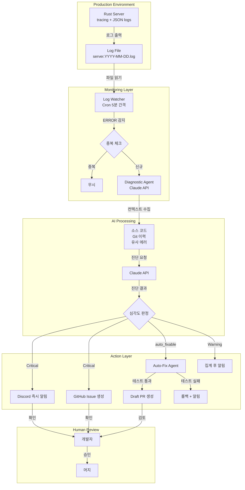

# AI 자동화 파이프라인 개요

> **버전**: 1.0
> **최종 수정**: 2025-01-31
> **상태**: 설계 완료, 구현 대기

---

## 1. 프로젝트 개요

### 왜 필요한가?

현재 백엔드 시스템에서 에러가 발생하면 다음과 같은 문제가 있습니다:

| 문제 | 현재 상태 | 목표 |
|------|----------|------|
| 장애 감지 시간 | 수동 확인 (수 시간) | 실시간 (< 5분) |
| 원인 분석 | 개발자가 로그 수동 분석 | AI가 자동 진단 |
| 대응 방식 | 개발자가 직접 수정 | AI가 자동 수정 제안 |
| 이슈 추적 | 수동 GitHub Issue 생성 | 자동 생성 및 관리 |

### 목표

**AI가 장애를 감지하고, 분석하고, 수정까지 자동으로 수행하는 파이프라인 구축**

```
에러 발생 → 자동 감지 → AI 진단 → 브랜치 생성 → 이슈 해결 → PR 생성
```

---

## 2. 핵심 기능 요약

### 2.1 에러 감지 및 알림

- **JSON 구조화 로그**: `tracing` 기반 로깅 시스템 (이미 구현됨)
- **Log Watcher**: 5분 간격으로 로그 파일 모니터링
- **Discord 알림**: 에러 발생 시 실시간 Webhook 알림
- **중복 방지**: 동일 에러 5분 내 중복 알림 차단

### 2.2 AI 진단

- **컨텍스트 수집**: 에러 로그 + 소스 코드 + Git 이력
- **근본 원인 분석**: Claude API를 통한 지능형 진단
- **권장 조치 생성**: 우선순위별 해결책 제안
- **자동 수정 가능 여부 판단**: 저위험 변경만 자동화

### 2.3 자동화 액션

- **GitHub Issue 자동 생성**: 에러 정보 + 진단 결과 포함
- **Auto-Fix PR 생성**: 테스트 통과 시 Draft PR 자동 생성
- **안전장치**: 사람 검토 없이 머지 불가

---

## 3. 시스템 아키텍처



### 컴포넌트 관계도

```
┌─────────────────────────────────────────────────────────────────────────────┐
│                              AI 자동화 파이프라인                             │
│                                                                             │
│  ┌─────────────┐      ┌─────────────┐      ┌─────────────┐                 │
│  │ Log Watcher │ ───▶ │ Diagnostic  │ ───▶ │  Auto-Fix   │                 │
│  │   Agent     │      │   Agent     │      │   Agent     │                 │
│  └─────────────┘      └─────────────┘      └─────────────┘                 │
│        │                    │                    │                          │
│        ▼                    ▼                    ▼                          │
│   로그 감지/필터       컨텍스트 분석         코드 수정 시도                   │
│   이벤트 트리거        진단 보고서           Draft PR 생성                   │
│                                                                             │
│  ─────────────────────────────────────────────────────────────────────────  │
│                                                                             │
│  ┌─────────────┐      ┌─────────────┐      ┌─────────────┐                 │
│  │   Discord   │      │   GitHub    │      │   Cron      │                 │
│  │   Webhook   │      │   CLI (gh)  │      │   Scheduler │                 │
│  └─────────────┘      └─────────────┘      └─────────────┘                 │
│                                                                             │
└─────────────────────────────────────────────────────────────────────────────┘
```

---

## 4. 기대 효과

### 정량적 목표

| 지표 | 현재 | 목표 | 개선율 |
|------|------|------|--------|
| 장애 감지 시간 | 수 시간 | < 5분 | 95%+ |
| 진단 정확도 | N/A | > 70% | - |
| Auto-Fix 성공률 | N/A | > 50% | - |
| 월간 운영 비용 | $0 | ~$30 | - |

### 정성적 효과

- **개발자 부담 감소**: 반복적인 로그 분석 및 이슈 생성 자동화
- **대응 속도 향상**: 실시간 알림으로 빠른 대응 가능
- **지식 축적**: AI 진단 결과가 이슈에 기록되어 재사용 가능
- **안전한 자동화**: Draft PR + 테스트 필수로 품질 보장

---

## 5. 기술 스택 개요

### 이미 구현된 기반 시스템

| 영역 | 기술 | 상태 |
|------|------|------|
| 로깅 | tracing + JSON 포맷 | 구현 완료 |
| 에러 코드 | AppError enum (AI50xx, RETRO40xx 등) | 구현 완료 |
| Discord 알림 | discord-alert.sh | 구현 완료 |
| Log Watcher | log-watcher.sh | 구현 완료 |

### 신규 구현 필요

| 영역 | 기술 | Phase |
|------|------|-------|
| AI 진단 | Claude API (claude-sonnet-4-20250514) | Phase 3 |
| GitHub Issue | gh CLI | Phase 4 |
| Auto-Fix | Claude Code CLI | Phase 4 |
| 비용 제한 | Rate Limiter (시간당 10회) | Phase 3 |

### 비용 구조

```
MVP (Phase 1-2):     $0/월     (파일 기반 + Shell Script)
Production (Phase 3-4): ~$30/월  (Claude API 호출 비용)

비교:
- Datadog: $230+/월
- New Relic: $100+/월
- 우리 시스템: ~$30/월
```

---

## 6. 다음 단계

### Phase별 구현 로드맵

```
Phase 1: Foundation    Phase 2: MVP          Phase 3: AI           Phase 4: Production
(Week 1-2)             (Week 3-4)            (Week 5-6)            (Week 7-8)
━━━━━━━━━━━━━━━━━     ━━━━━━━━━━━━━━━━━     ━━━━━━━━━━━━━━━━━     ━━━━━━━━━━━━━━━━━
    로그 기반     ───▶    모니터링 MVP   ───▶     AI 진단      ───▶    자동화 확장
        │                    │                     │                     │
        ▼                    ▼                     ▼                     ▼
• JSON 로깅 ✓          • Log Watcher ✓        • Claude 연동         • GitHub Issue
• ErrorCode enum ✓     • Discord 알림 ✓       • 컨텍스트 수집       • Auto-Fix PR
• Request ID           • Cron 설정 ✓          • 진단 보고서         • 안전장치
```

### 상세 구현 문서 참조

| Phase | 문서 | 상태 |
|-------|------|------|
| Phase 1 | [로그 기반 구축](../ai-monitoring/phases/phase-1-log-foundation.md) | 완료 |
| Phase 2 | [모니터링 MVP](../ai-monitoring/phases/phase-2-monitoring-mvp.md) | 완료 |
| Phase 3 | [AI 진단](../ai-monitoring/phases/phase-3-ai-diagnostic.md) | 대기 |
| Phase 4 | [자동화 확장](../ai-monitoring/phases/phase-4-automation.md) | 대기 |

### 설계 문서 참조

| 문서 | 내용 |
|------|------|
| [아키텍처 상세](../ai-monitoring/design/01-architecture.md) | 시스템 구조 상세 |
| [로그 스펙](../ai-monitoring/design/02-log-specification.md) | 로그 포맷 정의 |
| [Agent 설계](../ai-monitoring/design/03-agents.md) | AI Agent 상세 설계 |
| [알림 시스템](../ai-monitoring/design/04-alerting.md) | Discord/GitHub 연동 |

---

## 7. 안전장치

AI 자동화의 리스크를 최소화하기 위한 안전장치:

| 장치 | 내용 | 이유 |
|------|------|------|
| 중복 방지 | 5분 내 동일 에러 알림 1회 | 알림 피로 방지 |
| API 제한 | 시간당 최대 10회 진단 | 비용 제어 |
| Auto-Fix 제한 | 하루 최대 5개 PR | 과도한 자동화 방지 |
| 수정 범위 | 설정값만 (비즈니스 로직 불가) | 안전한 범위만 허용 |
| 테스트 필수 | cargo test 실패 시 롤백 | 깨진 코드 방지 |
| Draft PR | 사람 검토 없이 머지 불가 | 최종 검토 보장 |

### 수정 허용/불허 범위

| 허용 | 불허 |
|------|------|
| 타임아웃, 재시도 횟수 | 아키텍처 변경 |
| 로깅 추가/수정 | 비즈니스 로직 |
| 환경 변수 | 보안 관련 코드 |
| 간단한 null 체크 | DB 스키마 |

---

## 관련 문서

- [AI 모니터링 전체 개요](../ai-monitoring/00-overview.md)
- [문서 지도 (MOC)](../ai-monitoring/MOC.md)
- [Rust 코딩 규칙](../ai-conventions/claude.md)
