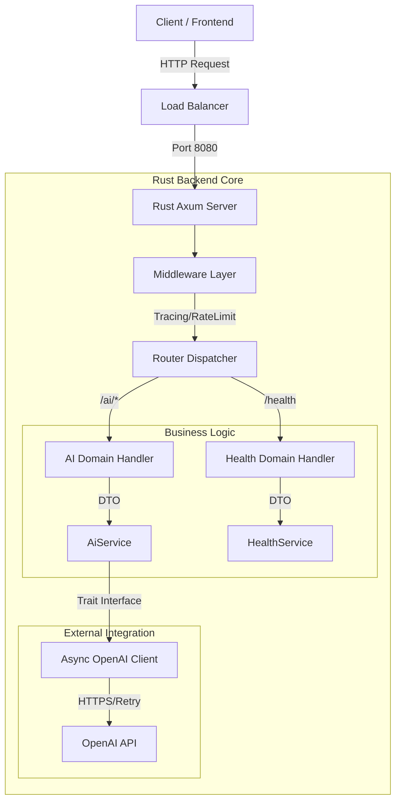

# 🏗️ 프로젝트 아키텍처 및 마이그레이션 보고서 (Java → Rust)

## 1. 프로젝트 개요

**프로젝트명:** 27th-Web-Team-3-BE (Web3 회고록 AI 서버)
**목표:** 사용자 입력을 분석하여 회고록 작성을 돕는 가이드 질문을 생성하고, 작성된 글의 톤앤매너(예: 친절하게, 정중하게)를 교정해주는 AI 기반 백엔드 서비스입니다.

### 🌟 핵심 기능
- **가이드 제공 (Provide Guide):** 사용자의 키워드나 초안을 분석하여 글을 확장할 수 있는 맞춤형 질문 생성
- **회고 교정 (Refine Retrospective):** 사용자의 글을 특정 스타일(Kind, Polite 등)로 재작성
- **헬스 체크 & 모니터링:** 서버 상태 및 OpenAI API 연결성 실시간 검증 (Prometheus 메트릭 포함)

---

## 2. 아키텍처 다이어그램 (Architecture Overview)

기존 모놀리식 계층형 구조에서 **도메인 주도형 모듈러 아키텍처(Domain-Driven Modular Architecture)**로 전환하여 유지보수성과 응집도를 높였습니다.

### 🔄 Request Processing Flow



### 🏛️ 계층 구조 상세 비교 (Layered Architecture)

| Layer | Java (Spring Boot) | Rust (Axum) | 특징 및 변화 |
| :--- | :--- | :--- | :--- |
| **Presentation** | `Controller` (`@RestController`) | `Handler` (Async Functions) | 어노테이션 매직 제거, 명시적 라우팅 함수 사용 |
| **Business** | `Service` (`@Service`) | `Service` (Struct + Impl) | 컴파일 타임 의존성 주입, 명시적 에러 전파 |
| **Domain Model** | `DTO` (Lombok `@Data`) | `Struct` (`serde::Deserialize`) | 매크로를 통한 Zero-copy 직렬화/역직렬화 |
| **Abstraction** | Interfaces | **Traits** (`AiClientTrait`) | Mocking 및 행위 추상화를 위한 강력한 타입 시스템 활용 |
| **Infra/Ext** | `Spring AI` | `async-openai` / `reqwest` | 비동기 Non-blocking I/O 최적화, 커스텀 재시도 로직 |

---

## 3. 기존 Java API 명세 및 데이터 제약조건 (Legacy API Specs)

마이그레이션 전 Java 프로젝트에서 제공하던 주요 API 명세입니다. Rust 프로젝트는 이 규격을 준수하며, **엄격한 타입 유효성 검사(Validation)**를 추가했습니다.

### 3.1. 회고 작성 가이드 (Provide Guide)
*   **Endpoint:** `POST /api/ai/retrospective/guide`
*   **Description:** 작성 중인 키워드나 문장을 기반으로, 회고를 구체화할 수 있는 가이드 질문을 생성합니다.
*   **Request Body:**
    | Field | Type | Required | Constraints | Description |
    | :--- | :--- | :--- | :--- | :--- |
    | `currentContent` | String | Yes | `@NotBlank` | 현재 작성 중인 회고 내용 (최소 1자 이상) |
    | `secretKey` | String | Yes | `@NotNull` | API 사용 권한 인증 키 |
*   **Response Body:**
    ```json
    {
      "isSuccess": true,
      "code": "COMMON200",
      "result": {
        "currentContent": "오늘 프로젝트를 진행하면서...",
        "guideMessage": "프로젝트 진행 과정에서 어떤 점이 특히 기억에 남으시나요? 구체적인 경험을 추가하면 더 의미 있는 회고가 될 거예요."
      }
    }
    ```

### 3.2. 회고 말투 정제 (Refine Retrospective)
*   **Endpoint:** `POST /api/ai/retrospective/refine`
*   **Description:** 작성된 회고를 선택한 페르소나(상냥한/정중한)에 맞춰 재작성합니다.
*   **Request Body:**
    | Field | Type | Required | Constraints | Description |
    | :--- | :--- | :--- | :--- | :--- |
    | `content` | String | Yes | `@NotBlank` | 정제할 원본 회고 내용 |
    | `toneStyle` | String | Yes | `@NotNull` | `KIND`(상냥체) 또는 `POLITE`(정중체) 만 허용 |
    | `secretKey` | String | Yes | `@NotNull` | API 사용 권한 인증 키 |
*   **Response Body:**
    ```json
    {
      "isSuccess": true,
      "code": "COMMON200",
      "result": {
        "originalContent": "오늘 일 너무 힘들었음.",
        "refinedContent": "오늘 업무가 많이 힘들었어요. 고생 많으셨어요.",
        "toneStyle": "KIND"
      }
    }
    ```

---

## 4. 기술 스택 상세 비교 및 선정 이유

### ☕ Legacy: Java (Spring Boot)
엔터프라이즈 환경의 표준이지만, AI 마이크로서비스로서는 다소 무거운 런타임을 가집니다.
*   **언어:** Java 17
*   **프레임워크:** Spring Boot 3.5.9
*   **단점:** JVM Warm-up 시간 필요, 높은 메모리 점유율(수백 MB), 리플렉션 기반의 런타임 오버헤드.

### 🦀 Current: Rust (Axum)
클라우드 네이티브 환경에 최적화된 고성능/저비용 스택입니다.
*   **언어:** Rust 1.84 (Edition 2021)
*   **웹 프레임워크:** **Axum 0.7**
    *   *선정 이유:* Rust 비동기 표준 런타임인 `Tokio` 팀이 직접 관리하며, 타입 안전하고 인체공학적인 API를 제공합니다.
*   **비동기 런타임:** **Tokio**
    *   *특징:* Work-stealing 스케줄러를 통해 멀티코어를 효율적으로 활용하며, I/O 바운드 작업(AI API 호출)에 최적화되어 있습니다.
*   **문서화:** **Utoipa**
    *   *특징:* 코드 내 매크로를 통해 OpenAPI(Swagger) 명세를 자동 생성하여 문서와 코드의 불일치를 방지합니다.
*   **에러 처리:** **Thiserror & Anyhow**
    *   *특징:* `AppError` Enum을 통해 발생 가능한 모든 에러를 구조화하고, 클라이언트에 적절한 HTTP 상태 코드로 매핑합니다.

### 4.1. 의존성 주입 (Dependency Injection)의 변화
*   **Before (Java):** IoC 컨테이너가 런타임에 리플렉션으로 빈(Bean)을 탐색하여 주입 (`@Autowired`).
*   **After (Rust):** **생성자 주입 (Constructor Injection) + Traits**.
    *   `AiService::new(client)` 형태로 명시적으로 의존성을 주입합니다.
    *   제네릭과 Trait Bound(`where C: AiClientTrait`)를 사용하여, 컴파일 타임에 구현체가 확정되므로 런타임 오버헤드가 '0'입니다 (Zero-cost Abstraction).

### 4.2. 성능 및 리소스 효율성 (Benchmark Expectation)
*   **Cold Start:** JVM 구동(수 초) vs Rust 바이너리 실행(수 밀리초).
*   **Memory:** 300MB+ (Spring Boot 기본) → **10~20MB** (Rust Axum). AWS Lambda나 컨테이너 환경에서 비용 절감 효과가 큽니다.

### 4.3. API 구현 흐름 상세 비교 (Implementation Flow)

#### ☕ Java (Synchronous Blocking)
```java
// Thread-per-request 모델
public GuideResponse provideGuide(String key) {
    // 1. I/O 작업 동안 스레드가 블로킹됨 (OS 스레드 자원 점유)
    String result = chatModel.call(prompt); 
    // 2. 예외 발생 시 전역 핸들러로 전파 (런타임 제어)
    return new GuideResponse(result);
}
```

#### 🦀 Rust (Asynchronous Non-blocking)
```rust
// Async/Await (Cooperative Multitasking)
pub async fn provide_guide(&self, key: &str) -> Result<GuideResponse, AppError> {
    // 1. I/O 작업 시점(.await)에 현재 Task가 스레드를 양보함 (다른 요청 처리 가능)
    let result = self.client.complete(messages).await?;
    // 2. Result 타입을 통해 에러 처리를 강제함 (컴파일 타임 제어)
    Ok(GuideResponse { result })
}
```

### 4.4. 안정성 및 관측가능성 (Resilience & Observability)
*   **재시도 전략 (Exponential Backoff):** `backoff` 크레이트를 사용하여 OpenAI API 호출 실패(5xx, 타임아웃) 시 점진적으로 대기 시간을 늘리며 재시도합니다. (Java에서는 AOP나 Resilience4j 설정 필요)
*   **속도 제한 (Rate Limiting):** `tower-governor`를 사용하여 IP별 요청량을 제한(Token Bucket 알고리즘), 악의적인 트래픽으로부터 서버를 보호합니다.
*   **구조화된 로깅:** `tracing` 크레이트로 JSON 로그를 출력하여, 분산 추적(Distributed Tracing) 및 로그 분석 시스템(ELK, Datadog) 연동 준비를 마쳤습니다.

---

## 5. Rust와 AI 개발의 시너지: "엄격한 컴파일러"

이번 마이그레이션 과정에서 Rust의 강력한 타입 시스템과 컴파일러(`rustc`)는 AI가 코드를 작성하는 데 있어 큰 이점을 제공했습니다.

### 🛡️ 컴파일러 피드백 루프 (The Compiler Feedback Loop)
다른 언어(Python, JS)와 달리, Rust 컴파일러는 에러 발생 시 **"무엇이 잘못되었는지"** 뿐만 아니라 **"어떻게 고쳐야 하는지"** 정확하게 알려줍니다.

> **예시 상황:** AI가 변수의 소유권(Ownership)을 실수로 두 번 사용했을 때

```text
error[E0382]: use of moved value: `request`
  --> src/handler.rs:20:15
   |
19 |     service.process(request);      // request가 여기서 이동됨(Moved)
   |                     ------- value moved here
20 |     println!("{:?}", request);     // 이동된 값을 다시 사용하려고 함 -> 에러!
   |                      ^^^^^^^ value used here after move
   |
   = help: consider cloning the value if the performance cost is acceptable
```

이러한 상세한 에러 메시지 덕분에, AI 모델은 모호한 런타임 버그를 추측하는 대신 **컴파일러의 지시를 따라 코드를 즉시 자가 수정(Self-Correction)** 할 수 있습니다. 이는 "컴파일만 되면 실행은 보장된다"는 Rust의 신뢰성으로 이어집니다.

---

## 6. AI 에이전트 협업 가이드 (AI Collaboration Guide)

이 프로젝트는 개발자뿐만 아니라 AI 에이전트(Claude 등)가 프로젝트의 컨텍스트를 빠르고 정확하게 파악하여 일관성 있는 코드를 작성할 수 있도록 돕는 문서화 시스템을 포함하고 있습니다.

### 📂 문서 구조 및 활용
루트 디렉토리 및 `.claude` 폴더에 위치한 파일들은 AI가 프로젝트를 이해하는 "지도" 역할을 합니다.

*   **`CLAUDE.md`**: AI 에이전트의 진입점(Entry Point).
    *   프로젝트의 최상위 컨텍스트, 주요 명령어, 필수 규칙의 요약본입니다.
*   **`agent.md`**: AI의 페르소나 및 행동 지침.
    *   **Strict Teacher Mode:** 컴파일 에러가 없는 안전한 코드, 관용적인 Rust(Idiomatic Rust) 작성을 최우선 목표로 합니다.
*   **`.claude/` (규칙 및 스킬 셋)**:
    *   **`rules/`**: 구체적인 코딩 컨벤션(API 설계, Rust 스타일 가이드 등)이 정의되어 있습니다.
    *   **`skills/`**: AI가 수행해야 할 특정 작업(예: 보안 리뷰, 테스트 코드 작성)에 대한 절차적 지식이 담겨 있습니다.
    *   **`hooks/`**: `architecture-check.md` 등 작업을 수행하기 전 반드시 확인해야 할 체크리스트를 제공합니다.

### 🚀 활용 방법 (Workflow)
1.  **Context Loading:** 개발자는 AI에게 "프로젝트 컨텍스트를 파악해줘"라고 요청합니다.
2.  **Rule Adherence:** AI는 `.claude/rules`를 참조하여 기존 코드 스타일과 일치하는 코드를 생성합니다.
3.  **Self-Correction:** 컴파일 에러 발생 시, Rust 컴파일러의 에러 메시지를 기반으로 스스로 코드를 수정합니다.

---

## 7. 폴더 구조 맵 (Directory Structure)

도메인별로 응집도 높게 구성된 Rust 프로젝트 구조입니다.

```text
rust/
├── Cargo.toml             # 의존성 및 프로젝트 메타데이터
├── src/
│   ├── main.rs            # 앱 진입점, 서버 설정, 라우터 조립, Tracing 초기화
│   ├── lib.rs             # 라이브러리 루트 (모듈 노출)
│   ├── config.rs          # 환경 변수 로드 (dotenvy) 및 Config 구조체
│   ├── error.rs           # 전역 에러 정의 (AppError Enum, thiserror)
│   │
│   ├── domain/            # [핵심] 도메인별 비즈니스 로직 (DDD)
│   │   ├── ai/
│   │   │   ├── handler.rs # 요청 처리 (Controller), 입력 검증
│   │   │   ├── service.rs # 비즈니스 로직, 외부 클라이언트 호출
│   │   │   ├── client.rs  # OpenAI API 연동 (Trait & Impl)
│   │   │   ├── dto.rs     # Request/Response 구조체 (Serde)
│   │   │   └── prompt/    # 프롬프트 템플릿 관리 (Static Strings)
│   │   │
│   │   └── health/        # 헬스 체크 도메인
│   │       └── ...
│   │
│   └── global/            # 공통 모듈 (Cross-cutting Concerns)
│       ├── middleware.rs  # 로깅, 추적, Rate Limit 미들웨어
│       └── validator.rs   # 공통 유효성 검사 로직 (SecretKey 등)
└── tests/                 # 통합 테스트 (Integration Tests)
```