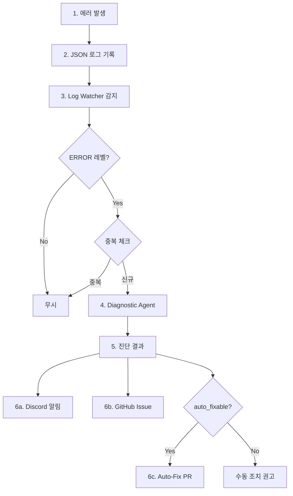
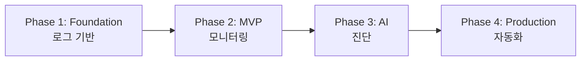

# AI 자율 모니터링 시스템 - 전체 흐름

> 구현 전 전체 구조, 선택 근거, 데이터 플로우 정리

---

## 1. 전체 아키텍처

```
┌─────────────────────────────────────────────────────────────────────────────┐
│                              RUNTIME FLOW                                    │
│                                                                              │
│  ┌─────────────┐      ┌─────────────┐      ┌─────────────┐                  │
│  │ Rust Server │ ───▶ │  Log File   │ ───▶ │ Log Watcher │                  │
│  │  (tracing)  │      │   (JSON)    │      │   (Cron)    │                  │
│  └─────────────┘      └─────────────┘      └──────┬──────┘                  │
│                                                    │                         │
│                                         ERROR 감지 │                         │
│                                                    ▼                         │
│                                            ┌─────────────┐                   │
│                                            │ Diagnostic  │                   │
│                                            │   Agent     │                   │
│                                            │  (Claude)   │                   │
│                                            └──────┬──────┘                   │
│                                                   │                          │
│                          ┌────────────────────────┼────────────────────────┐ │
│                          ▼                        ▼                        ▼ │
│                   ┌─────────────┐          ┌─────────────┐          ┌──────────┐
│                   │   Discord   │          │   GitHub    │          │ Auto-Fix │
│                   │   Alert     │          │   Issue     │          │    PR    │
│                   └─────────────┘          └─────────────┘          └──────────┘
└─────────────────────────────────────────────────────────────────────────────┘
```

---

## 2. 기술 선택 근거

| 영역 | 선택 | 제외한 대안 | 근거 |
|------|------|------------|------|
| **로그** | Loki (File MVP) | ELK, CloudWatch | ELK 리소스 과다, CloudWatch 비용 누적 |
| **메트릭** | Prometheus | CloudWatch Metrics, Datadog | CNCF 표준, 무료, Grafana 네이티브 |
| **알림** | Discord | Slack, PagerDuty | 팀 이미 사용 중, 무료, Webhook 5분 설정 |
| **AI 진단** | Claude API | Datadog AI, 자체 ML | 컨텍스트 기반 진단, 자동 수정 제안 가능 |
| **자동화** | Shell + gh CLI | GitHub Actions Only | 로컬 실행 가능, 디버깅 용이 |

### 핵심 원칙

```
MVP:        $0/월     (파일 기반 + Shell Script)
Production: ~$30/월   (Claude API 호출 비용만)
```

> 상세 비교: [[design/00-tool-comparison|도구 비교 문서]]

---

## 3. 데이터 플로우



### 상세 플로우

#### Step 1-2: 에러 발생 → 로그 기록

```json
{
  "timestamp": "2025-01-31T14:23:45Z",
  "level": "ERROR",
  "target": "server::domain::ai::service",
  "fields": {
    "error_code": "AI_003",
    "request_id": "req_abc123",
    "duration_ms": 30500
  },
  "message": "Claude API timeout after 30000ms"
}
```

#### Step 3: Log Watcher 감지

- **실행 주기**: 5분 (Cron)
- **필터링**: `level == "ERROR"`
- **중복 체크**: `fingerprint = {error_code}:{target}` (통일된 규칙)
- **중복 윈도우**: 5분 내 동일 에러 무시
- **비용 제한**: 진단 호출 전 `check_rate_limit()` 확인 (시간당 최대 10회)

#### Step 4-5: Diagnostic Agent

**입력**:
- 에러 로그 전문
- 관련 소스 코드 (`target` → `.rs` 파일 매핑)
- Git 이력 (최근 5커밋)

**출력**:
```json
{
  "severity": "high",
  "root_cause": "프롬프트 길이 초과로 API 처리 시간 증가",
  "impact": "AI 회고 생성 기능 전체 영향",
  "recommendation": [
    "타임아웃 값 조정 (30s → 60s)",
    "프롬프트 길이 제한 추가"
  ],
  "auto_fixable": true,
  "fix_suggestion": "TIMEOUT_SECS 상수를 30에서 60으로 변경"
}
```

#### Step 6: 액션 분기

| 조건 | 액션 |
|------|------|
| 모든 에러 | Discord 알림 |
| Critical/High | GitHub Issue 생성 |
| `auto_fixable: true` | Draft PR 생성 시도 |

---

## 4. Phase별 구현 순서

```
Phase 1: Foundation      Phase 2: MVP             Phase 3: AI              Phase 4: Production
(Week 1-2)               (Week 3-4)               (Week 5-6)               (Week 7-8)
━━━━━━━━━━━━━━━━━━       ━━━━━━━━━━━━━━━━━━       ━━━━━━━━━━━━━━━━━━       ━━━━━━━━━━━━━━━━━━
    로그 기반        ───▶    모니터링 MVP     ───▶     AI 진단        ───▶    자동화 확장
        │                        │                      │                       │
        ▼                        ▼                      ▼                       ▼
• JSON 로깅             • Log Watcher           • Claude 연동          • GitHub Issue
• ErrorCode enum        • Discord 알림          • 컨텍스트 수집        • Auto-Fix PR
• Request ID            • Cron 설정             • 진단 보고서          • 안전장치
```

### Phase 의존성



### 각 Phase 산출물

| Phase | 이름 | 산출물 | 문서 |
|-------|------|--------|------|
| 1 | Foundation | JSON 로그, 에러 코드, Request ID | [[phases/phase-1-log-foundation]] |
| 2 | MVP | ERROR 알림, 중복 방지, Cron | [[phases/phase-2-monitoring-mvp]] |
| 3 | AI | AI 진단, 근본원인 분석, 권장 조치 | [[phases/phase-3-ai-diagnostic]] |
| 4 | Production | 자동 Issue, Auto-Fix PR | [[phases/phase-4-automation]] |

---

## 5. 주요 컴포넌트

### 5.1 Rust Server (기존 수정)

```rust
// 현재: tracing 사용 중
// 추가: JSON 포맷 + 에러코드

tracing::error!(
    error_code = %ErrorCode::AI003.as_str(),
    request_id = %req_id,
    duration_ms = %elapsed,
    "Claude API timeout"
);
```

### 5.2 Log Watcher (신규)

```bash
# scripts/log-watcher.sh
# 실행: */5 * * * * (5분마다)
# Cron: .env 파일 로드 + 프로젝트 logs/ 디렉토리에 로그 저장

동작:
1. 마지막 체크 이후 새 로그 읽기
2. ERROR 레벨 필터링
3. fingerprint로 중복 체크
4. 중복 아니면 → Diagnostic Agent 호출

로그 로테이션 대응:
- 상태 파일은 날짜별로 분리 저장 (logs/.state/log-watcher-state-YYYY-MM-DD)
- 날짜 변경 시 새 상태 파일 사용 (이전 상태 무시)
- 파일 inode 변경 감지하여 로그 파일 교체 대응
- 7일 이상 된 상태 파일 자동 정리
```

### 5.3 Diagnostic Agent (신규)

```python
# scripts/diagnostic-agent.py
# 트리거: Log Watcher에서 호출

Input:
- 에러 로그 (JSON)
- 소스 코드 (target → 파일 매핑)
- Git 이력 (최근 5커밋)

Output:
- 심각도, 근본원인, 권장조치
- auto_fixable 여부
- 수정 제안
```

### 5.4 Auto-Fix Agent (신규)

```bash
# scripts/auto-fix.sh
# 조건: auto_fixable == true

1. 브랜치 생성 (fix/AI_003-timestamp)
2. 수정 적용
3. cargo test 실행
4. 성공 → Draft PR 생성
   실패 → 롤백 + 알림
```

---

## 6. 안전장치

| 장치 | 내용 | 이유 |
|------|------|------|
| **중복 방지** | 5분 내 동일 에러 알림 1회 (fingerprint: `{error_code}:{target}`) | 알림 피로 방지 |
| **API 제한** | 시간당 최대 10회 진단 (`check_rate_limit()`) | 비용 제어 |
| **Auto-Fix 제한** | 하루 최대 5개 PR | 과도한 자동화 방지 |
| **수정 범위** | 설정값만 (비즈니스 로직 불가) | 안전한 범위만 허용 |
| **테스트 필수** | cargo test 실패 시 롤백 | 깨진 코드 방지 |
| **Draft PR** | 사람 검토 없이 머지 불가 | 최종 검토 보장 |

> **비용 제한 호출 흐름**: Log Watcher가 에러 감지 후 Diagnostic Agent 호출 **전에**
> `check_rate_limit()` 함수로 시간당 호출 제한을 확인합니다.
> 제한 초과 시 진단을 건너뛰고 기본 알림만 발송합니다.

### 수정 허용/불허 범위

| ✅ 허용 | ❌ 불허 |
|---------|---------|
| 타임아웃, 재시도 횟수 | 아키텍처 변경 |
| 로깅 추가/수정 | 비즈니스 로직 |
| 환경 변수 | 보안 관련 코드 |
| 간단한 null 체크 | DB 스키마 |

---

## 7. 비용 구조

### MVP (Phase 1-2)

| 항목 | 비용 |
|------|------|
| 로그 저장 (파일) | $0 |
| Discord Webhook | $0 |
| Shell Script | $0 |
| **Total** | **$0/월** |

### Production (Phase 3-4)

| 항목 | 비용 |
|------|------|
| 로그 저장 (파일/Loki) | $0 |
| Discord Webhook | $0 |
| Claude API (일 50회 × $0.02) | ~$30/월 |
| **Total** | **~$30/월** |

### 비교 (SaaS 대안)

| 솔루션 | 월 비용 |
|--------|--------|
| Datadog | $230+ |
| New Relic | $100+ |
| **우리 시스템** | **~$30** |

---

## 8. 성공 지표

| 지표 | 현재 | 목표 | 측정 방법 |
|------|------|------|----------|
| 장애 감지 시간 | 수동 (수 시간) | < 5분 | 로그 → 알림 시간 |
| 진단 정확도 | - | > 70% | 사람 검토 피드백 |
| Auto-Fix 성공률 | - | > 50% | 머지된 PR / 생성된 PR |
| 월 비용 | - | < $50 | Claude API 청구서 |

---

## 9. 파일 구조 (구현 후)

```
27th-Web-Team-3-BE/
├── codes/server/
│   └── src/
│       ├── config/
│       │   └── logging.rs          # JSON 로깅 설정
│       ├── utils/
│       │   ├── error.rs            # ErrorCode enum 추가
│       │   └── error_code.rs       # (신규) 에러 코드 정의
│       └── global/
│           └── middleware.rs       # Request ID 미들웨어
│
├── scripts/                         # (신규) 모니터링 스크립트
│   ├── discord-alert.sh            # Discord 알림
│   ├── log-watcher.sh              # 로그 감시
│   ├── diagnostic-agent.py         # AI 진단
│   ├── create-issue.sh             # GitHub Issue 생성
│   └── auto-fix.sh                 # 자동 수정 PR
│
└── docs/ai-monitoring/              # 문서
    ├── 00-overview.md              # (현재 문서)
    ├── design/                     # 설계 문서
    └── phases/                     # 구축 가이드
```

---

## 관련 문서

- [[design/01-architecture|아키텍처 상세]]
- [[design/03-agents|Agent 설계]]
- [[phases/phase-1-log-foundation|Phase 1 시작하기]]

---

#overview #architecture #flow
