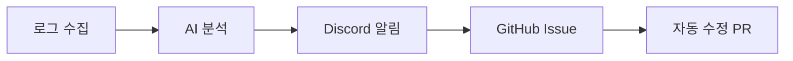

# AI Monitoring - Map of Content

> 로그 기반 AI 자율 모니터링 시스템의 전체 문서 지도
>
> **참고**: 이 문서는 Obsidian 전용 링크(`[[...]]`)를 사용합니다. 표준 Markdown 환경에서는 아래의 일반 링크를 사용하세요.

---

## Overview

**핵심 가치**: 장애 감지 시간을 수동(수 시간)에서 실시간(<1분)으로 단축

---

## Documents

### 1. 개요

| 문서 | Obsidian 링크 | 일반 Markdown 링크 |
|------|---------------|-------------------|
| 프로젝트 개요 | [[README]] | [README.md](./README.md) |
| 전체 흐름 | [[00-overview]] | [00-overview.md](./00-overview.md) |

### 2. 설계 (`design/`)

| 문서 | Obsidian 링크 | 일반 Markdown 링크 |
|------|---------------|-------------------|
| 도구 비교 | [[design/00-tool-comparison]] | [design/00-tool-comparison.md](./design/00-tool-comparison.md) |
| 아키텍처 | [[design/01-architecture]] | [design/01-architecture.md](./design/01-architecture.md) |
| 로그 스펙 | [[design/02-log-specification]] | [design/02-log-specification.md](./design/02-log-specification.md) |
| Agent 설계 | [[design/03-agents]] | [design/03-agents.md](./design/03-agents.md) |
| 알림 시스템 | [[design/04-alerting]] | [design/04-alerting.md](./design/04-alerting.md) |

### 3. 구축 가이드 (`phases/`)

| 문서 | Obsidian 링크 | 일반 Markdown 링크 |
|------|---------------|-------------------|
| 구현 로드맵 | [[phases/05-implementation-plan]] | [phases/05-implementation-plan.md](./phases/05-implementation-plan.md) |
| Phase 1: Foundation | [[phases/phase-1-log-foundation]] | [phases/phase-1-log-foundation.md](./phases/phase-1-log-foundation.md) |
| Phase 2: MVP | [[phases/phase-2-monitoring-mvp]] | [phases/phase-2-monitoring-mvp.md](./phases/phase-2-monitoring-mvp.md) |
| Phase 3: AI | [[phases/phase-3-ai-diagnostic]] | [phases/phase-3-ai-diagnostic.md](./phases/phase-3-ai-diagnostic.md) |
| Phase 4: Production | [[phases/phase-4-automation]] | [phases/phase-4-automation.md](./phases/phase-4-automation.md) |

---

## Related Links

| 문서 | Obsidian 링크 | 일반 Markdown 링크 |
|------|---------------|-------------------|
| API Specs | [[../api-specs/]] | [../api-specs/](../api-specs/) |
| Rust 코딩 규칙 | [[../ai-conventions/claude]] | [../ai-conventions/claude.md](../ai-conventions/claude.md) |
| 아키텍처 가이드 | [[../ai-conventions/architecture]] | [../ai-conventions/architecture.md](../ai-conventions/architecture.md) |

---

#ai-monitoring #moc
