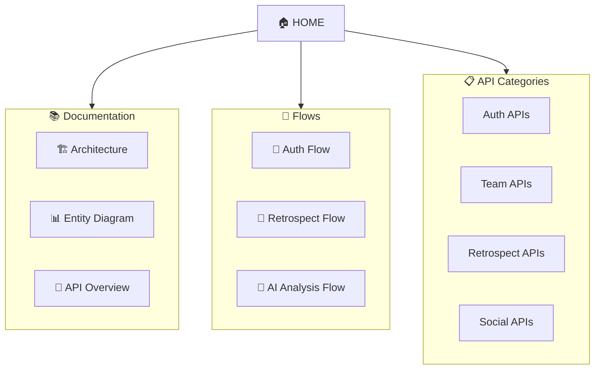
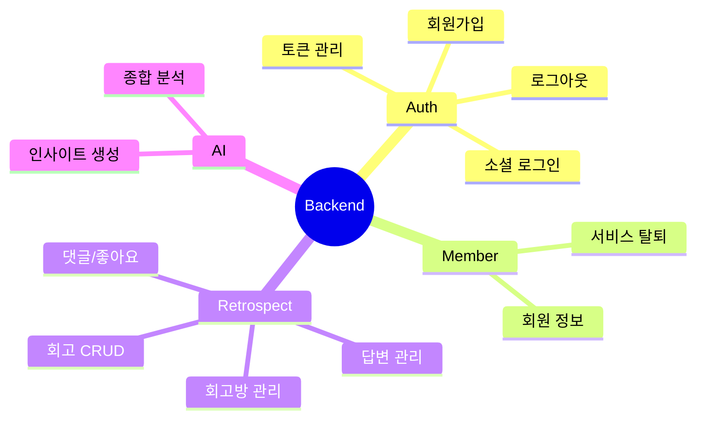
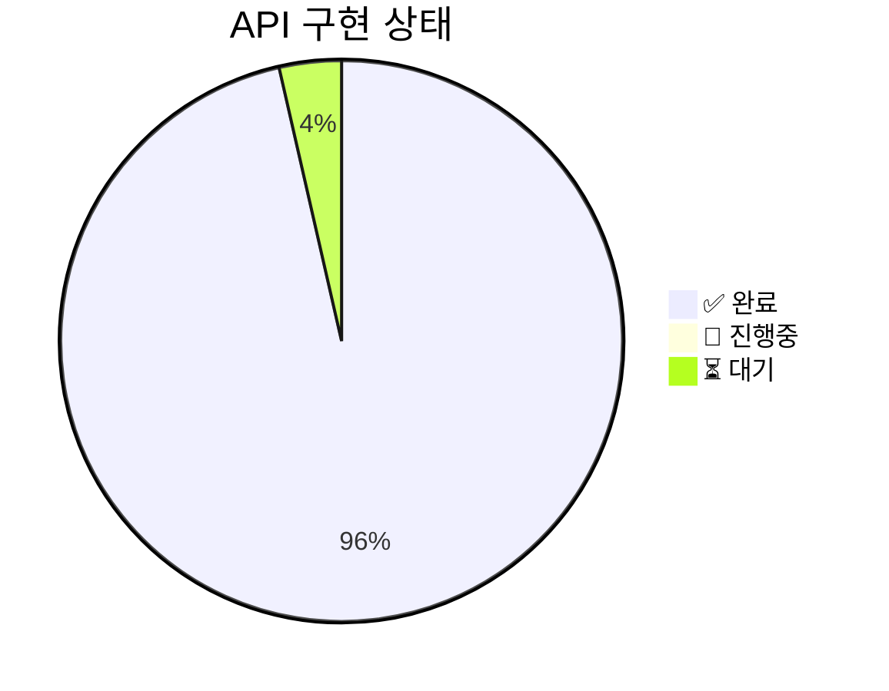
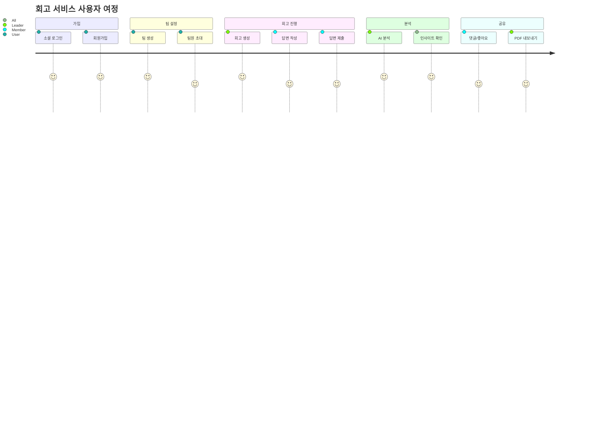

# 🏠 회고록 AI 서비스 - Visual Hub

> 프로젝트 전체를 한눈에 파악하는 시각적 허브

---

## 📍 Quick Navigation



---

## 🎯 프로젝트 개요

| 항목 | 설명 |
|------|------|
| **프로젝트** | 회고록 작성 AI 서비스 백엔드 |
| **기술 스택** | Rust + Axum + SeaORM + OpenAI |
| **아키텍처** | Domain-Driven Design |
| **인증** | JWT (Access/Refresh/Signup Token) |

---

## 🗂️ 도메인 구조



---

## 📊 API 구현 현황



| 카테고리 | 완료 | 전체 | 진행률 |
|---------|------|------|--------|
| 🔐 Auth | 4 | 4 | ██████████ 100% |
| 👥 Team | 7 | 7 | ██████████ 100% |
| 📝 Retrospect | 12 | 12 | ██████████ 100% |
| 💬 Social | 3 | 3 | ██████████ 100% |
| 👤 Member | 1 | 1 | ██████████ 100% |

---

## 🔗 핵심 문서 바로가기

### 📐 Architecture
- [[01-Architecture|🏗️ 전체 아키텍처]] - 시스템 구조 및 계층
- [[04-Entity-Diagram|📊 엔티티 다이어그램]] - DB 스키마 및 관계
- [[05-API-Overview|🔌 API 전체 맵]] - 엔드포인트 총정리

### 🔄 Flow Diagrams
- [[02-Auth-Flow|🔐 인증 플로우]] - 로그인/회원가입/토큰
- [[03-Retrospect-Flow|📝 회고 플로우]] - 회고 생성~분석 전체
- [[06-AI-Analysis-Flow|🤖 AI 분석 플로우]] - AI 분석 상세

### 📋 API Categories
- [[apis/MOC|📑 API 목록 (MOC)]] - 전체 API 인덱스
- [[07-Auth-APIs|🔐 Auth APIs]] - 인증 API 상세
- [[08-Team-APIs|👥 Team APIs]] - 팀/회고방 API 상세
- [[09-Retrospect-APIs|📝 Retrospect APIs]] - 회고 API 상세
- [[10-Social-APIs|💬 Social APIs]] - 소셜 기능 API 상세

---

## 🚀 주요 사용자 시나리오



---

## ⚡ 빠른 참조

### HTTP Methods 색상 가이드

| Method | 용도 | 색상 |
|--------|------|------|
| `GET` | 조회 | 🟢 |
| `POST` | 생성 | 🟡 |
| `PUT` | 전체 수정 | 🔵 |
| `PATCH` | 부분 수정 | 🟣 |
| `DELETE` | 삭제 | 🔴 |

### 인증 요구사항

| 아이콘 | 의미 |
|--------|------|
| 🔓 | 인증 불필요 |
| 🔐 | Access Token 필요 |
| 👑 | Owner 권한 필요 |

---

## 📁 디렉토리 구조

```
docs/api-visual/
├── 00-HOME.md              ← 현재 문서
├── 01-Architecture.md      # 전체 아키텍처
├── 02-Auth-Flow.md         # 인증 플로우
├── 03-Retrospect-Flow.md   # 회고 플로우
├── 04-Entity-Diagram.md    # 엔티티 다이어그램
├── 05-API-Overview.md      # API 전체 맵
├── 06-AI-Analysis-Flow.md  # AI 분석 플로우
├── 07-Auth-APIs.md         # Auth API 상세
├── 08-Team-APIs.md         # Team API 상세
├── 09-Retrospect-APIs.md   # Retrospect API 상세
├── 10-Social-APIs.md       # Social API 상세
└── apis/                   # 개별 API 문서
    ├── MOC.md              # API 목록
    └── API-XXX *.md        # 개별 API
```

---

## 🔖 Tags

#home #hub #overview #retrospect #ai-service

---

> [!tip] Obsidian Graph View
> `Ctrl/Cmd + G`로 Graph View를 열어 문서 간 연결 관계를 시각적으로 확인하세요.
