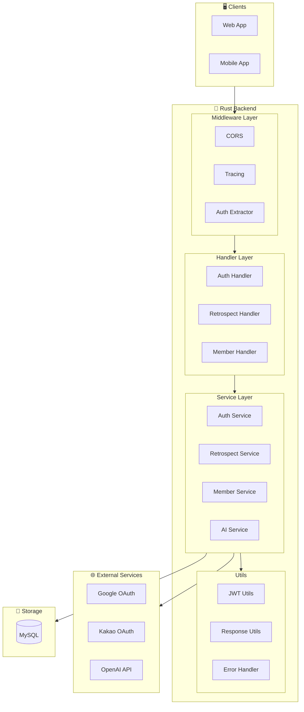
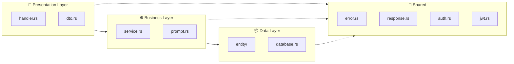
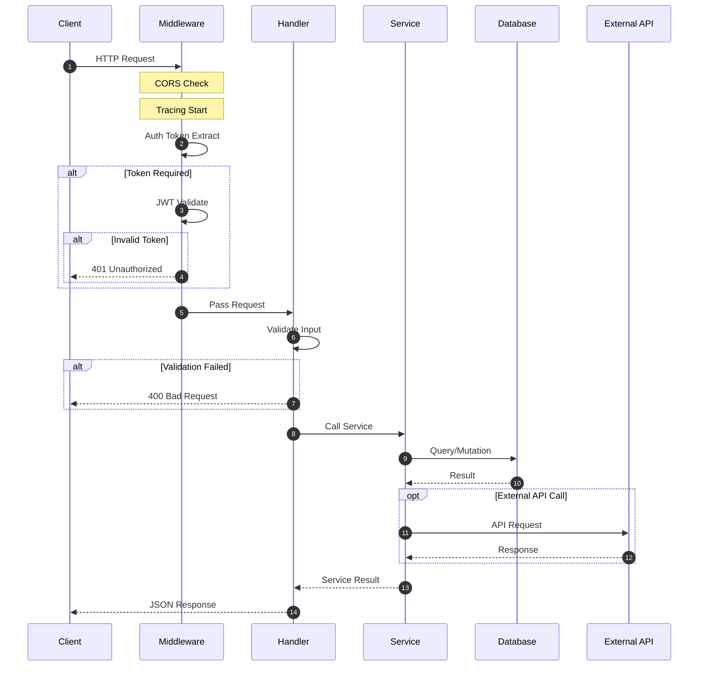
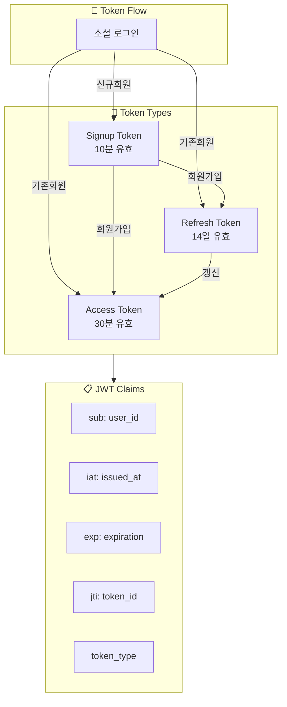
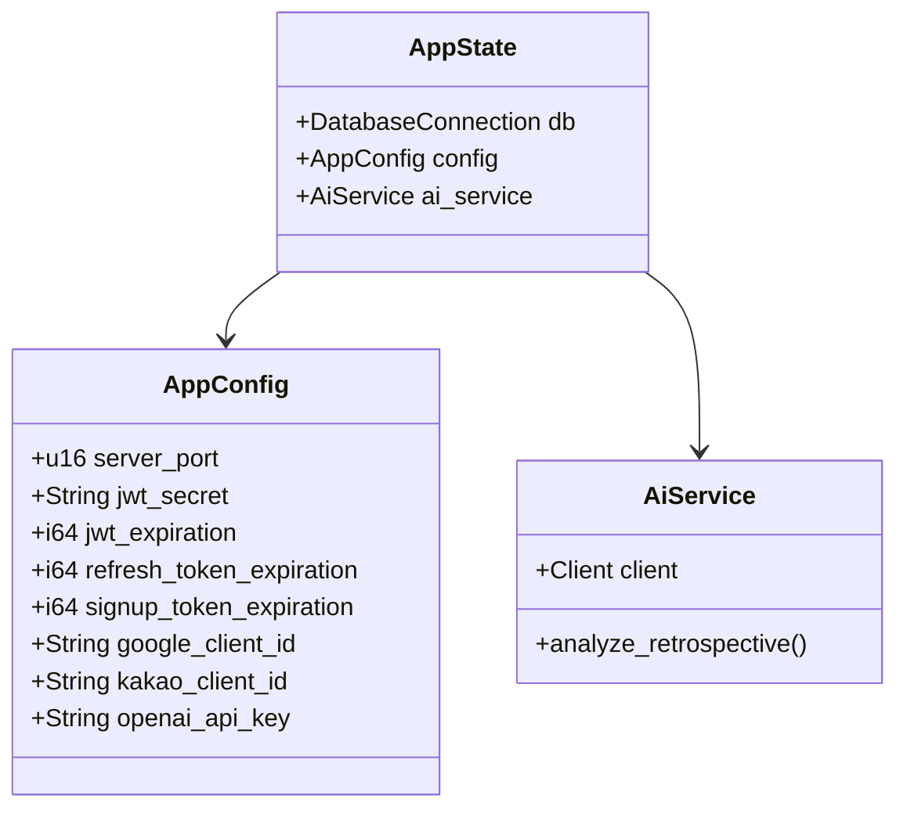
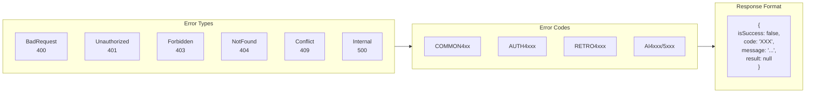

# 🏗️ System Architecture

> 회고록 AI 서비스 백엔드 전체 아키텍처

---

## 📐 High-Level Architecture



---

## 🗂️ Layer Architecture



---

## 📁 프로젝트 구조

```
codes/server/src/
├── main.rs                 # 🚀 Entry Point & Router
├── lib.rs                  # 📚 Public API
├── state.rs                # 🔄 AppState
│
├── config/                 # ⚙️ Configuration
│   ├── mod.rs
│   ├── app_config.rs       # 환경변수 설정
│   └── database.rs         # DB 연결 & 스키마
│
├── utils/                  # 🔧 Utilities
│   ├── mod.rs
│   ├── error.rs            # AppError
│   ├── response.rs         # BaseResponse
│   ├── auth.rs             # AuthUser Extractor
│   └── jwt.rs              # JWT 생성/검증
│
└── domain/                 # 📦 Domains
    ├── auth/               # 🔐 인증
    │   ├── handler.rs
    │   ├── service.rs
    │   └── dto.rs
    │
    ├── member/             # 👤 회원
    │   ├── handler.rs
    │   ├── service.rs
    │   ├── dto.rs
    │   └── entity/
    │       ├── member.rs
    │       ├── refresh_token.rs
    │       ├── member_retro.rs
    │       └── member_retro_room.rs
    │
    ├── retrospect/         # 📝 회고
    │   ├── handler.rs
    │   ├── service.rs
    │   ├── dto.rs
    │   └── entity/
    │       ├── retro_room.rs
    │       ├── retrospect.rs
    │       ├── response.rs
    │       ├── response_comment.rs
    │       ├── response_like.rs
    │       └── retro_reference.rs
    │
    └── ai/                 # 🤖 AI
        ├── service.rs
        └── prompt.rs
```

---

## 🔄 Request Flow



---

## 🔐 Authentication Architecture



---

## ⚙️ AppState



---

## 🛡️ Error Handling



---

## 📦 Dependencies

| Category | Library | Version | 용도 |
|----------|---------|---------|------|
| **Web** | axum | 0.7 | Web Framework |
| **Async** | tokio | 1.0 | Runtime |
| **ORM** | sea-orm | 1.1 | Database |
| **Auth** | jsonwebtoken | 10.2 | JWT |
| **AI** | async-openai | 0.25 | OpenAI |
| **Docs** | utoipa | 4.0 | OpenAPI |
| **Log** | tracing | 0.1 | Logging |
| **Validate** | validator | 0.18 | Input |

---

## 🔗 Related

- [[00-HOME|🏠 HOME]]
- [[04-Entity-Diagram|📊 Entity Diagram]]
- [[05-API-Overview|🔌 API Overview]]

---

#architecture #system #overview
