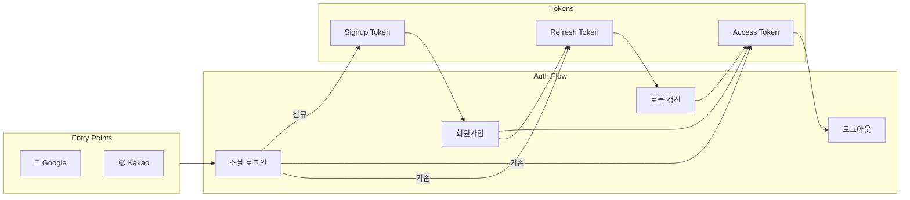
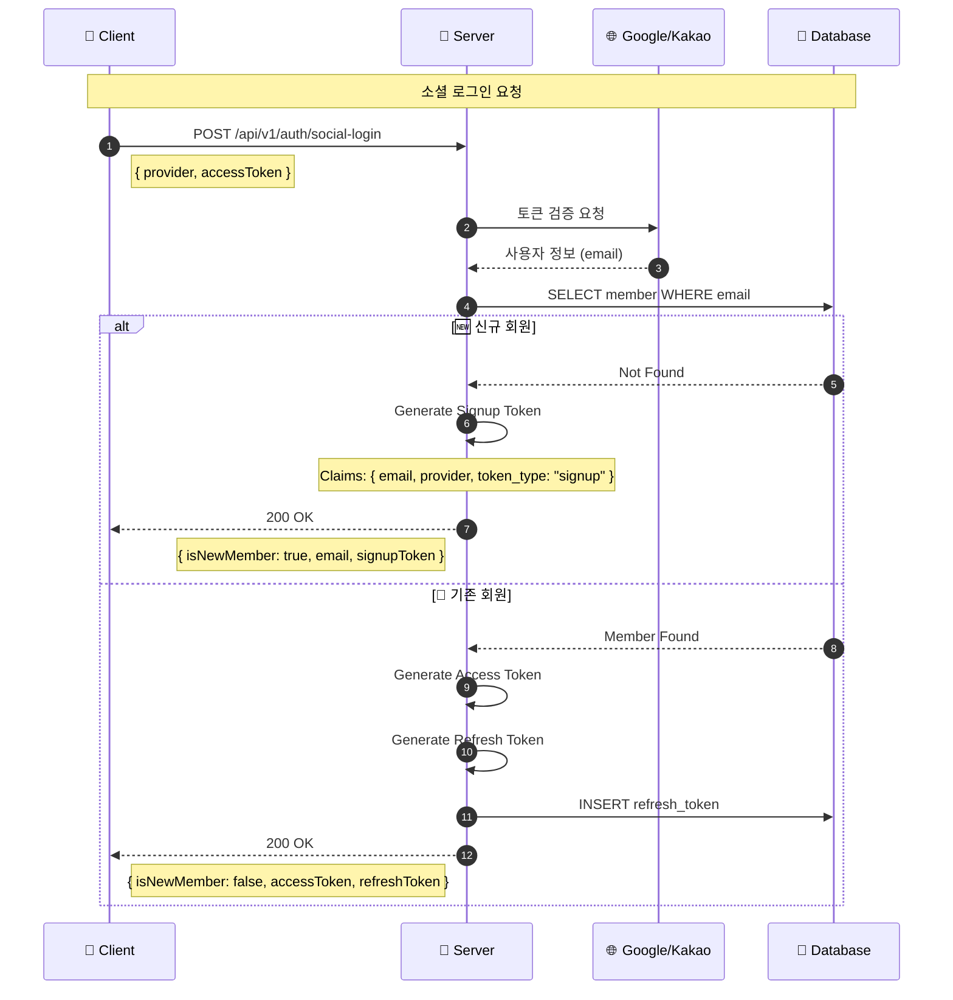
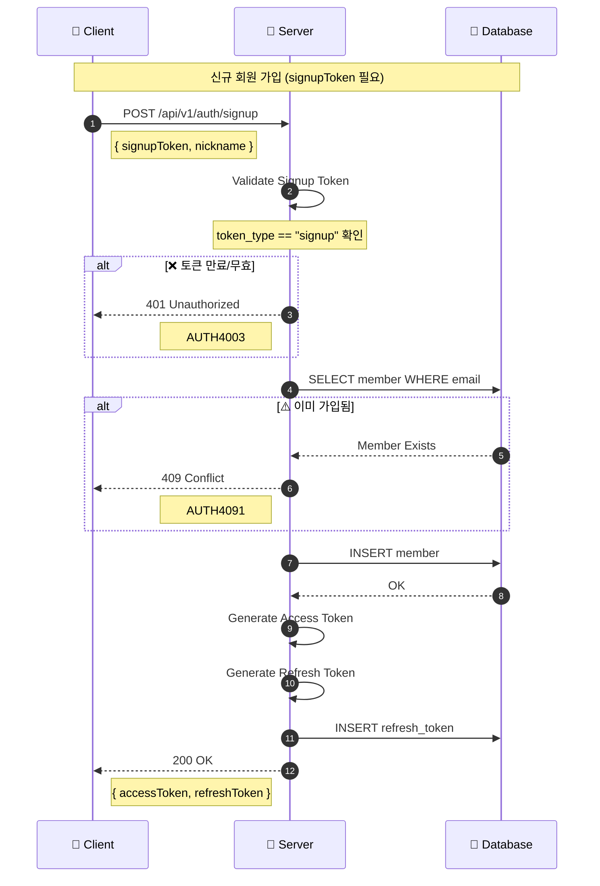
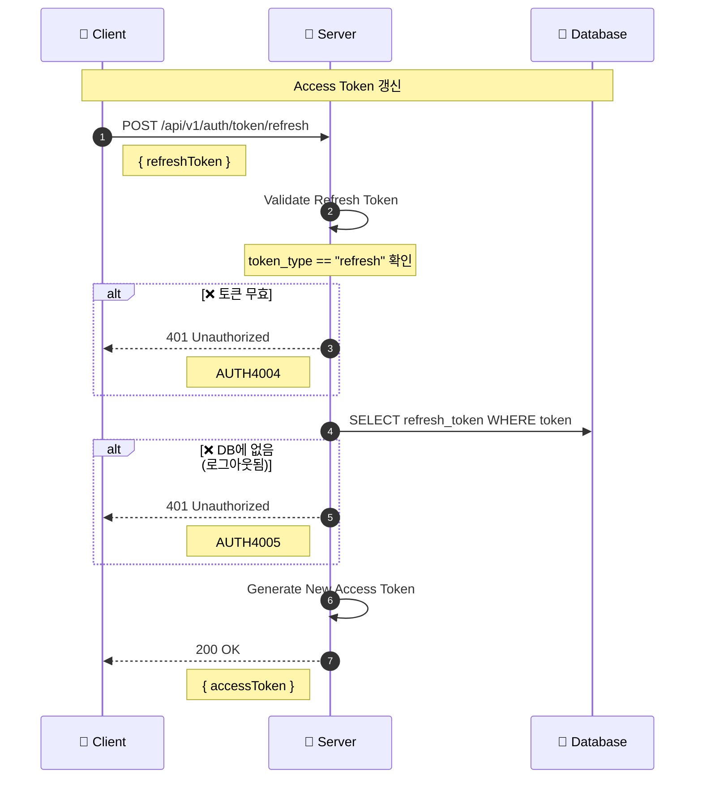
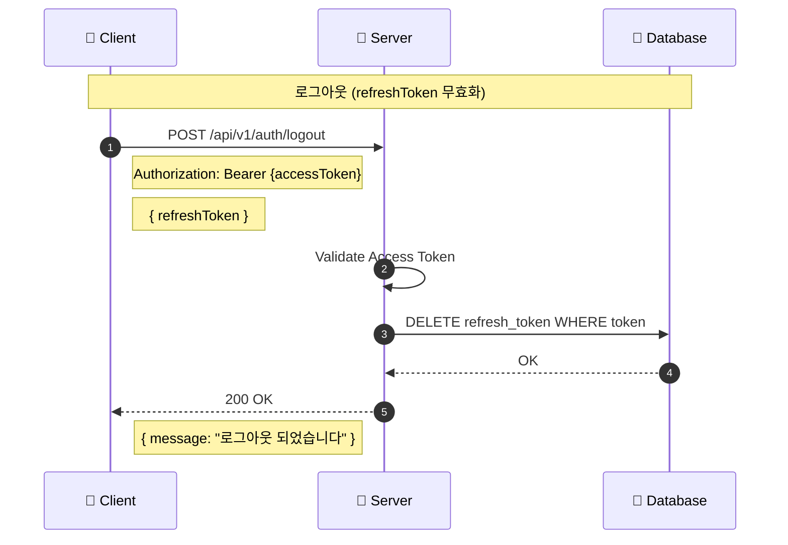
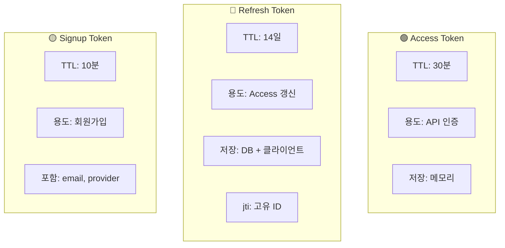
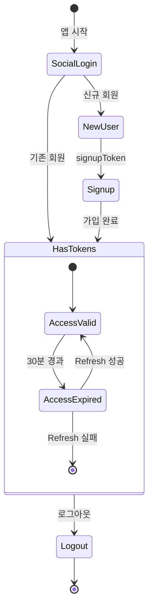

# 🔐 Authentication Flow

> 소셜 로그인부터 로그아웃까지 전체 인증 플로우

---

## 📍 Overview



---

## 1️⃣ 소셜 로그인 (API-001)



### Request / Response

```json
// Request
{
  "provider": "KAKAO",      // KAKAO | GOOGLE
  "accessToken": "소셜_액세스_토큰"
}

// Response (신규 회원)
{
  "isSuccess": true,
  "code": "AUTH2001",
  "result": {
    "isNewMember": true,
    "email": "user@example.com",
    "signupToken": "eyJhbG..."
  }
}

// Response (기존 회원)
{
  "isSuccess": true,
  "code": "COMMON200",
  "result": {
    "isNewMember": false,
    "accessToken": "eyJhbG...",
    "refreshToken": "eyJhbG..."
  }
}
```

---

## 2️⃣ 회원가입 (API-002)



### Request / Response

```json
// Request
{
  "signupToken": "eyJhbG...",
  "nickname": "홍길동"
}

// Response
{
  "isSuccess": true,
  "code": "COMMON200",
  "result": {
    "accessToken": "eyJhbG...",
    "refreshToken": "eyJhbG..."
  }
}
```

---

## 3️⃣ 토큰 갱신 (API-003)



### Request / Response

```json
// Request
{
  "refreshToken": "eyJhbG..."
}

// Response
{
  "isSuccess": true,
  "code": "COMMON200",
  "result": {
    "accessToken": "eyJhbG..."
  }
}
```

---

## 4️⃣ 로그아웃 (API-004)



### Request / Response

```json
// Request
{
  "refreshToken": "eyJhbG..."
}

// Response
{
  "isSuccess": true,
  "code": "COMMON200",
  "result": {
    "message": "로그아웃 되었습니다"
  }
}
```

---

## 🎫 Token Comparison



| 토큰 | 유효기간 | 용도 | 특징 |
|------|---------|------|------|
| **Access** | 30분 | API 인증 | `token_type: "access"` |
| **Refresh** | 14일 | 토큰 갱신 | `jti` 포함, DB 저장 |
| **Signup** | 10분 | 회원가입 | `email`, `provider` 포함 |

---

## 🚨 Error Codes

| Code | HTTP | 상황 | 대응 |
|------|------|------|------|
| AUTH4001 | 401 | 인증 실패 | 재로그인 |
| AUTH4002 | 401 | 무효한 소셜 토큰 | 소셜 재인증 |
| AUTH4003 | 400 | 무효한 회원가입 토큰 | 로그인 재시도 |
| AUTH4004 | 401 | 무효한 리프레시 토큰 | 재로그인 |
| AUTH4005 | 401 | 로그아웃된 토큰 | 재로그인 |
| AUTH4091 | 409 | 이미 가입된 이메일 | 로그인 시도 |

---

## 🔄 Token Lifecycle



---

## 🔗 Related APIs

- [[apis/API-001 소셜 로그인|API-001 소셜 로그인]]
- [[apis/API-002 회원가입|API-002 회원가입]]
- [[apis/API-003 토큰 리프레시|API-003 토큰 리프레시]]
- [[apis/API-004 로그아웃|API-004 로그아웃]]

---

## 🔗 Navigation

- [[00-HOME|🏠 HOME]]
- [[01-Architecture|🏗️ Architecture]]
- [[03-Retrospect-Flow|📝 Retrospect Flow]] →

---

#auth #jwt #token #login #flow
