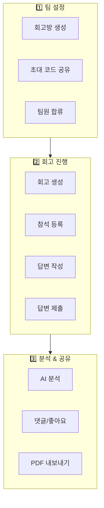
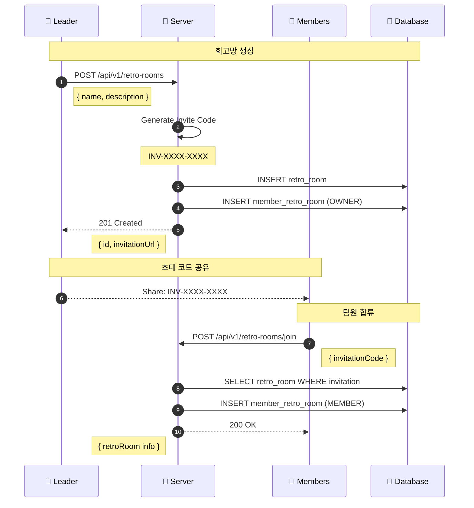
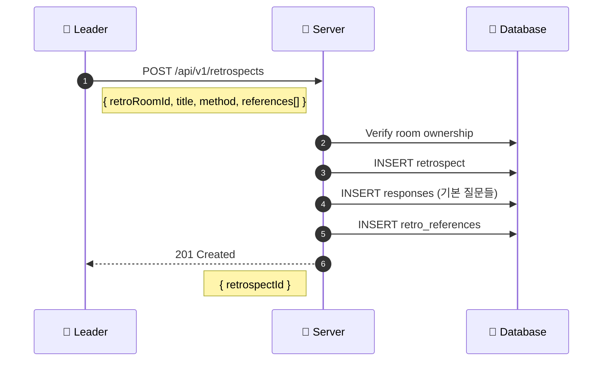
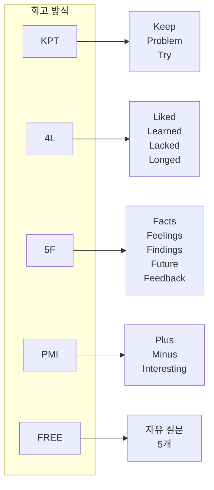
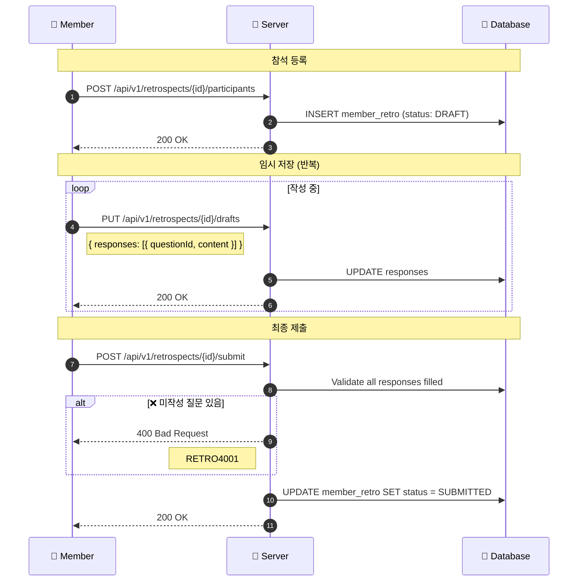
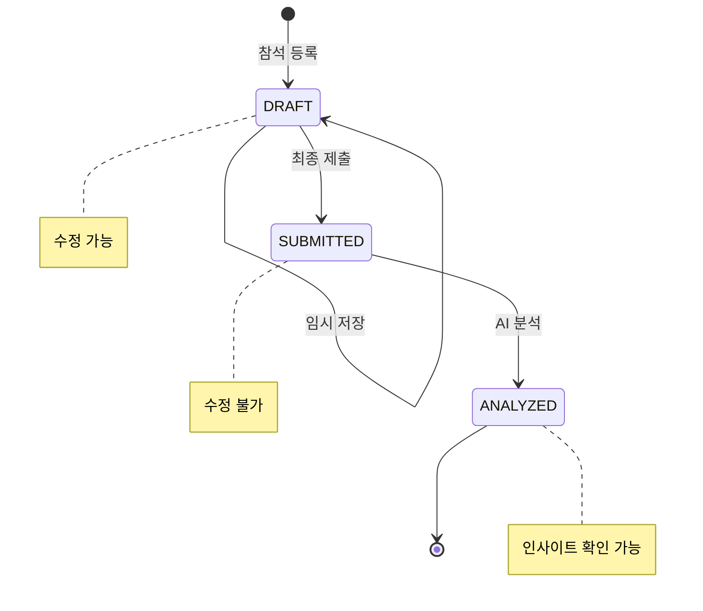
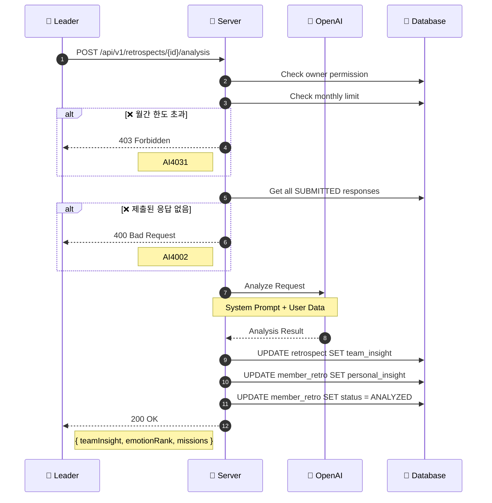
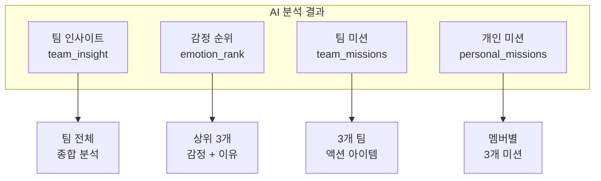
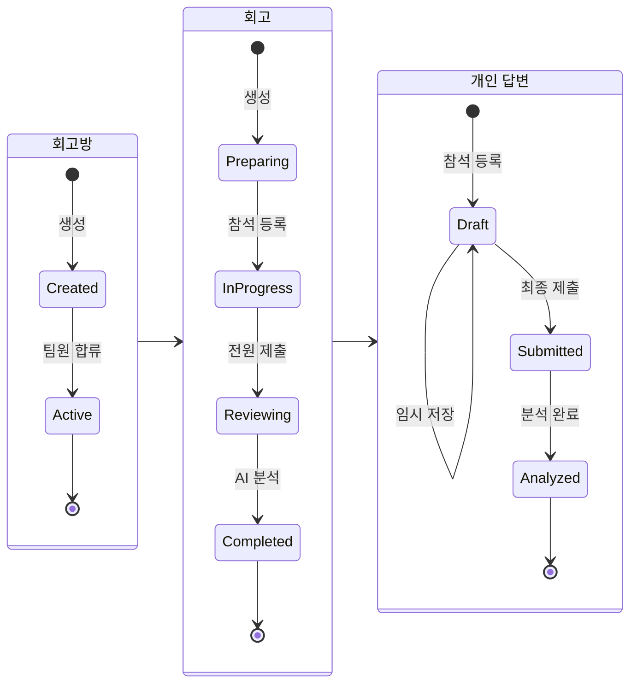
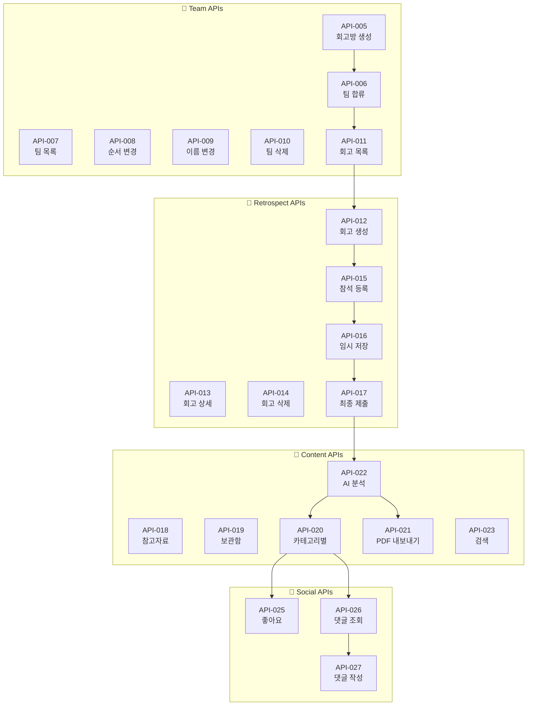

# 📝 Retrospect Flow

> 회고방 생성부터 AI 분석까지 전체 회고 플로우

---

## 📍 Overview



---

## 1️⃣ 팀 설정 Phase

### 회고방 생성 → 팀원 합류



### 초대 코드 형식

```
INV-XXXX-XXXX
     │    │
     │    └── 4자리 랜덤 (A-Z, 0-9)
     └── 4자리 랜덤 (A-Z, 0-9)
```

---

## 2️⃣ 회고 진행 Phase

### 회고 생성



### 회고 방식 (Method)



---

### 답변 작성 → 제출 플로우



### 회고 상태 흐름



---

## 3️⃣ 분석 & 공유 Phase

### AI 분석 플로우



### AI 분석 결과 구조



---

## 📊 전체 상태 다이어그램



---

## 🔄 연관 API 맵



---

## 🔗 Related

- [[00-HOME|🏠 HOME]]
- [[02-Auth-Flow|🔐 Auth Flow]] ←
- [[06-AI-Analysis-Flow|🤖 AI Analysis Flow]] →
- [[08-Team-APIs|👥 Team APIs]]
- [[09-Retrospect-APIs|📝 Retrospect APIs]]

---

#retrospect #flow #team #ai #analysis
