# 📊 Entity Relationship Diagram

> 데이터베이스 스키마 및 엔티티 관계

---

## 📍 Overview

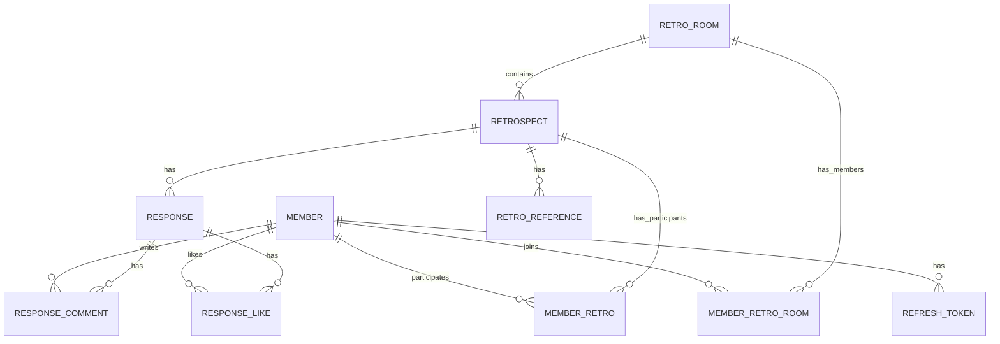

---

## 🧩 Entity Details

### 👤 Member (회원)

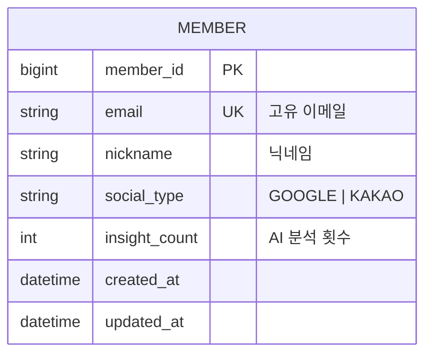

| Field | Type | 설명 |
|-------|------|------|
| `member_id` | BIGINT | PK, Auto Increment |
| `email` | VARCHAR | Unique, 소셜 이메일 |
| `nickname` | VARCHAR | 사용자 닉네임 |
| `social_type` | ENUM | GOOGLE, KAKAO |
| `insight_count` | INT | 월간 AI 분석 횟수 |

---

### 🎫 Refresh Token (토큰)

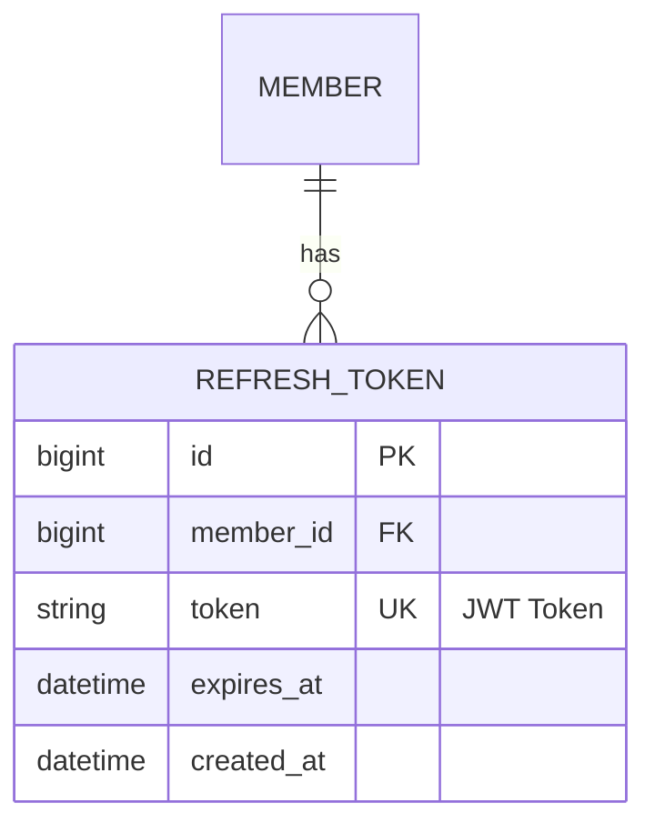

> [!note] 토큰 관리
> - 로그아웃 시 토큰 삭제
> - 토큰 갱신 시 기존 토큰 유지

---

### 🏠 Retro Room (회고방)

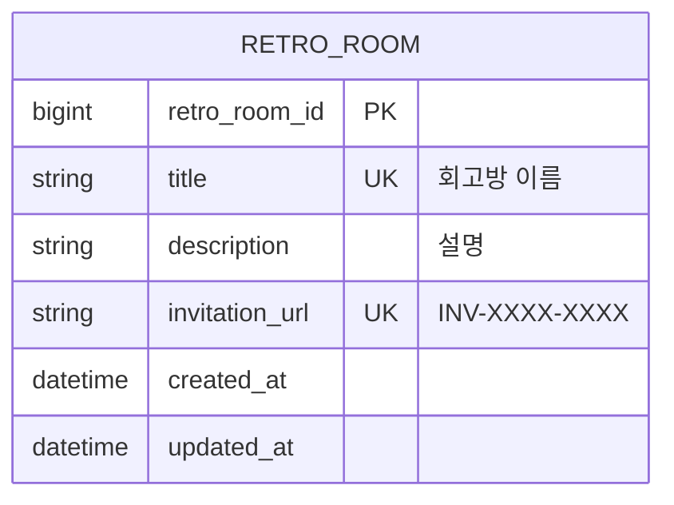

| Field | Type | 설명 |
|-------|------|------|
| `retro_room_id` | BIGINT | PK |
| `title` | VARCHAR | Unique, 회고방 이름 |
| `invitation_url` | VARCHAR | Unique, 초대 코드 |
| `description` | TEXT | 회고방 설명 |

---

### 👥 Member Retro Room (회고방 멤버십)

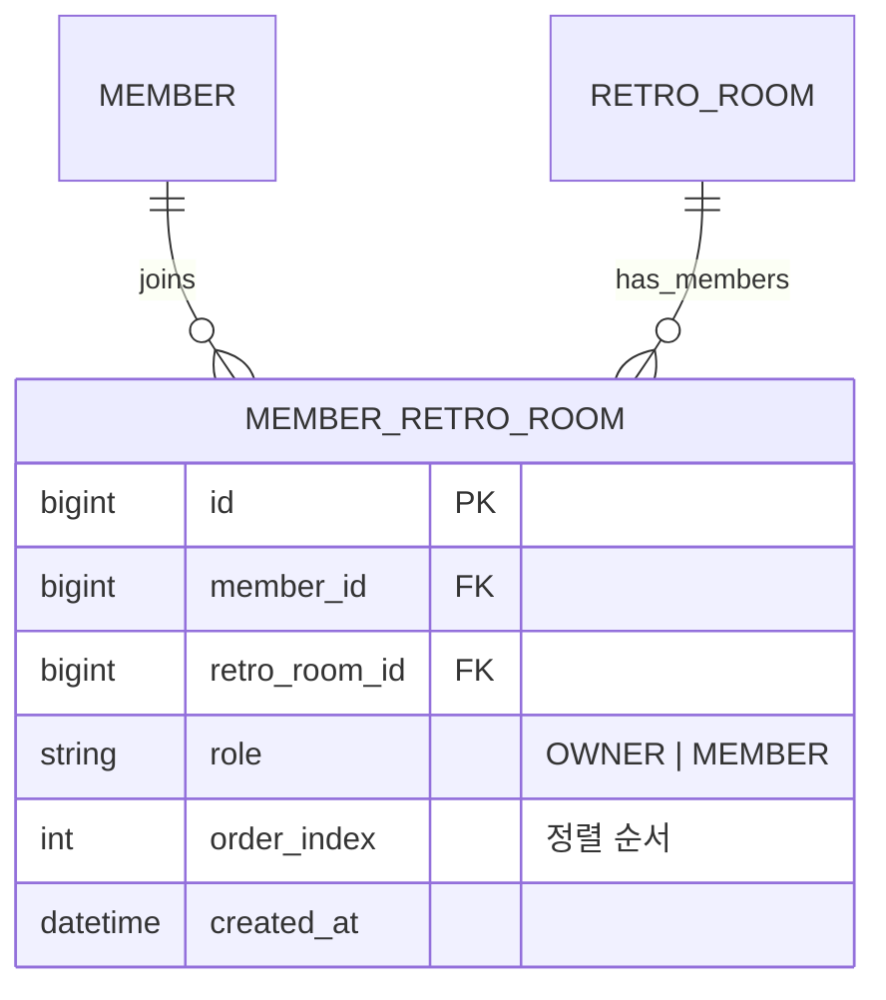

| Role | 권한 |
|------|------|
| `OWNER` | 수정, 삭제, AI 분석 |
| `MEMBER` | 참여만 가능 |

---

### 📝 Retrospect (회고)

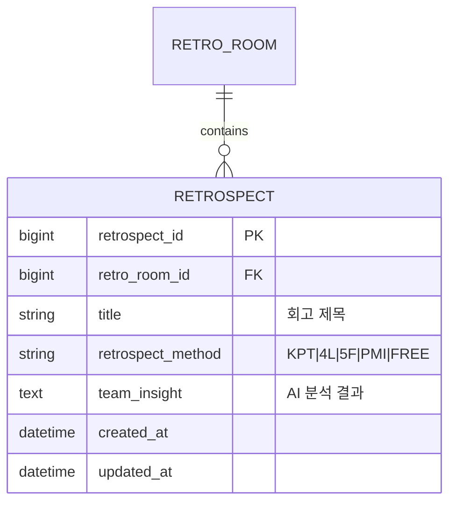

### 회고 방식 (Method)

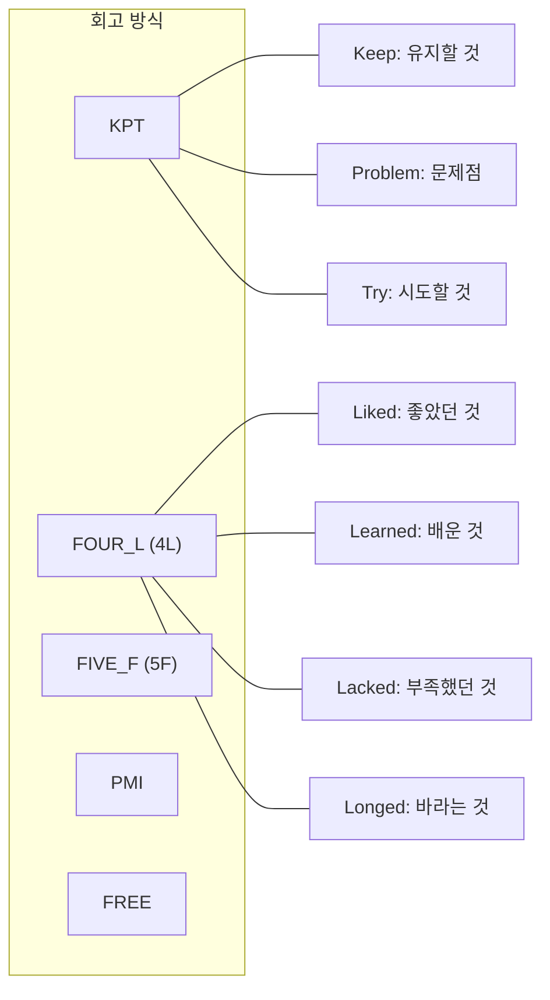

---

### 👤 Member Retro (회고 참여)

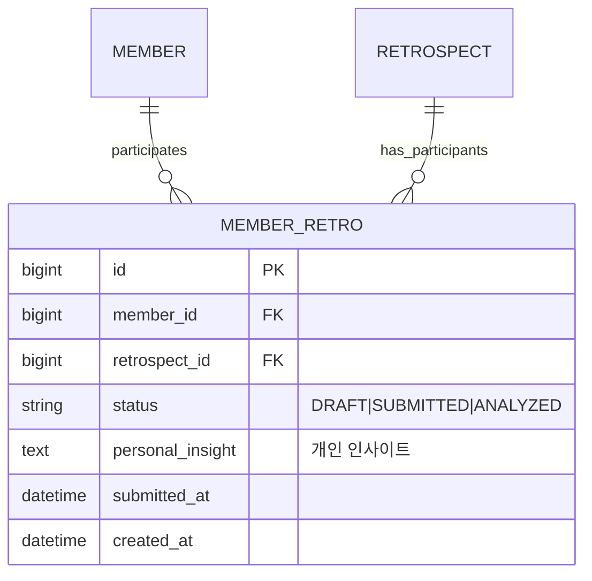

### 참여 상태 흐름

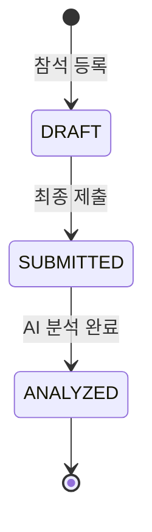

---

### 💬 Response (회고 답변)

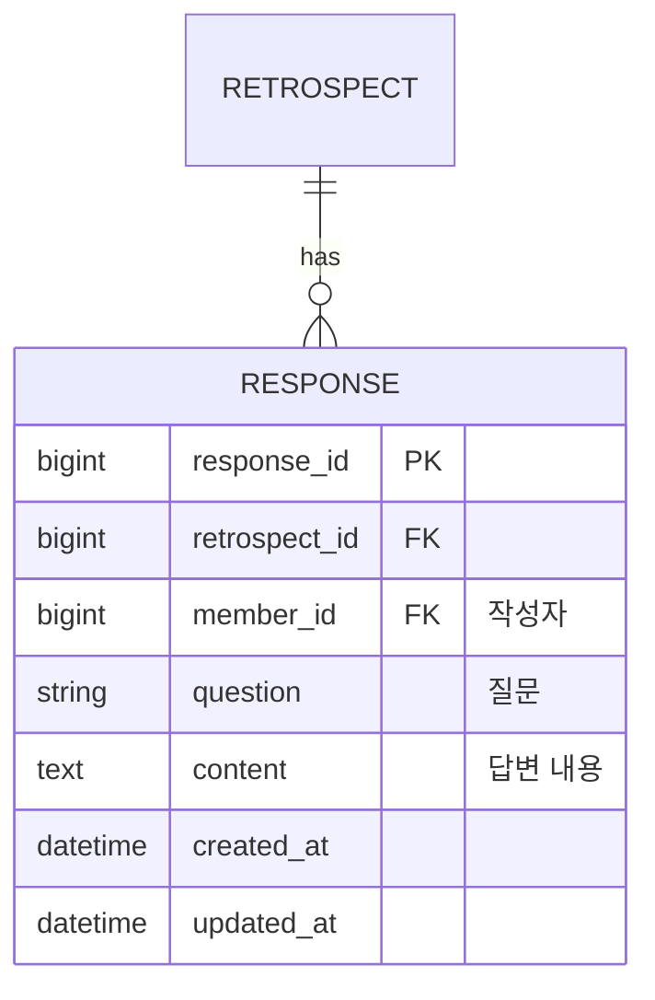

---

### 💭 Response Comment (댓글)

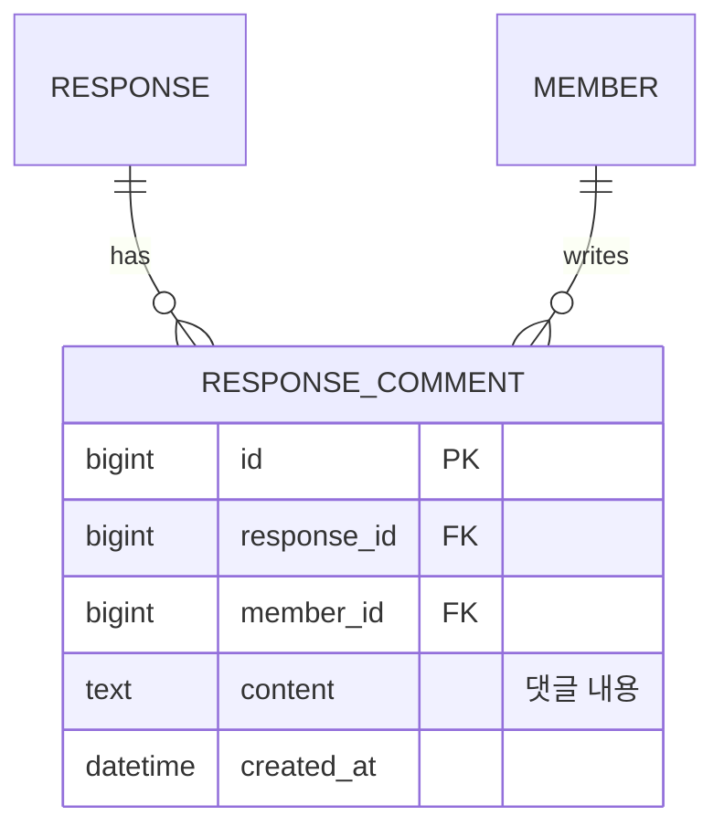

---

### ❤️ Response Like (좋아요)

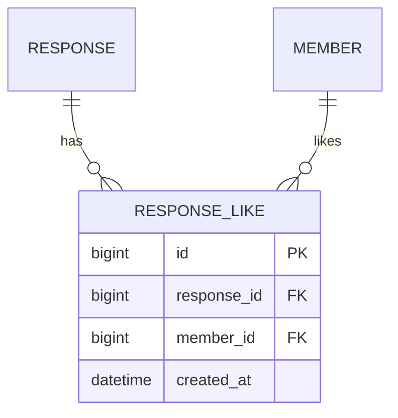

> [!important] Unique Constraint
> `(response_id, member_id)` 조합은 유니크해야 함

---

### 📎 Retro Reference (참고자료)

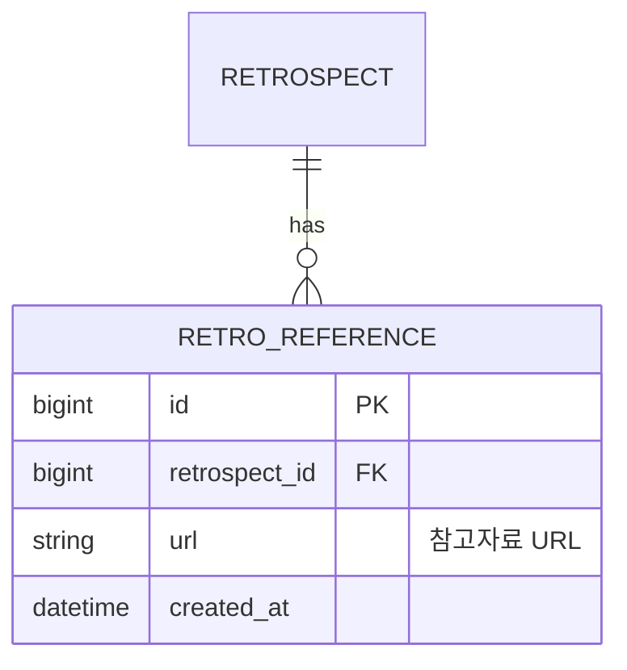

---

## 🗂️ 전체 ERD

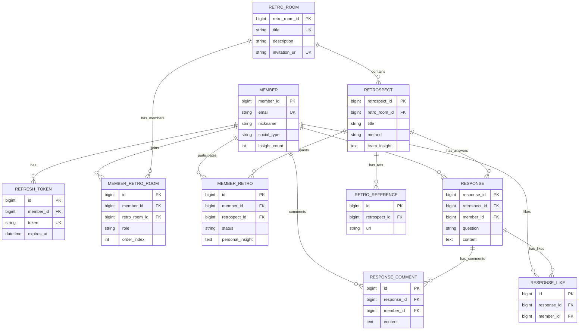

---

## 🔄 Cascade Rules

| Parent | Child | On Delete |
|--------|-------|-----------|
| Member | RefreshToken | CASCADE |
| Member | MemberRetroRoom | SET NULL |
| Member | MemberRetro | SET NULL |
| RetroRoom | Retrospect | CASCADE |
| Retrospect | Response | CASCADE |
| Response | ResponseComment | CASCADE |
| Response | ResponseLike | CASCADE |

---

## 🔗 Related

- [[00-HOME|🏠 HOME]]
- [[01-Architecture|🏗️ Architecture]]
- [[05-API-Overview|🔌 API Overview]]

---

#entity #database #erd #schema
