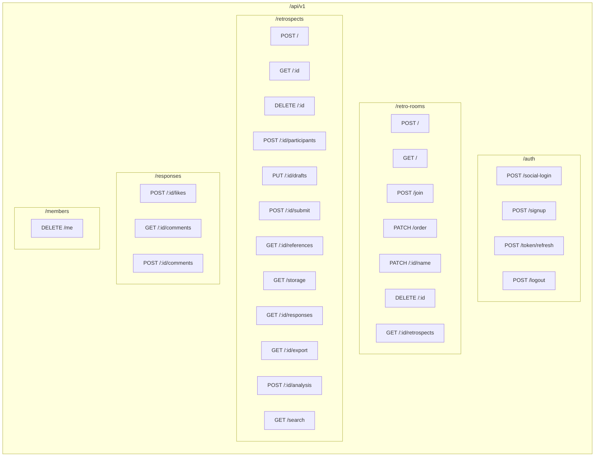
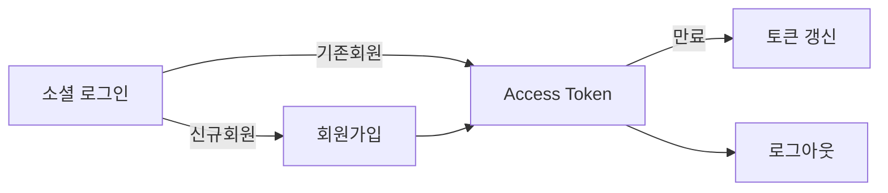
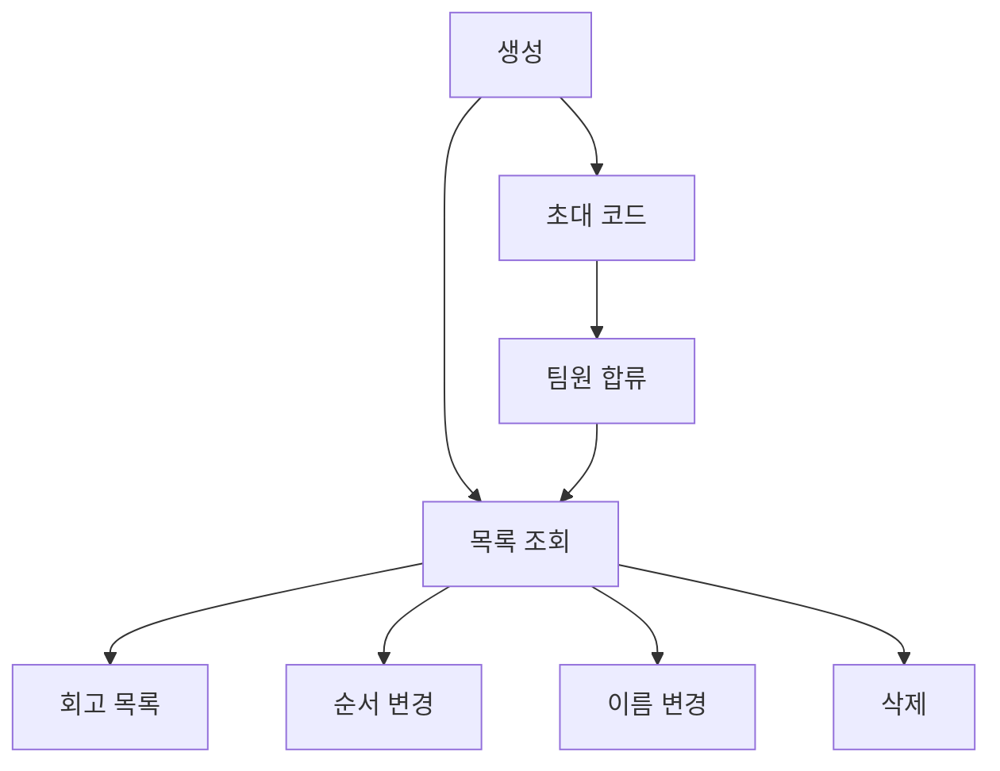
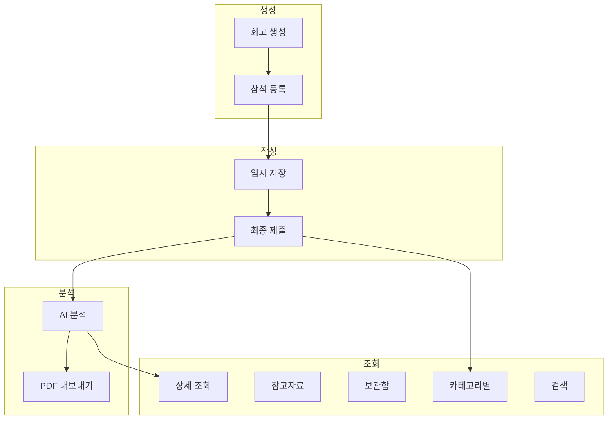
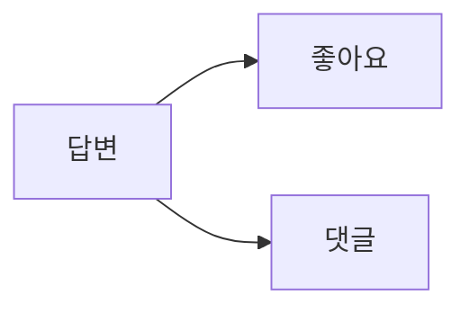
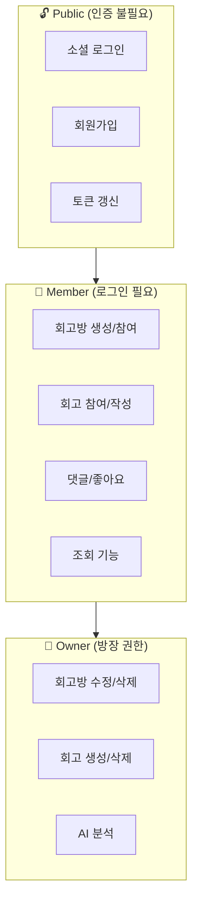
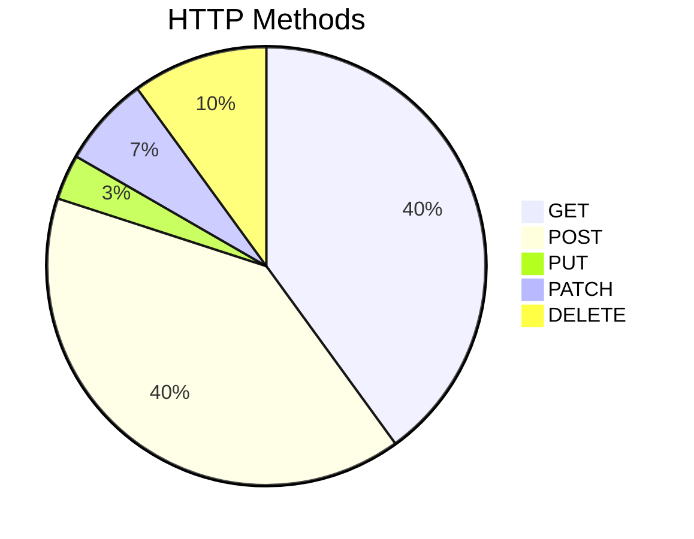

# 🔌 API Overview

> 전체 API 엔드포인트 맵 및 카테고리별 정리

---

## 📍 API Map

---

## 📋 API 전체 목록

### 🔐 Auth (인증)

| ID | Method | Endpoint | 설명 | Auth |
|:--:|:------:|----------|------|:----:|
| 001 | 🟡 POST | `/api/v1/auth/social-login` | 소셜 로그인 | 🔓 |
| 002 | 🟡 POST | `/api/v1/auth/signup` | 회원가입 | 🔓 |
| 003 | 🟡 POST | `/api/v1/auth/token/refresh` | 토큰 갱신 | 🔓 |
| 004 | 🟡 POST | `/api/v1/auth/logout` | 로그아웃 | 🔐 |

→ [[07-Auth-APIs|상세 보기]]

---

### 👥 Team (회고방)

| ID | Method | Endpoint | 설명 | Auth |
|:--:|:------:|----------|------|:----:|
| 005 | 🟡 POST | `/api/v1/retro-rooms` | 회고방 생성 | 🔐 |
| 006 | 🟡 POST | `/api/v1/retro-rooms/join` | 회고방 참여 | 🔐 |
| 007 | 🟢 GET | `/api/v1/retro-rooms` | 회고방 목록 | 🔐 |
| 008 | 🟣 PATCH | `/api/v1/retro-rooms/order` | 순서 변경 | 🔐 |
| 009 | 🟣 PATCH | `/api/v1/retro-rooms/:id/name` | 이름 변경 | 👑 |
| 010 | 🔴 DELETE | `/api/v1/retro-rooms/:id` | 회고방 삭제 | 👑 |
| 011 | 🟢 GET | `/api/v1/retro-rooms/:id/retrospects` | 회고 목록 | 🔐 |

→ [[08-Team-APIs|상세 보기]]

---

### 📝 Retrospect (회고)

| ID | Method | Endpoint | 설명 | Auth |
|:--:|:------:|----------|------|:----:|
| 012 | 🟡 POST | `/api/v1/retrospects` | 회고 생성 | 👑 |
| 013 | 🟢 GET | `/api/v1/retrospects/:id` | 회고 상세 | 🔐 |
| 014 | 🔴 DELETE | `/api/v1/retrospects/:id` | 회고 삭제 | 👑 |
| 015 | 🟡 POST | `/api/v1/retrospects/:id/participants` | 참석 등록 | 🔐 |
| 016 | 🔵 PUT | `/api/v1/retrospects/:id/drafts` | 임시 저장 | 🔐 |
| 017 | 🟡 POST | `/api/v1/retrospects/:id/submit` | 최종 제출 | 🔐 |
| 018 | 🟢 GET | `/api/v1/retrospects/:id/references` | 참고자료 | 🔐 |
| 019 | 🟢 GET | `/api/v1/retrospects/storage` | 보관함 | 🔐 |
| 020 | 🟢 GET | `/api/v1/retrospects/:id/responses` | 카테고리별 답변 | 🔐 |
| 021 | 🟢 GET | `/api/v1/retrospects/:id/export` | PDF 내보내기 | 🔐 |
| 022 | 🟡 POST | `/api/v1/retrospects/:id/analysis` | AI 분석 | 👑 |
| 023 | 🟢 GET | `/api/v1/retrospects/search` | 검색 | 🔐 |

→ [[09-Retrospect-APIs|상세 보기]]

---

### 💬 Social (소셜)

| ID | Method | Endpoint | 설명 | Auth |
|:--:|:------:|----------|------|:----:|
| 026 | 🟡 POST | `/api/v1/responses/:id/likes` | 좋아요 토글 | 🔐 |
| 027 | 🟢 GET | `/api/v1/responses/:id/comments` | 댓글 조회 | 🔐 |
| 028 | 🟡 POST | `/api/v1/responses/:id/comments` | 댓글 작성 | 🔐 |

→ [[10-Social-APIs|상세 보기]]

---

### 👤 Member (회원)

| ID | Method | Endpoint | 설명 | Auth |
|:--:|:------:|----------|------|:----:|
| 025 | 🔴 DELETE | `/api/v1/members/me` | 서비스 탈퇴 | 🔐 |

---

## 🎯 권한 매트릭스

| 권한 | 설명 | API 예시 |
|------|------|---------|
| 🔓 Public | 인증 불필요 | 로그인, 회원가입 |
| 🔐 Member | Access Token 필요 | 대부분의 API |
| 👑 Owner | 회고방 소유자만 | 수정, 삭제, AI 분석 |

---

## 📊 HTTP Method 분포

| Method | 개수 | 용도 |
|--------|------|------|
| 🟢 GET | 12 | 조회 |
| 🟡 POST | 12 | 생성/액션 |
| 🔵 PUT | 1 | 전체 수정 |
| 🟣 PATCH | 2 | 부분 수정 |
| 🔴 DELETE | 3 | 삭제 |

---

## 🚨 공통 에러 코드

| Code | HTTP | 설명 |
|------|------|------|
| COMMON200 | 200 | 성공 |
| COMMON400 | 400 | 잘못된 요청 |
| COMMON401 | 401 | 인증 실패 |
| COMMON403 | 403 | 권한 없음 |
| COMMON404 | 404 | 리소스 없음 |
| COMMON500 | 500 | 서버 에러 |

→ [[11-Error-Codes|에러 코드 전체 목록]]

---

## 🔗 Related

- [[00-HOME|🏠 HOME]]
- [[01-Architecture|🏗️ Architecture]]
- [[apis/MOC|📑 API 목록 (MOC)]]

---

#api #endpoint #overview #map
