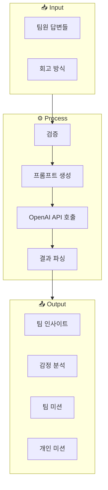
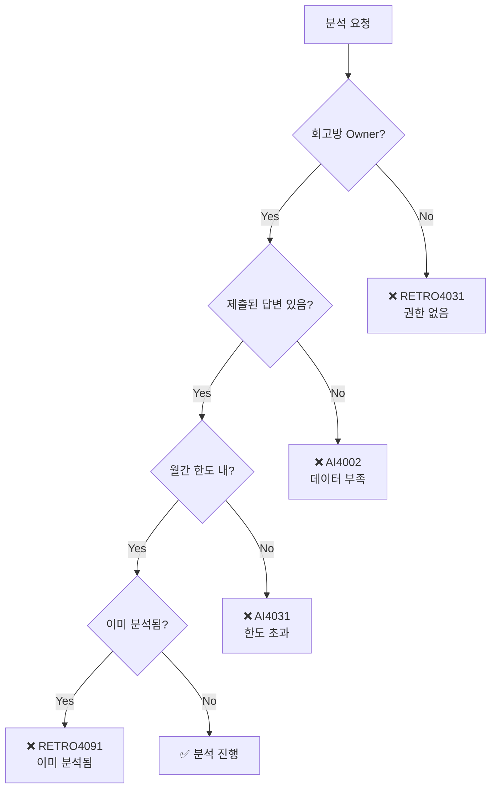
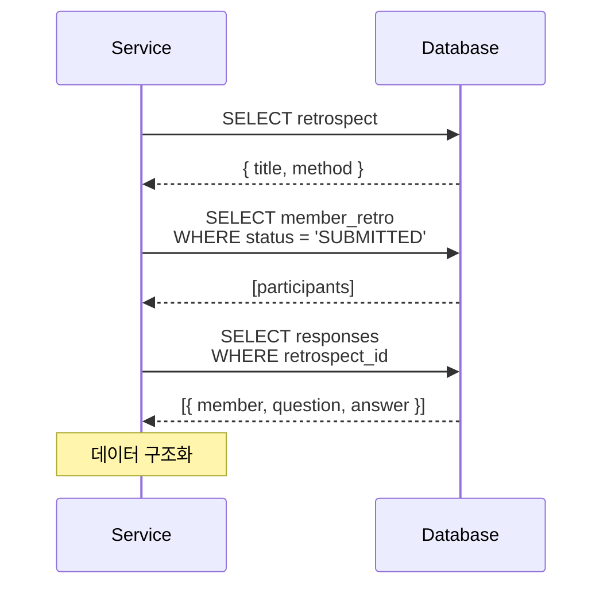
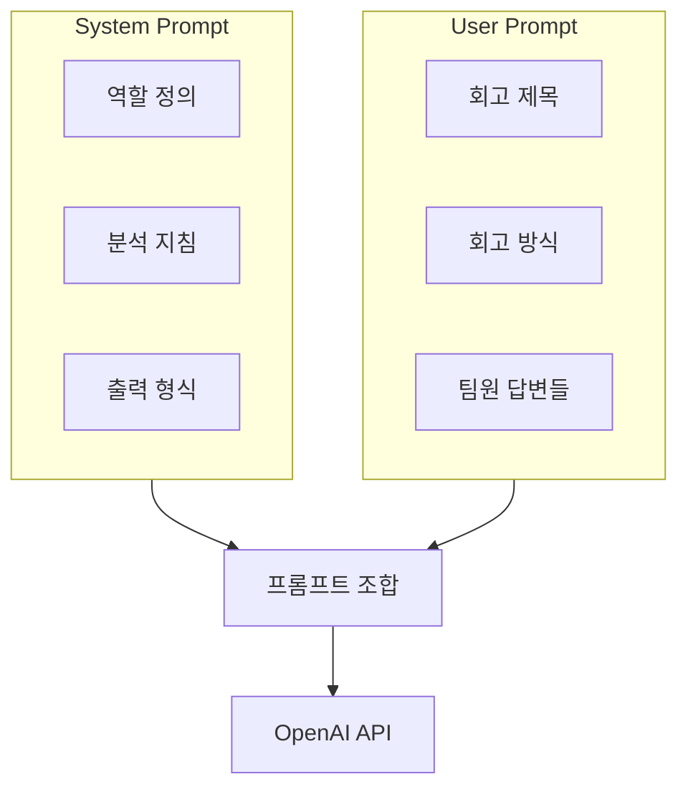
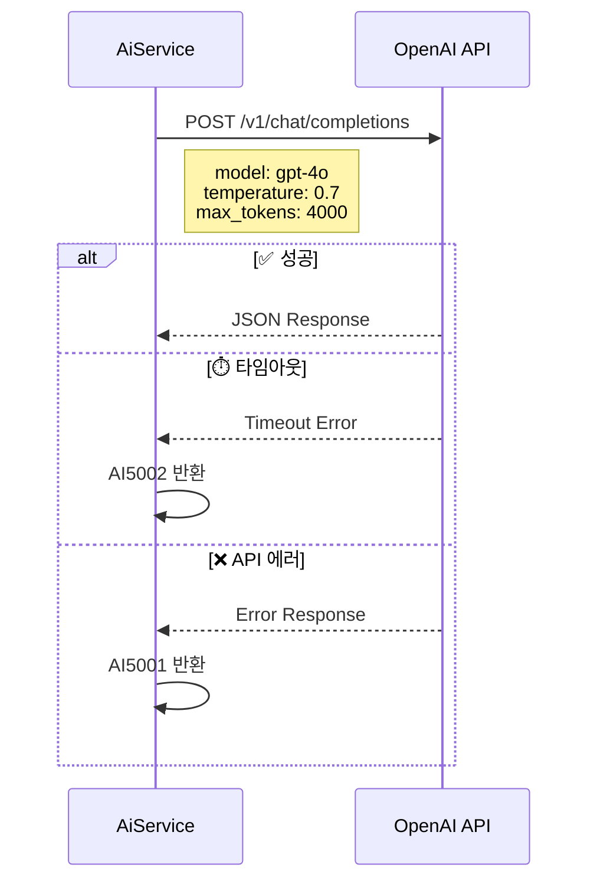
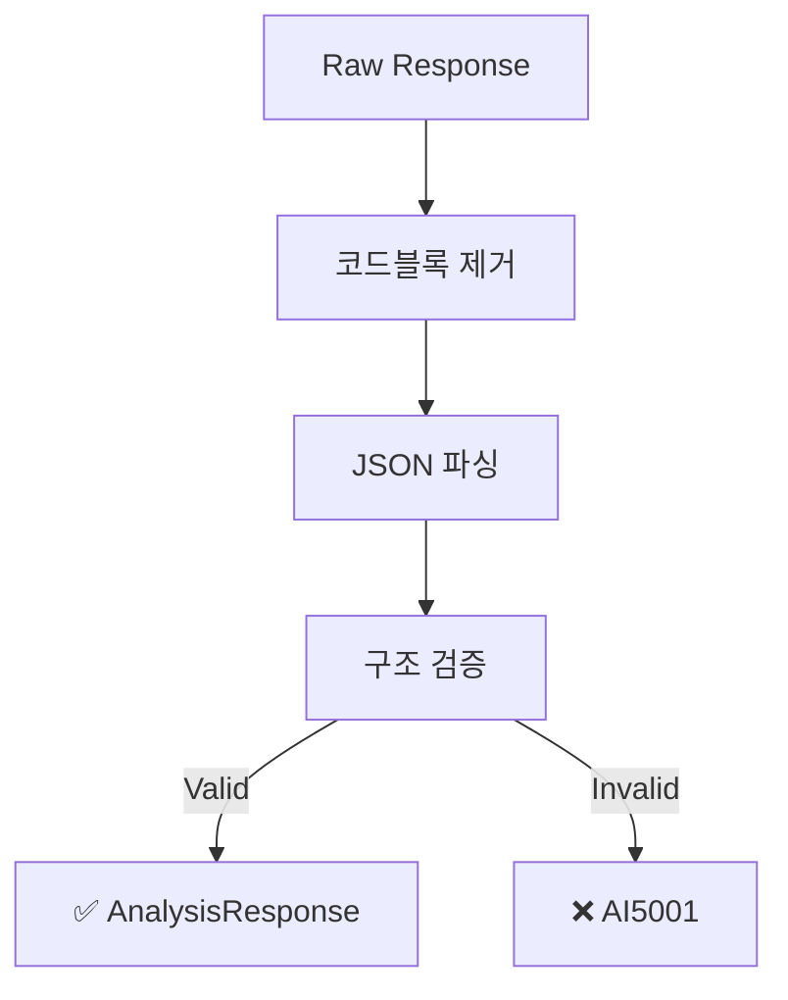
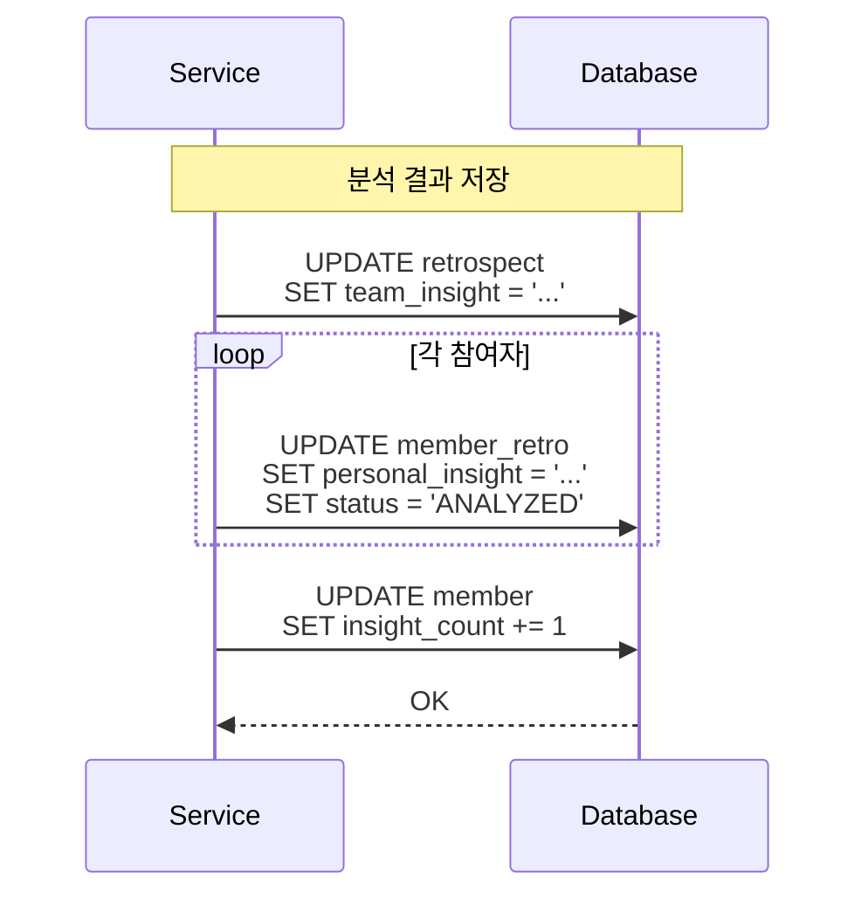
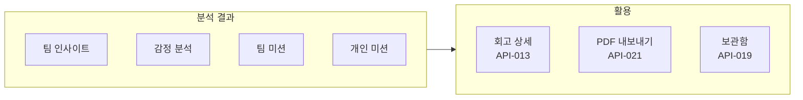
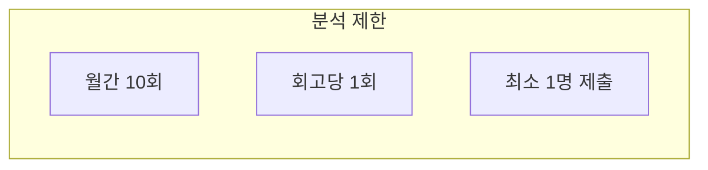

# 🤖 AI Analysis Flow

> OpenAI를 활용한 회고 분석 상세 플로우

---

## 📍 Overview



---

## 1️⃣ 분석 요청 조건



### 분석 조건 요약

| 조건 | 에러 코드 | 설명 |
|------|----------|------|
| Owner 권한 | RETRO4031 | 회고방 소유자만 분석 가능 |
| 제출된 답변 | AI4002 | 최소 1명 이상 제출 필요 |
| 월간 한도 | AI4031 | 월 10회 제한 |
| 중복 분석 | RETRO4091 | 회고당 1회만 분석 |

---

## 2️⃣ 데이터 수집



### 수집 데이터 구조

```json
{
  "retrospect": {
    "title": "스프린트 1 회고",
    "method": "KPT"
  },
  "participants": [
    {
      "memberId": 1,
      "nickname": "홍길동",
      "responses": [
        {
          "question": "Keep: 유지할 점은?",
          "content": "팀 커뮤니케이션이 잘 되었습니다..."
        }
      ]
    }
  ]
}
```

---

## 3️⃣ 프롬프트 구성



### System Prompt 구조

```
당신은 회고 분석 전문가입니다.

분석 지침:
1. 팀 전체의 핵심 인사이트를 도출하세요
2. 팀원들의 감정을 분석하세요
3. 실행 가능한 미션을 제안하세요

출력 형식:
- JSON 형식으로 응답
- 한국어로 작성
- 구체적이고 실행 가능한 내용
```

### User Prompt 예시

```
회고 제목: 스프린트 1 회고
회고 방식: KPT

팀원 답변:
---
[홍길동]
Keep: 팀 커뮤니케이션이 잘 되었습니다...
Problem: 일정 관리가 어려웠습니다...
Try: 데일리 스크럼을 도입하고 싶습니다...
---
[김철수]
Keep: 코드 리뷰 문화가 좋았습니다...
...
```

---

## 4️⃣ OpenAI API 호출



### API 설정

| Parameter | Value | 설명 |
|-----------|-------|------|
| model | gpt-4o | 최신 모델 |
| temperature | 0.7 | 창의성 수준 |
| max_tokens | 4000 | 최대 응답 길이 |
| timeout | 60s | 타임아웃 |

---

## 5️⃣ 응답 파싱



### 응답 구조

```json
{
  "teamInsight": "이번 스프린트에서 팀은 커뮤니케이션 측면에서...",
  "emotionRank": [
    {
      "emotion": "성취감",
      "reason": "목표한 기능을 모두 완성했기 때문"
    },
    {
      "emotion": "피로감",
      "reason": "연속된 야근으로 인한 체력 소모"
    },
    {
      "emotion": "기대감",
      "reason": "다음 스프린트에 대한 새로운 도전"
    }
  ],
  "teamMissions": [
    {
      "mission": "데일리 스크럼 15분 제한",
      "description": "효율적인 미팅을 위해 시간을 엄수합니다"
    }
  ],
  "personalMissions": [
    {
      "memberId": 1,
      "nickname": "홍길동",
      "missions": [
        {
          "mission": "문서화 습관 기르기",
          "description": "작업 내용을 꼼꼼히 기록합니다"
        }
      ]
    }
  ]
}
```

---

## 6️⃣ 결과 저장



---

## 📊 분석 결과 활용



---

## 🚨 에러 처리

| Code | HTTP | 상황 | 대응 |
|------|------|------|------|
| AI4002 | 400 | 데이터 부족 | 답변 제출 유도 |
| AI4031 | 403 | 월간 한도 초과 | 다음 달까지 대기 |
| AI5001 | 500 | 분석 실패 | 재시도 |
| AI5002 | 500 | 연결 실패 | 잠시 후 재시도 |
| AI5031 | 503 | 서비스 불가 | 관리자 문의 |

---

## 📈 분석 제한



| 제한 | 값 | 설명 |
|------|---|------|
| 월간 한도 | 10회 | 사용자별 월 10회 |
| 회고당 | 1회 | 중복 분석 불가 |
| 최소 데이터 | 1명 | 제출된 답변 필요 |

---

## 🔗 Related

- [[00-HOME|🏠 HOME]]
- [[03-Retrospect-Flow|📝 Retrospect Flow]]
- [[apis/API-023 AI 분석|API-022 AI 분석]]
- [[09-Retrospect-APIs|📝 Retrospect APIs]]

---

#ai #openai #analysis #flow
