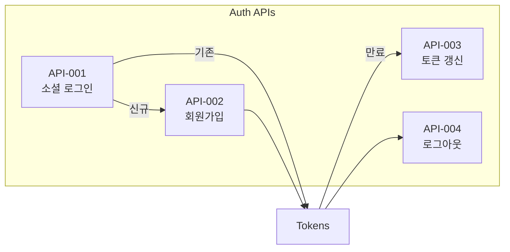
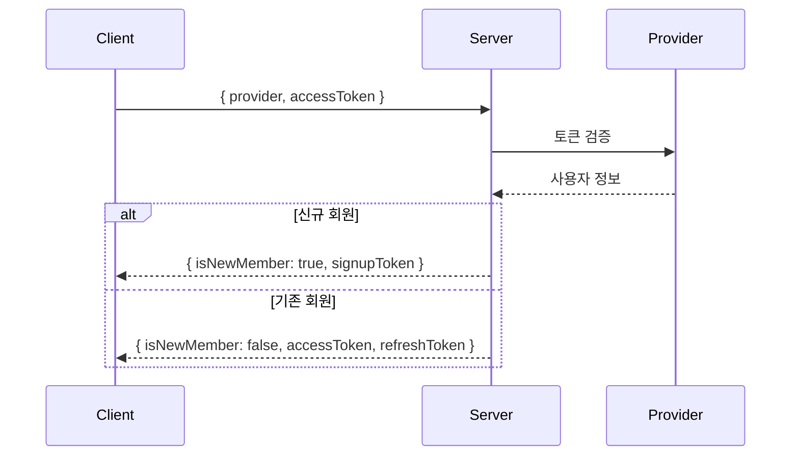
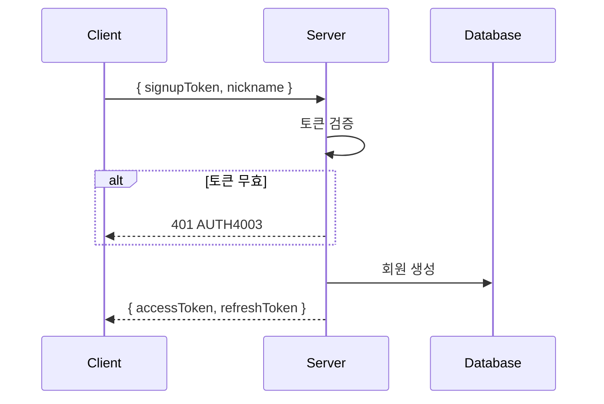
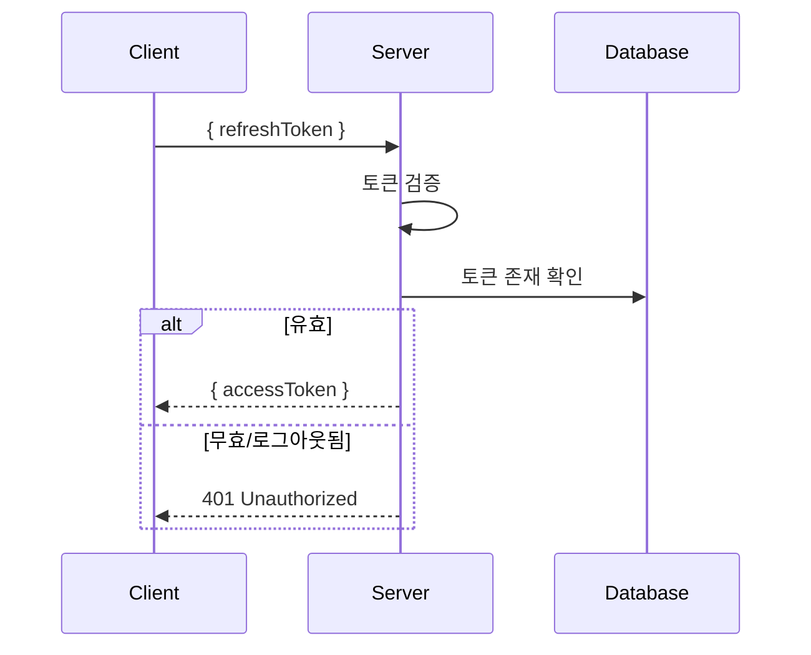
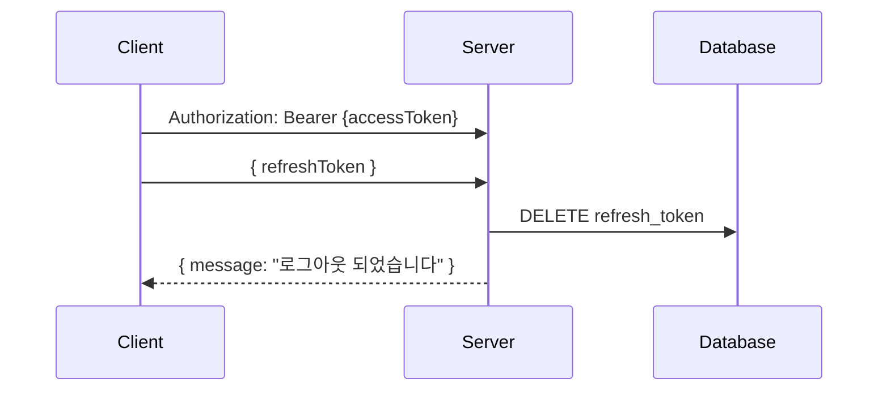
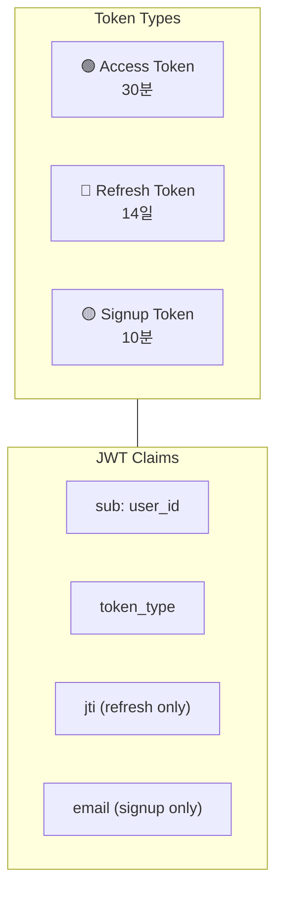

# 🔐 Auth APIs

> 인증 관련 API 상세 명세

---

## 📍 Overview



---

## API-001 소셜 로그인

> `POST /api/v1/auth/social-login`

### 흐름



### Request

```json
{
  "provider": "KAKAO",       // KAKAO | GOOGLE
  "accessToken": "소셜_토큰"
}
```

### Response

| 상황 | Code | Response |
|------|------|----------|
| 신규 | AUTH2001 | `isNewMember: true, signupToken` |
| 기존 | COMMON200 | `isNewMember: false, accessToken, refreshToken` |

### Errors

| Code | HTTP | 설명 |
|------|------|------|
| AUTH4002 | 401 | 유효하지 않은 소셜 토큰 |

→ [[apis/API-001 소셜 로그인|상세 문서]]

---

## API-002 회원가입

> `POST /api/v1/auth/signup`

### 흐름



### Request

```json
{
  "signupToken": "eyJhbG...",
  "nickname": "홍길동"
}
```

### Response

```json
{
  "isSuccess": true,
  "code": "COMMON200",
  "result": {
    "accessToken": "eyJhbG...",
    "refreshToken": "eyJhbG..."
  }
}
```

### Errors

| Code | HTTP | 설명 |
|------|------|------|
| AUTH4003 | 400 | 유효하지 않은 회원가입 토큰 |
| AUTH4091 | 409 | 이미 가입된 이메일 |

→ [[apis/API-002 회원가입|상세 문서]]

---

## API-003 토큰 리프레시

> `POST /api/v1/auth/token/refresh`

### 흐름



### Request

```json
{
  "refreshToken": "eyJhbG..."
}
```

### Response

```json
{
  "isSuccess": true,
  "code": "COMMON200",
  "result": {
    "accessToken": "eyJhbG..."
  }
}
```

### Errors

| Code | HTTP | 설명 |
|------|------|------|
| AUTH4004 | 401 | 유효하지 않은 리프레시 토큰 |
| AUTH4005 | 401 | 로그아웃된 토큰 |

→ [[apis/API-003 토큰 리프레시|상세 문서]]

---

## API-004 로그아웃

> `POST /api/v1/auth/logout`

### 흐름



### Headers

```
Authorization: Bearer {accessToken}
```

### Request

```json
{
  "refreshToken": "eyJhbG..."
}
```

### Response

```json
{
  "isSuccess": true,
  "code": "COMMON200",
  "result": {
    "message": "로그아웃 되었습니다"
  }
}
```

→ [[apis/API-004 로그아웃|상세 문서]]

---

## 🎫 Token Summary



| Token | TTL | 용도 | 특징 |
|-------|-----|------|------|
| Access | 30분 | API 인증 | `token_type: "access"` |
| Refresh | 14일 | 토큰 갱신 | `jti` 포함, DB 저장 |
| Signup | 10분 | 회원가입 | `email`, `provider` 포함 |

---

## 🚨 Error Codes

| Code | HTTP | 설명 | 대응 |
|------|------|------|------|
| AUTH2001 | 200 | 신규 회원 | 회원가입 진행 |
| AUTH4001 | 401 | 인증 실패 | 재로그인 |
| AUTH4002 | 401 | 무효한 소셜 토큰 | 소셜 재인증 |
| AUTH4003 | 400 | 무효한 회원가입 토큰 | 로그인 재시도 |
| AUTH4004 | 401 | 무효한 리프레시 토큰 | 재로그인 |
| AUTH4005 | 401 | 로그아웃된 토큰 | 재로그인 |
| AUTH4091 | 409 | 이미 가입된 이메일 | 로그인 시도 |

---

## 🔗 Related

- [[00-HOME|🏠 HOME]]
- [[02-Auth-Flow|🔐 Auth Flow]]
- [[05-API-Overview|🔌 API Overview]]

---

#auth #api #login #token
