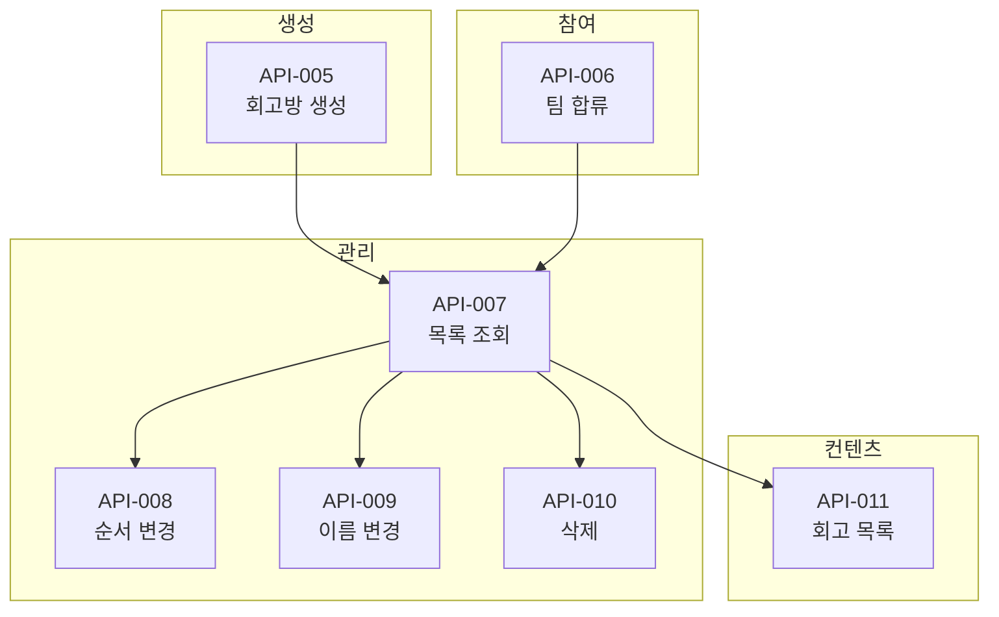
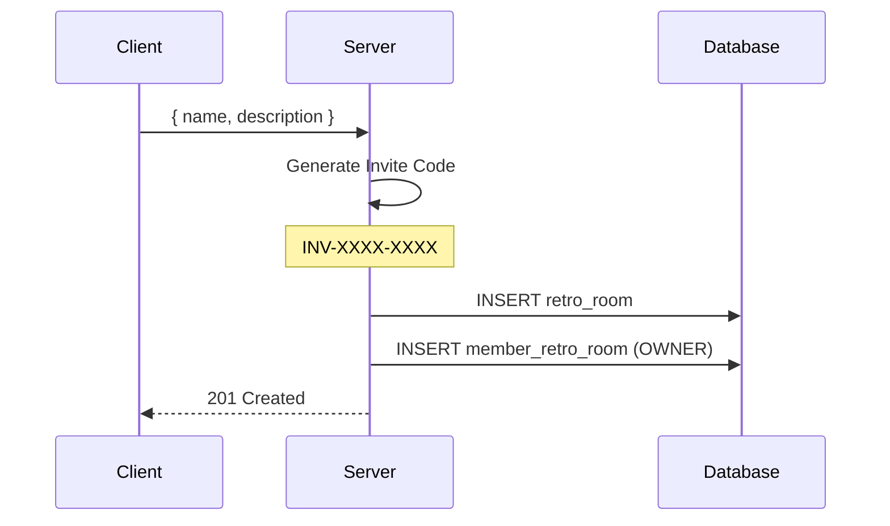
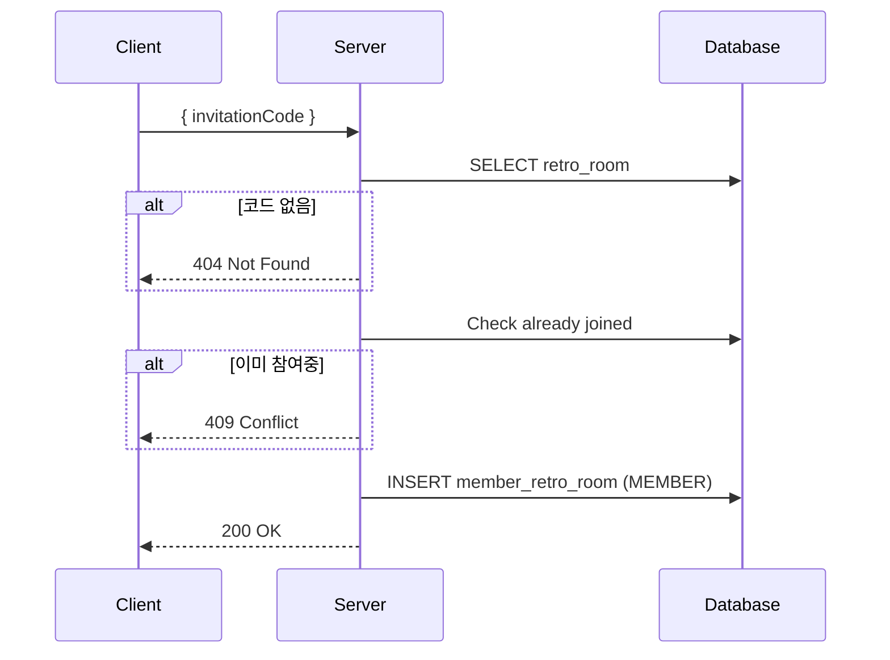
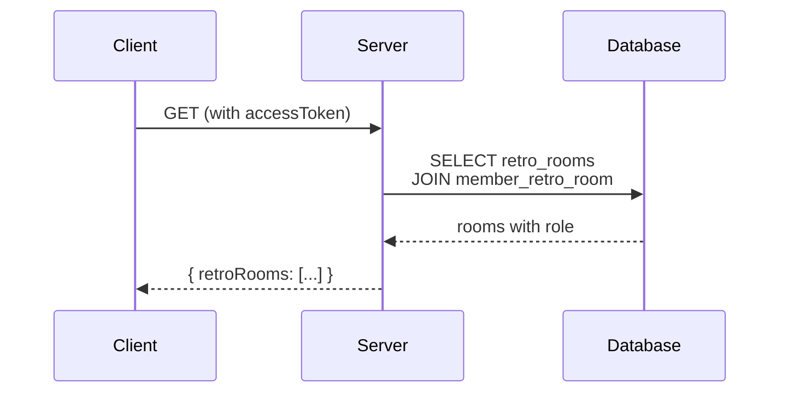
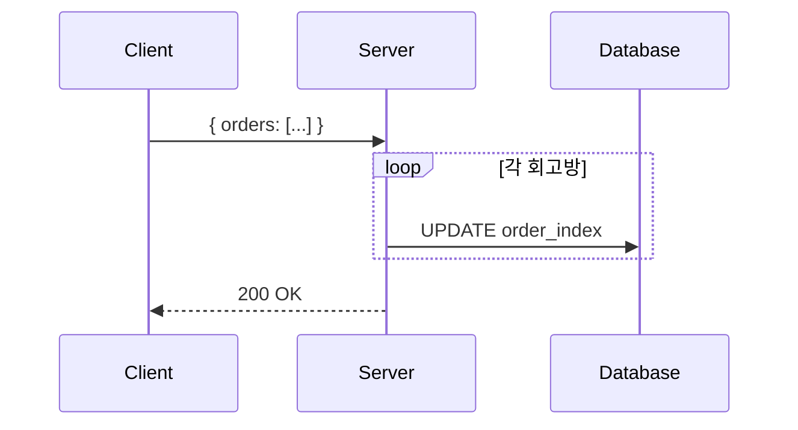
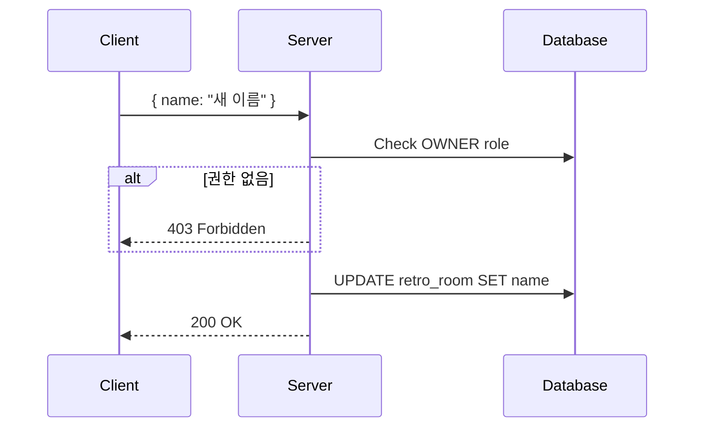
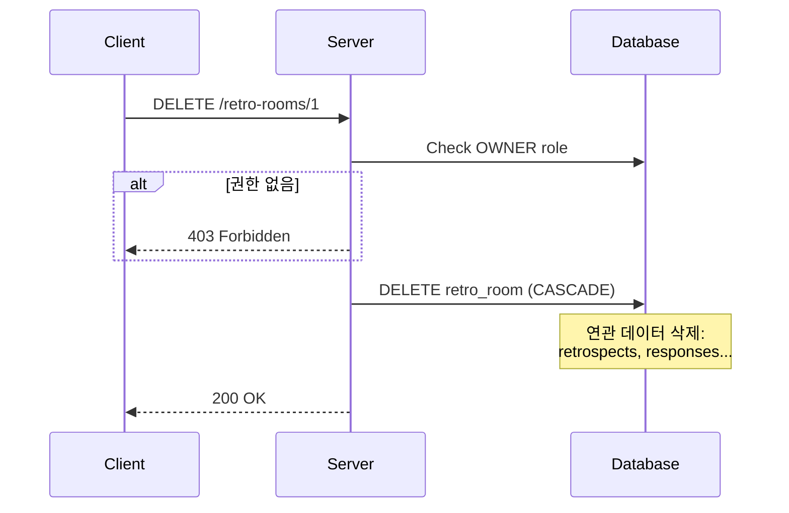
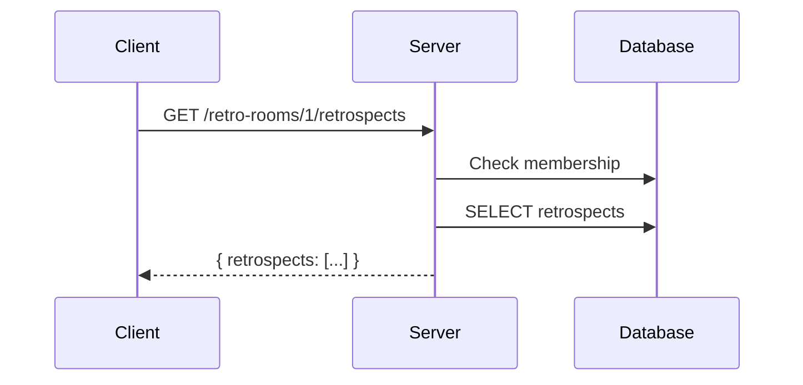
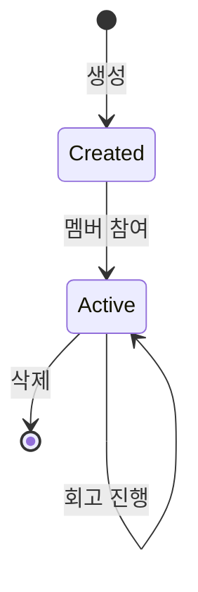

# 👥 Team APIs

> 회고방(팀) 관련 API 상세 명세

---

## 📍 Overview



---

## 권한 매트릭스

| API | Member | Owner |
|-----|:------:|:-----:|
| 회고방 생성 | ✅ | - |
| 팀 합류 | ✅ | - |
| 목록 조회 | ✅ | ✅ |
| 순서 변경 | ✅ | ✅ |
| 이름 변경 | ❌ | ✅ |
| 회고방 삭제 | ❌ | ✅ |
| 회고 목록 | ✅ | ✅ |

---

## API-005 회고방 생성

> `POST /api/v1/retro-rooms` 🔐

### 흐름



### Request

```json
{
  "name": "우리 팀 회고방",
  "description": "스프린트 회고를 위한 공간입니다"
}
```

### Response

```json
{
  "isSuccess": true,
  "code": "COMMON200",
  "result": {
    "retroRoomId": 1,
    "name": "우리 팀 회고방",
    "invitationUrl": "INV-A1B2-C3D4"
  }
}
```

→ [[apis/API-005 팀 생성|상세 문서]]

---

## API-006 팀 합류

> `POST /api/v1/retro-rooms/join` 🔐

### 흐름



### Request

```json
{
  "invitationCode": "INV-A1B2-C3D4"
}
```

### Response

```json
{
  "isSuccess": true,
  "code": "COMMON200",
  "result": {
    "retroRoomId": 1,
    "name": "우리 팀 회고방"
  }
}
```

### Errors

| Code | HTTP | 설명 |
|------|------|------|
| RETRO4041 | 404 | 존재하지 않는 초대 코드 |
| RETRO4091 | 409 | 이미 참여한 회고방 |

→ [[apis/API-006 팀 합류|상세 문서]]

---

## API-007 팀 목록

> `GET /api/v1/retro-rooms` 🔐

### 흐름



### Response

```json
{
  "isSuccess": true,
  "code": "COMMON200",
  "result": {
    "retroRooms": [
      {
        "retroRoomId": 1,
        "name": "우리 팀 회고방",
        "role": "OWNER",
        "orderIndex": 0,
        "memberCount": 5
      }
    ]
  }
}
```

→ [[apis/API-007 팀 목록|상세 문서]]

---

## API-008 팀 순서 변경

> `PATCH /api/v1/retro-rooms/order` 🔐

### 흐름



### Request

```json
{
  "orders": [
    { "retroRoomId": 3, "orderIndex": 0 },
    { "retroRoomId": 1, "orderIndex": 1 },
    { "retroRoomId": 2, "orderIndex": 2 }
  ]
}
```

→ [[apis/API-008 팀 순서 변경|상세 문서]]

---

## API-009 팀 이름 변경

> `PATCH /api/v1/retro-rooms/:id/name` 👑

### 흐름



### Request

```json
{
  "name": "새로운 회고방 이름"
}
```

### Errors

| Code | HTTP | 설명 |
|------|------|------|
| RETRO4031 | 403 | 회고방 수정 권한 없음 |

→ [[apis/API-009 팀 이름 변경|상세 문서]]

---

## API-010 팀 삭제

> `DELETE /api/v1/retro-rooms/:id` 👑

### 흐름



### Errors

| Code | HTTP | 설명 |
|------|------|------|
| RETRO4031 | 403 | 회고방 삭제 권한 없음 |

→ [[apis/API-010 팀 삭제|상세 문서]]

---

## API-011 회고 목록

> `GET /api/v1/retro-rooms/:id/retrospects` 🔐

### 흐름



### Response

```json
{
  "isSuccess": true,
  "code": "COMMON200",
  "result": {
    "retrospects": [
      {
        "retrospectId": 1,
        "title": "스프린트 1 회고",
        "method": "KPT",
        "status": "ANALYZED",
        "participantCount": 5,
        "createdAt": "2024-01-15T10:00:00Z"
      }
    ]
  }
}
```

→ [[apis/API-011 팀 회고 목록|상세 문서]]

---

## 📊 회고방 상태



---

## 🔗 Related

- [[00-HOME|🏠 HOME]]
- [[03-Retrospect-Flow|📝 Retrospect Flow]]
- [[05-API-Overview|🔌 API Overview]]

---

#team #retro-room #api
