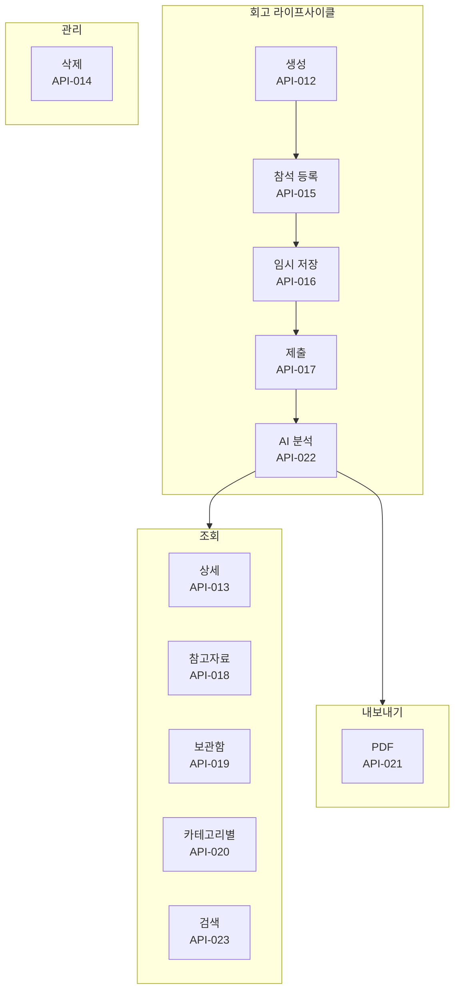
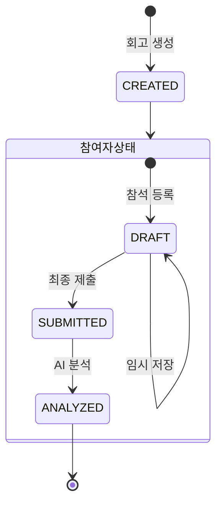
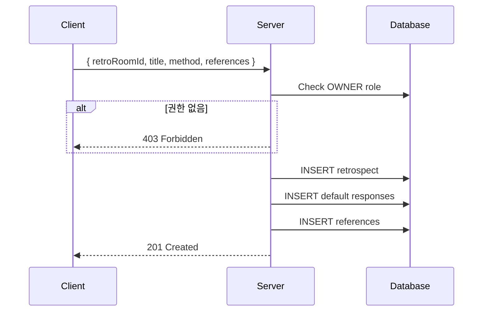
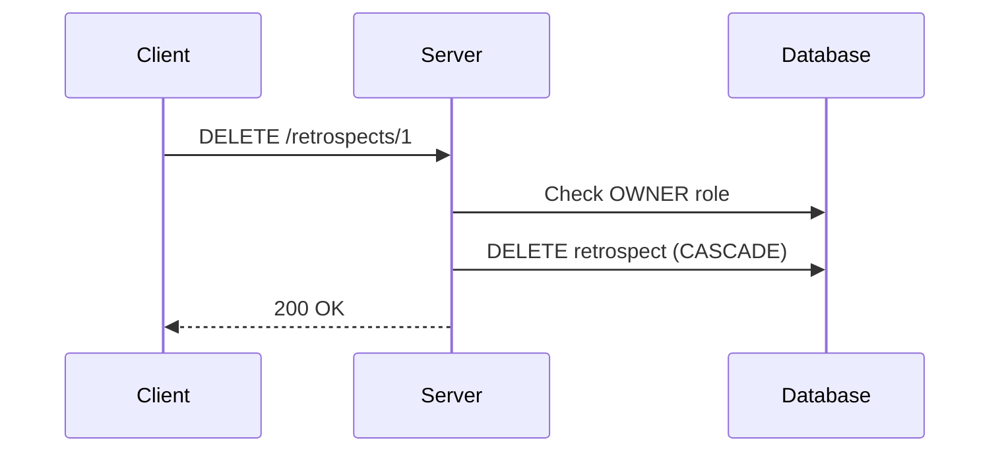
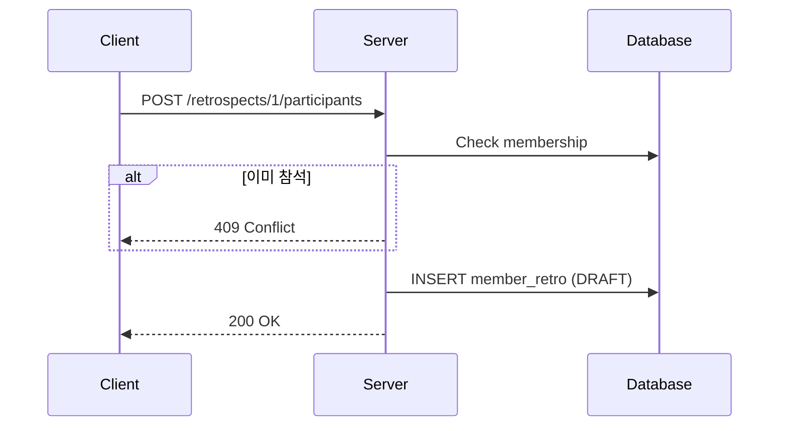
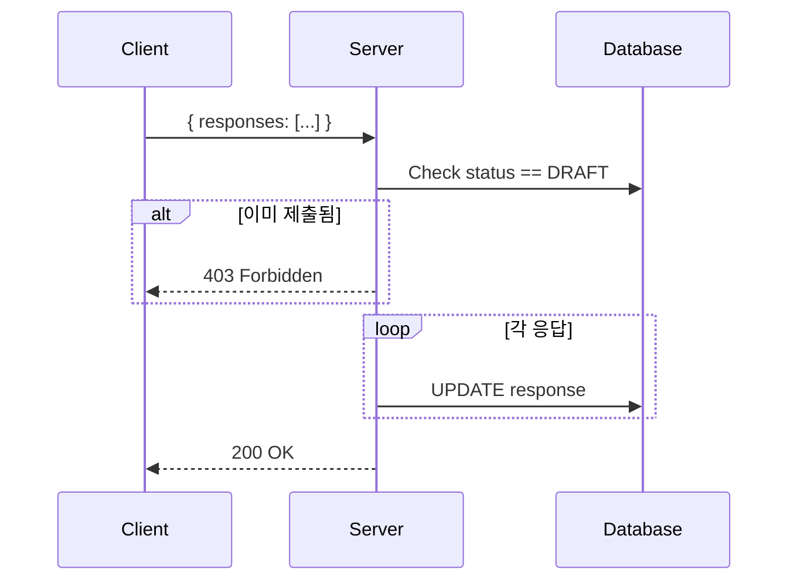
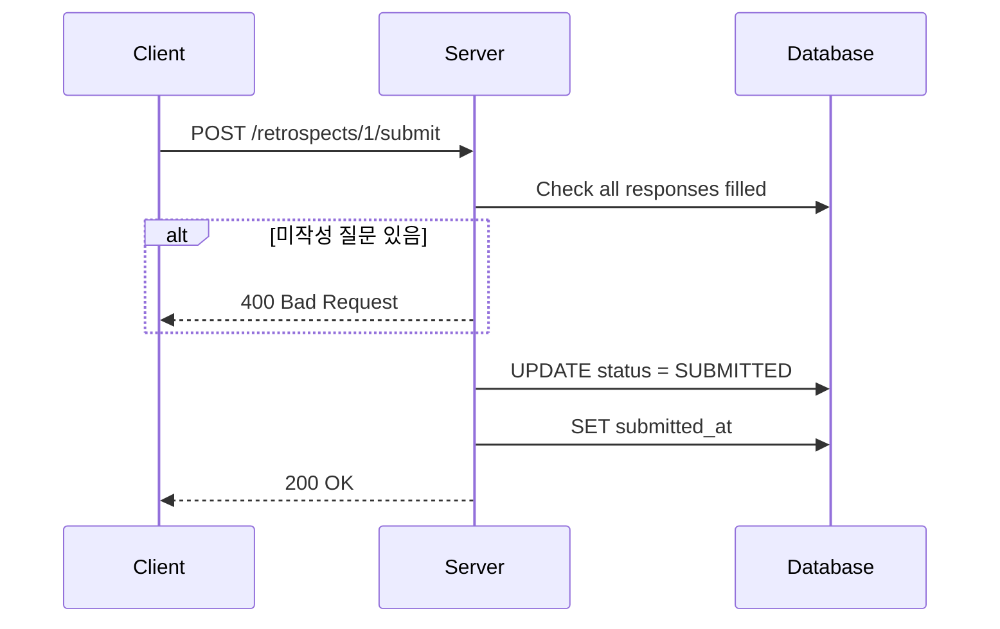
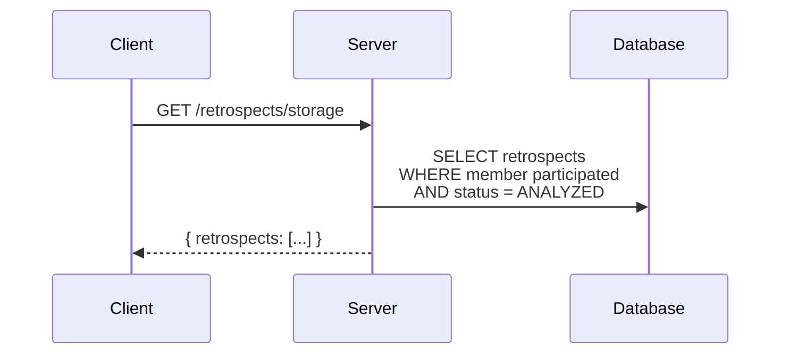
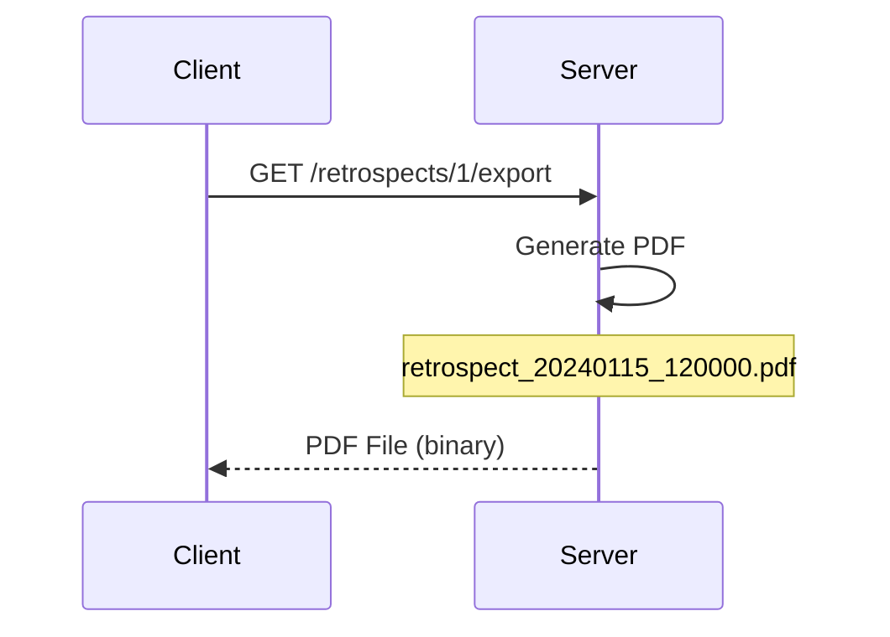
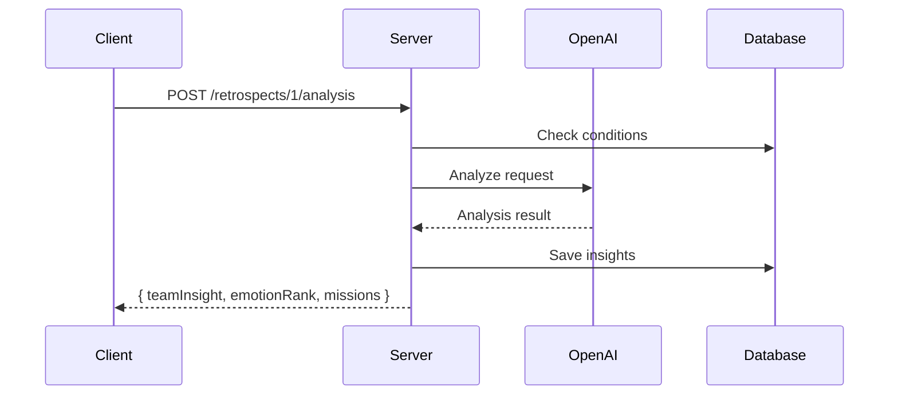

# 📝 Retrospect APIs

> 회고 관련 API 상세 명세

---

## 📍 Overview



---

## 🔄 회고 상태 흐름



---

## API-012 회고 생성

> `POST /api/v1/retrospects` 👑

### 흐름



### Request

```json
{
  "retroRoomId": 1,
  "title": "스프린트 1 회고",
  "retrospectMethod": "KPT",
  "references": [
    { "url": "https://notion.so/sprint1" }
  ]
}
```

### 회고 방식

| Method | 기본 질문 |
|--------|---------|
| KPT | Keep, Problem, Try |
| FOUR_L | Liked, Learned, Lacked, Longed |
| FIVE_F | Facts, Feelings, Findings, Future, Feedback |
| PMI | Plus, Minus, Interesting |
| FREE | 자유 질문 5개 |

→ [[apis/API-012 회고 생성|상세 문서]]

---

## API-013 회고 상세

> `GET /api/v1/retrospects/:id` 🔐

### Response

```json
{
  "retrospectId": 1,
  "title": "스프린트 1 회고",
  "method": "KPT",
  "teamInsight": "팀 전체 인사이트...",
  "questions": [
    {
      "questionId": 1,
      "question": "Keep: 유지하고 싶은 점은?",
      "myAnswer": "커뮤니케이션..."
    }
  ],
  "participants": [
    {
      "memberId": 1,
      "nickname": "홍길동",
      "status": "ANALYZED"
    }
  ]
}
```

→ [[apis/API-013 회고 상세|상세 문서]]

---

## API-014 회고 삭제

> `DELETE /api/v1/retrospects/:id` 👑

### 흐름



→ [[apis/API-014 회고 삭제|상세 문서]]

---

## API-015 참석 등록

> `POST /api/v1/retrospects/:id/participants` 🔐

### 흐름



→ [[apis/API-015 참석 등록|상세 문서]]

---

## API-016 임시 저장

> `PUT /api/v1/retrospects/:id/drafts` 🔐

### 흐름



### Request

```json
{
  "responses": [
    {
      "questionId": 1,
      "content": "Keep: 팀 커뮤니케이션이 좋았습니다..."
    },
    {
      "questionId": 2,
      "content": "Problem: 일정 관리가 어려웠습니다..."
    }
  ]
}
```

→ [[apis/API-017 임시 저장|상세 문서]]

---

## API-017 최종 제출

> `POST /api/v1/retrospects/:id/submit` 🔐

### 흐름



### Validation

| 항목 | 조건 |
|------|------|
| 모든 질문 | 답변 필수 |
| 답변 길이 | 최소 1자 이상 |

→ [[apis/API-018 최종 제출|상세 문서]]

---

## API-018 참고자료 조회

> `GET /api/v1/retrospects/:id/references` 🔐

### Response

```json
{
  "references": [
    {
      "id": 1,
      "url": "https://notion.so/sprint1",
      "createdAt": "2024-01-15T10:00:00Z"
    }
  ]
}
```

→ [[apis/API-019 참고자료|상세 문서]]

---

## API-019 보관함

> `GET /api/v1/retrospects/storage` 🔐

### 흐름



### Response

```json
{
  "retrospects": [
    {
      "retrospectId": 1,
      "title": "스프린트 1 회고",
      "retroRoomName": "우리 팀",
      "analyzedAt": "2024-01-20T10:00:00Z"
    }
  ]
}
```

→ [[apis/API-020 보관함|상세 문서]]

---

## API-020 카테고리별 답변 조회

> `GET /api/v1/retrospects/:id/responses` 🔐

### Query Parameters

| Param | Type | 설명 |
|-------|------|------|
| `category` | String | 질문 카테고리 (선택) |

### Response

```json
{
  "responses": [
    {
      "questionId": 1,
      "question": "Keep: 유지하고 싶은 점은?",
      "answers": [
        {
          "memberId": 1,
          "nickname": "홍길동",
          "content": "커뮤니케이션...",
          "likeCount": 3,
          "isLiked": true
        }
      ]
    }
  ]
}
```

→ [[apis/API-021 카테고리별 조회|상세 문서]]

---

## API-021 PDF 내보내기

> `GET /api/v1/retrospects/:id/export` 🔐

### 흐름



### Response Headers

```
Content-Type: application/pdf
Content-Disposition: attachment; filename="retrospect_20240115_120000.pdf"
```

→ [[apis/API-022 PDF 내보내기|상세 문서]]

---

## API-022 AI 분석

> `POST /api/v1/retrospects/:id/analysis` 👑

### 흐름



### Conditions

| 조건 | 에러 |
|------|------|
| Owner 권한 | RETRO4031 |
| 제출된 답변 있음 | AI4002 |
| 월간 한도 내 | AI4031 |
| 미분석 상태 | RETRO4091 |

→ [[apis/API-023 AI 분석|상세 문서]]
→ [[06-AI-Analysis-Flow|AI 분석 상세 플로우]]

---

## API-023 검색

> `GET /api/v1/retrospects/search` 🔐

### Query Parameters

| Param | Type | 설명 |
|-------|------|------|
| `keyword` | String | 검색어 |
| `method` | String | 회고 방식 필터 |
| `startDate` | Date | 시작일 |
| `endDate` | Date | 종료일 |

### Response

```json
{
  "retrospects": [
    {
      "retrospectId": 1,
      "title": "스프린트 1 회고",
      "retroRoomName": "우리 팀",
      "method": "KPT",
      "createdAt": "2024-01-15T10:00:00Z"
    }
  ]
}
```

→ [[apis/API-024 검색|상세 문서]]

---

## 🚨 Error Codes

| Code | HTTP | 설명 |
|------|------|------|
| RETRO4001 | 400 | 미작성 질문 존재 |
| RETRO4031 | 403 | 권한 없음 |
| RETRO4033 | 403 | 이미 제출됨 |
| RETRO4041 | 404 | 회고 없음 |
| RETRO4091 | 409 | 이미 분석됨 |

---

## 🔗 Related

- [[00-HOME|🏠 HOME]]
- [[03-Retrospect-Flow|📝 Retrospect Flow]]
- [[06-AI-Analysis-Flow|🤖 AI Analysis Flow]]
- [[05-API-Overview|🔌 API Overview]]

---

#retrospect #api #crud #ai
