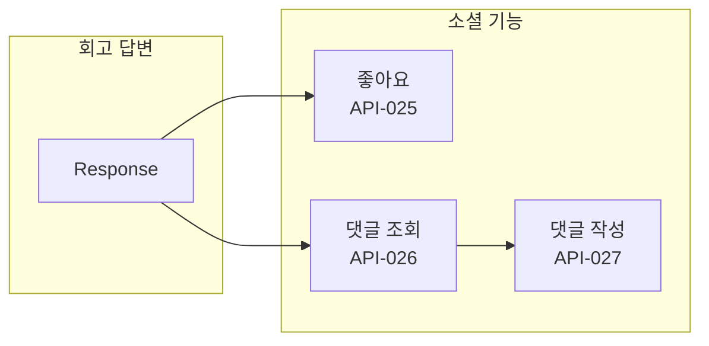
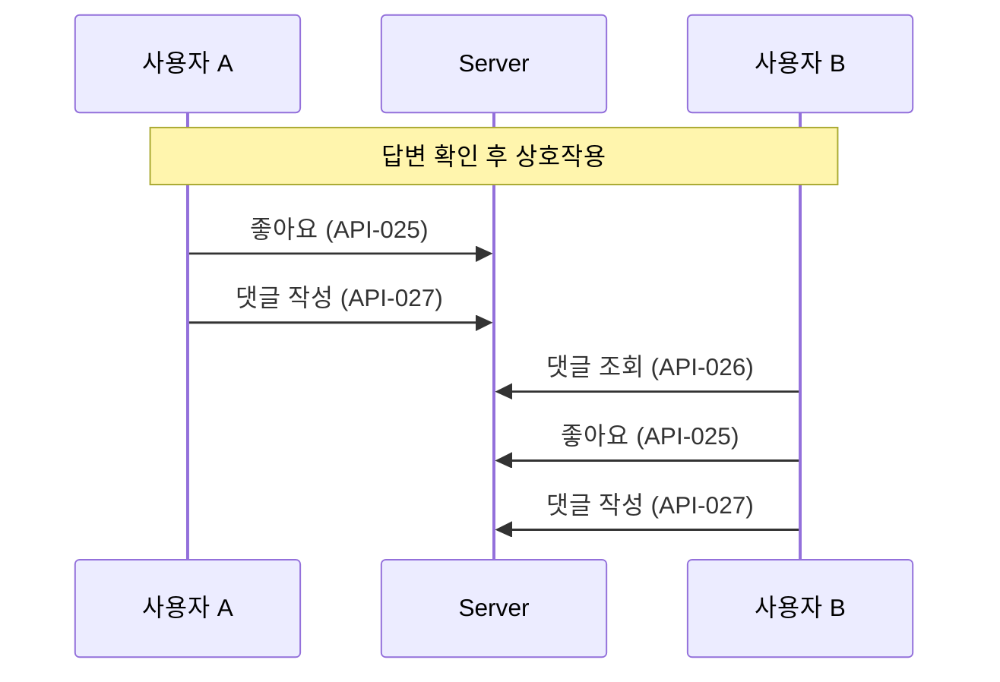
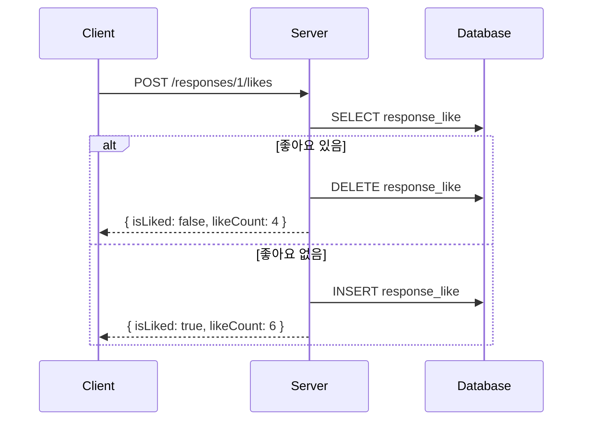
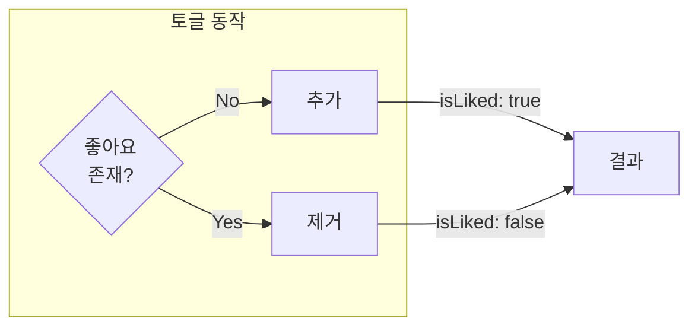
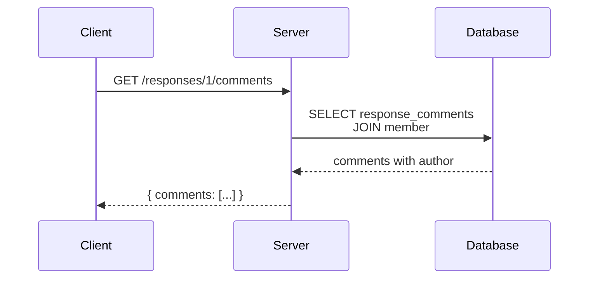
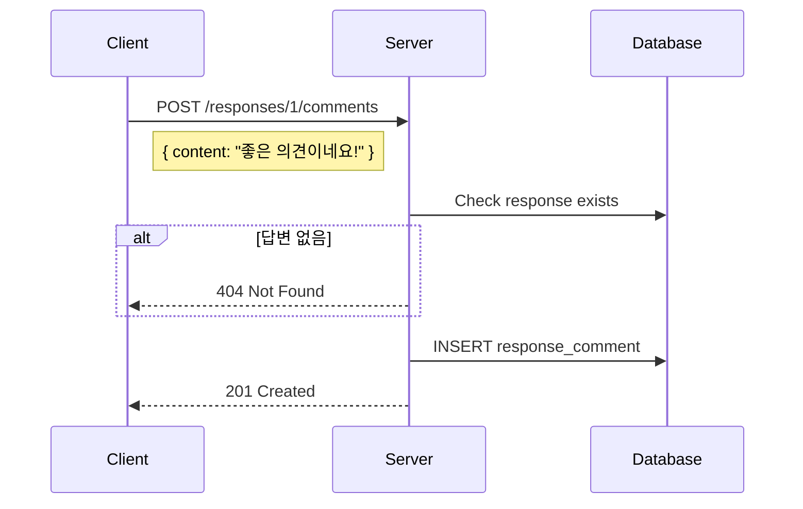
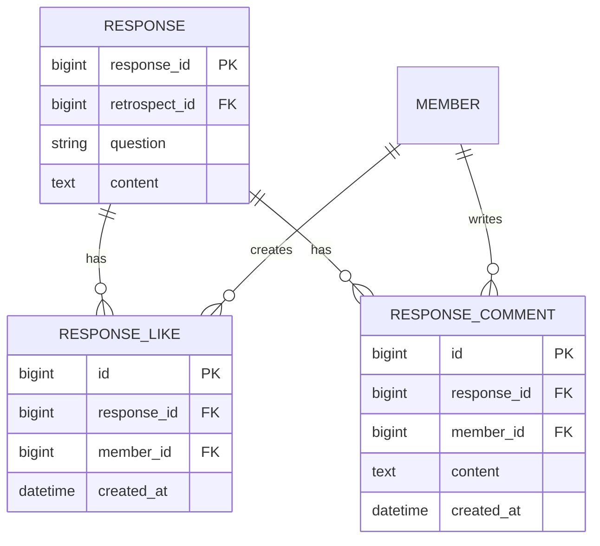
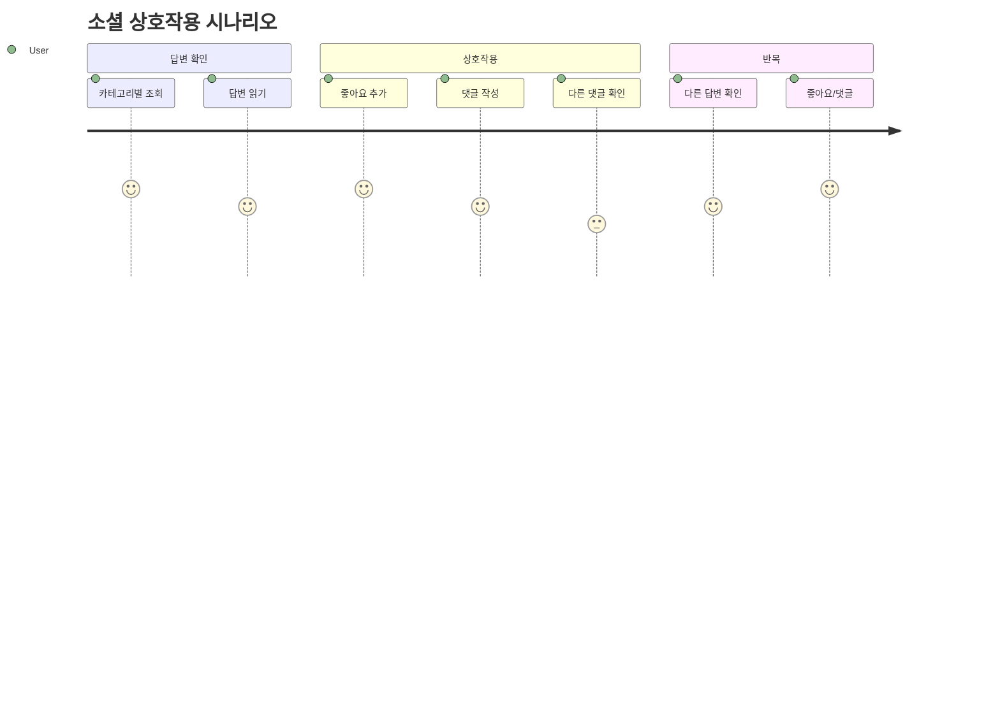

# 💬 Social APIs

> 소셜 기능 (좋아요, 댓글) API 상세 명세

---

## 📍 Overview



---

## 🔄 상호작용 흐름



---

## API-025 좋아요 토글

> `POST /api/v1/responses/:id/likes` 🔐

### 흐름



### Response

```json
{
  "isSuccess": true,
  "code": "COMMON200",
  "result": {
    "isLiked": true,
    "likeCount": 6
  }
}
```

### 동작 방식



### Errors

| Code | HTTP | 설명 |
|------|------|------|
| RES4041 | 404 | 답변을 찾을 수 없음 |

→ [[apis/API-026 좋아요 토글|상세 문서]]

---

## API-026 댓글 조회

> `GET /api/v1/responses/:id/comments` 🔐

### 흐름



### Response

```json
{
  "isSuccess": true,
  "code": "COMMON200",
  "result": {
    "comments": [
      {
        "commentId": 1,
        "content": "좋은 의견이네요!",
        "author": {
          "memberId": 2,
          "nickname": "김철수"
        },
        "createdAt": "2024-01-15T14:30:00Z",
        "isOwner": false
      },
      {
        "commentId": 2,
        "content": "저도 같은 생각입니다",
        "author": {
          "memberId": 1,
          "nickname": "홍길동"
        },
        "createdAt": "2024-01-15T14:35:00Z",
        "isOwner": true
      }
    ]
  }
}
```

### Response Fields

| Field | Type | 설명 |
|-------|------|------|
| `commentId` | number | 댓글 ID |
| `content` | string | 댓글 내용 |
| `author` | object | 작성자 정보 |
| `createdAt` | string | 작성 시간 |
| `isOwner` | boolean | 본인 작성 여부 |

→ [[apis/API-027 댓글 조회|상세 문서]]

---

## API-027 댓글 작성

> `POST /api/v1/responses/:id/comments` 🔐

### 흐름



### Request

```json
{
  "content": "좋은 의견이네요!"
}
```

### Validation

| Field | 조건 |
|-------|------|
| `content` | 필수, 1자 이상 |

### Response

```json
{
  "isSuccess": true,
  "code": "COMMON200",
  "result": {
    "commentId": 3,
    "content": "좋은 의견이네요!",
    "createdAt": "2024-01-15T15:00:00Z"
  }
}
```

### Errors

| Code | HTTP | 설명 |
|------|------|------|
| RES4041 | 404 | 답변을 찾을 수 없음 |
| COMMON400 | 400 | 내용이 비어있음 |

→ [[apis/API-028 댓글 작성|상세 문서]]

---

## 📊 데이터 모델



---

## 🎯 사용 시나리오



---

## 🔐 권한

| API | 요구 권한 | 설명 |
|-----|----------|------|
| 좋아요 토글 | 🔐 로그인 | 누구나 가능 |
| 댓글 조회 | 🔐 로그인 | 누구나 가능 |
| 댓글 작성 | 🔐 로그인 | 누구나 가능 |

> [!note] 회고방 멤버 제한
> 소셜 기능은 해당 회고방의 멤버만 사용할 수 있습니다.

---

## 🚨 Error Codes

| Code | HTTP | 설명 |
|------|------|------|
| RES4041 | 404 | 답변을 찾을 수 없음 |
| COMMON400 | 400 | 잘못된 요청 (빈 내용) |
| COMMON401 | 401 | 인증 필요 |

---

## 🔗 Related

- [[00-HOME|🏠 HOME]]
- [[09-Retrospect-APIs|📝 Retrospect APIs]]
- [[05-API-Overview|🔌 API Overview]]

---

#social #like #comment #api
