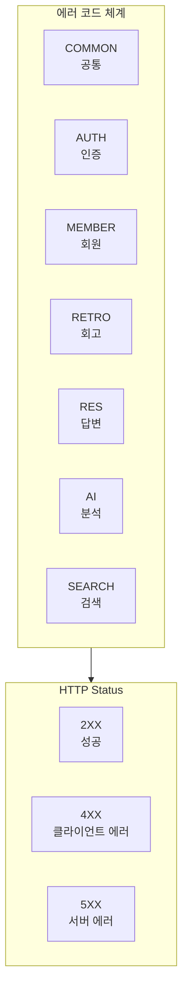
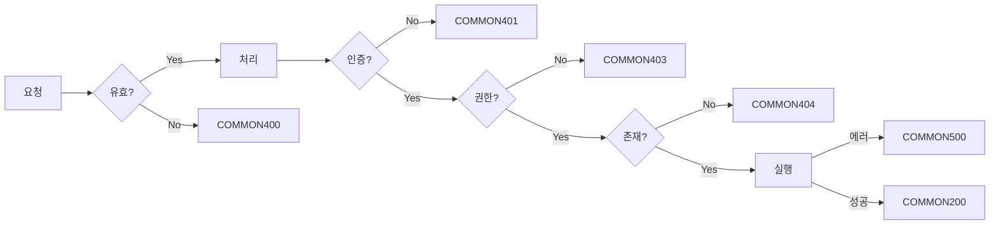
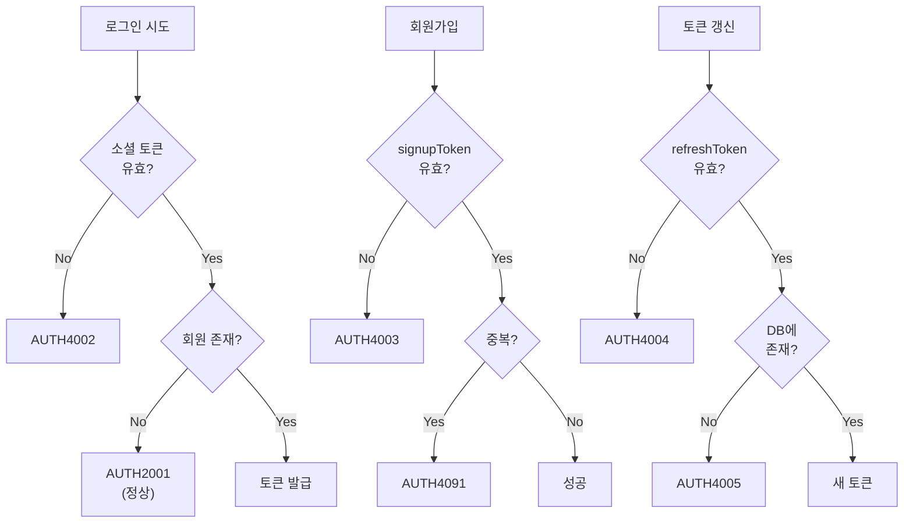
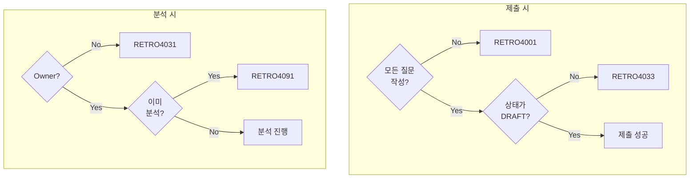
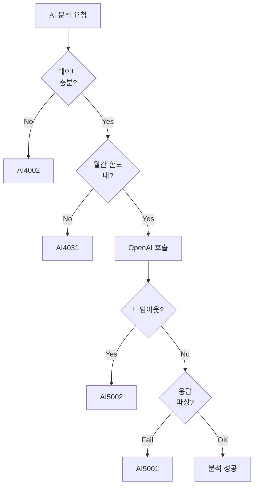

# 🚨 Error Codes

> 전체 에러 코드 참조 문서

---

## 📍 Overview



---

## 📋 공통 에러 (COMMON)

| Code | HTTP | 설명 | 대응 |
|------|------|------|------|
| COMMON200 | 200 | 성공 | - |
| COMMON400 | 400 | 잘못된 요청 | 요청 데이터 확인 |
| COMMON401 | 401 | 인증 실패 | 로그인 필요 |
| COMMON403 | 403 | 권한 없음 | 권한 확인 |
| COMMON404 | 404 | 리소스 없음 | URL 확인 |
| COMMON500 | 500 | 서버 에러 | 관리자 문의 |



---

## 🔐 인증 에러 (AUTH)

| Code | HTTP | 설명 | 발생 상황 | 대응 |
|------|------|------|----------|------|
| AUTH2001 | 200 | 신규 회원 | 소셜 로그인 시 미가입 | 회원가입 진행 |
| AUTH4001 | 401 | 인증 실패 | 토큰 없음/만료 | 재로그인 |
| AUTH4002 | 401 | 무효한 소셜 토큰 | 소셜 토큰 검증 실패 | 소셜 재인증 |
| AUTH4003 | 400 | 무효한 회원가입 토큰 | 만료/조작된 signupToken | 로그인 재시도 |
| AUTH4004 | 401 | 무효한 리프레시 토큰 | 만료/조작된 refreshToken | 재로그인 |
| AUTH4005 | 401 | 로그아웃된 토큰 | DB에서 삭제된 토큰 | 재로그인 |
| AUTH4091 | 409 | 이미 가입된 이메일 | 중복 회원가입 시도 | 로그인 시도 |



---

## 👤 회원 에러 (MEMBER)

| Code | HTTP | 설명 | 발생 상황 |
|------|------|------|----------|
| MEMBER4041 | 404 | 회원 없음 | 탈퇴/존재하지 않는 회원 |

---

## 📝 회고 에러 (RETRO)

| Code | HTTP | 설명 | 발생 상황 | 대응 |
|------|------|------|----------|------|
| RETRO4001 | 400 | 미작성 질문 존재 | 제출 시 빈 답변 | 모든 질문 작성 |
| RETRO4031 | 403 | 회고방 권한 없음 | Owner 아닌 사용자 | 방장에게 요청 |
| RETRO4033 | 403 | 이미 제출됨 | 제출 후 수정 시도 | 수정 불가 안내 |
| RETRO4041 | 404 | 회고 없음 | 삭제/없는 회고 | ID 확인 |
| RETRO4091 | 409 | 이미 분석됨 | 중복 분석 시도 | 결과 확인 |



---

## 💬 답변 에러 (RES)

| Code | HTTP | 설명 | 발생 상황 |
|------|------|------|----------|
| RES4041 | 404 | 답변 없음 | 삭제/없는 답변 |

---

## 🤖 AI 에러 (AI)

| Code | HTTP | 설명 | 발생 상황 | 대응 |
|------|------|------|----------|------|
| AI4002 | 400 | 분석 데이터 부족 | 제출된 답변 없음 | 팀원 제출 유도 |
| AI4031 | 403 | 월간 한도 초과 | 10회 초과 | 다음 달 대기 |
| AI5001 | 500 | AI 분석 실패 | OpenAI 응답 파싱 실패 | 재시도 |
| AI5002 | 500 | AI 연결 실패 | OpenAI 타임아웃 | 잠시 후 재시도 |
| AI5031 | 503 | AI 서비스 불가 | OpenAI 서비스 장애 | 관리자 문의 |



---

## 🔍 검색 에러 (SEARCH)

| Code | HTTP | 설명 | 발생 상황 |
|------|------|------|----------|
| SEARCH4001 | 400 | 검색어 없음 | 빈 검색어 |
| SEARCH4002 | 400 | 잘못된 날짜 범위 | 시작일 > 종료일 |

---

## 📊 에러 코드 체계

### 코드 구조

```
PREFIX + STATUS + SEQUENCE
  │        │        │
  │        │        └── 순번 (2자리)
  │        └── HTTP 상태 (3자리)
  └── 도메인 접두사
```

### 예시

```
AUTH4001
  │  │ │
  │  │ └── 01 (첫 번째 에러)
  │  └── 4 (400번대 = 클라이언트 에러)
  └── AUTH (인증 도메인)

AI5002
  │ │ │
  │ │ └── 02 (두 번째 에러)
  │ └── 5 (500번대 = 서버 에러)
  └── AI (AI 도메인)
```

---

## 🎯 HTTP Status 매핑

| HTTP Status | 의미 | 대표 에러 |
|-------------|------|----------|
| 200 | 성공 | COMMON200, AUTH2001 |
| 400 | 잘못된 요청 | COMMON400, RETRO4001 |
| 401 | 인증 필요 | AUTH4001, AUTH4004 |
| 403 | 권한 없음 | RETRO4031, AI4031 |
| 404 | 리소스 없음 | RETRO4041, RES4041 |
| 409 | 충돌 | AUTH4091, RETRO4091 |
| 500 | 서버 에러 | AI5001, AI5002 |
| 503 | 서비스 불가 | AI5031 |

---

## 🔧 에러 응답 형식

### 표준 응답

```json
{
  "isSuccess": false,
  "code": "RETRO4031",
  "message": "회고방 수정 권한이 없습니다",
  "result": null
}
```

### 검증 에러 (상세)

```json
{
  "isSuccess": false,
  "code": "COMMON400",
  "message": "입력값 검증에 실패했습니다",
  "result": {
    "errors": [
      {
        "field": "nickname",
        "message": "닉네임은 필수입니다"
      }
    ]
  }
}
```

---

## 🔗 Related

- [[00-HOME|🏠 HOME]]
- [[01-Architecture|🏗️ Architecture]]
- [[05-API-Overview|🔌 API Overview]]

---

#error #code #reference
