# 👤 User Scenarios

> 주요 사용자 시나리오별 API 호출 흐름

---

## 📍 Overview

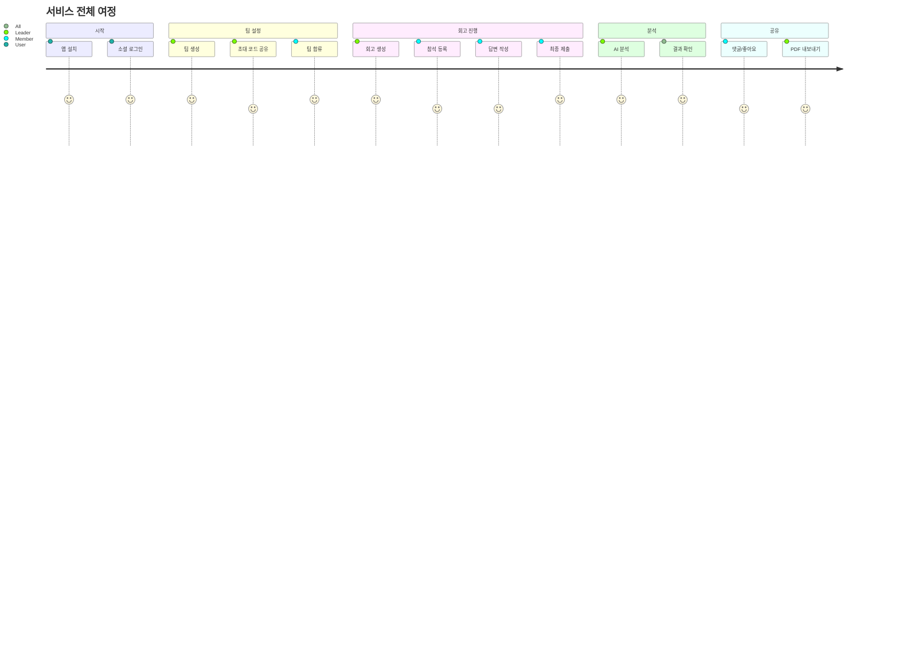

---

## 🔐 시나리오 1: 신규 사용자 가입

### 흐름

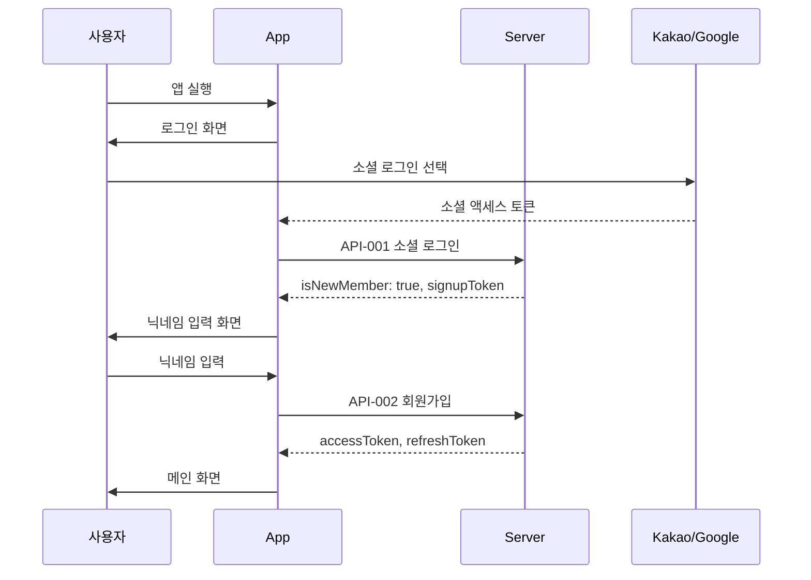

### API 호출 순서

| 순서 | API | 설명 |
|:----:|-----|------|
| 1 | API-001 | 소셜 로그인 → signupToken 받음 |
| 2 | API-002 | 회원가입 → 토큰 발급 |

---

## 👑 시나리오 2: 팀 리더 - 회고방 생성

### 흐름

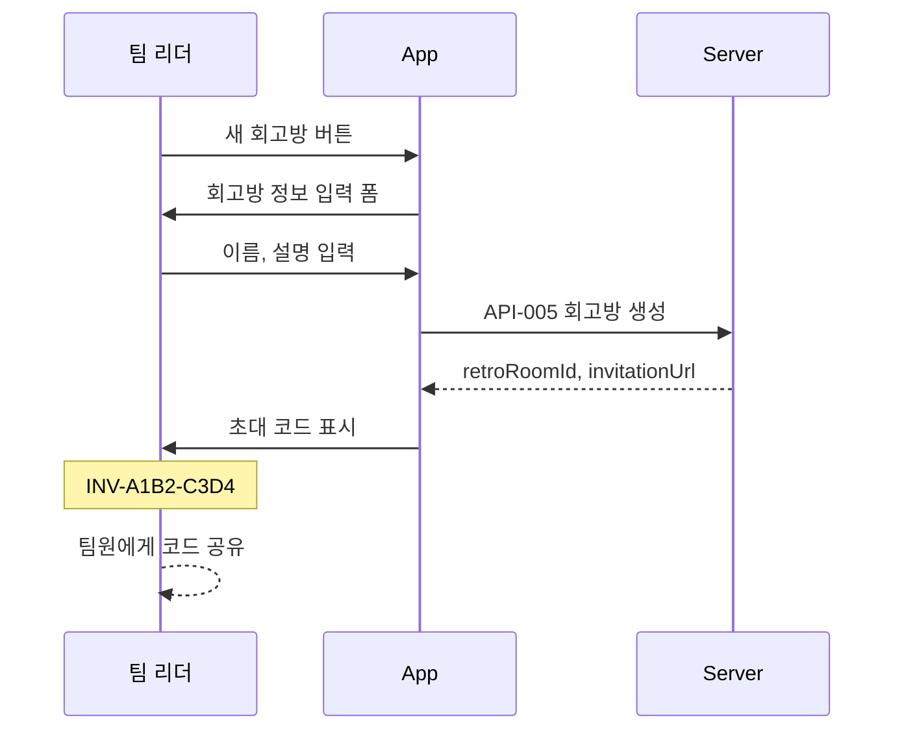

### API 호출 순서

| 순서 | API | 설명 |
|:----:|-----|------|
| 1 | API-005 | 회고방 생성 |
| - | - | 초대 코드 공유 (앱 외부) |

---

## 👥 시나리오 3: 팀원 - 팀 합류

### 흐름

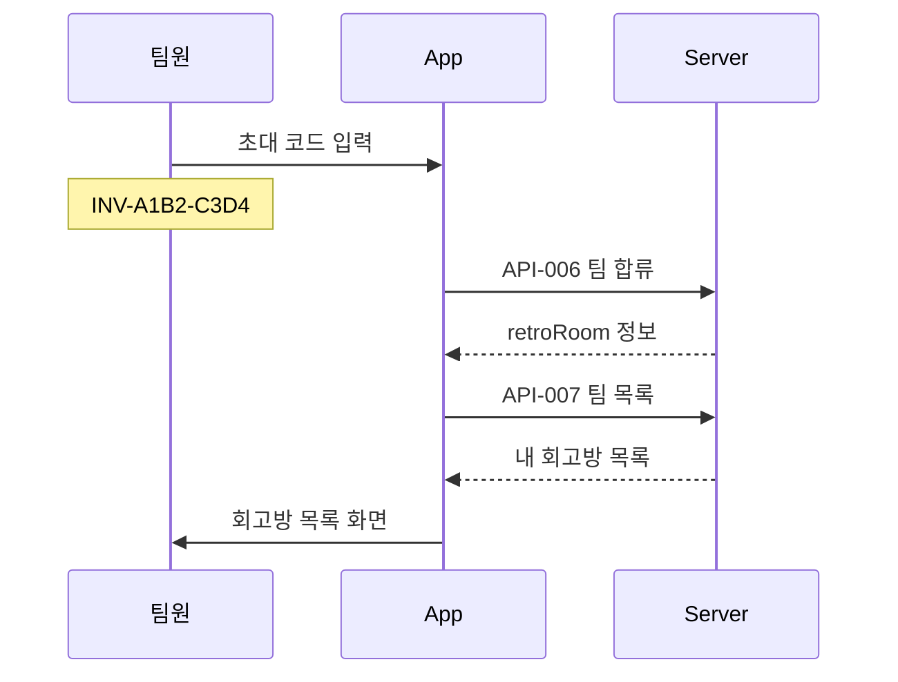

### API 호출 순서

| 순서 | API | 설명 |
|:----:|-----|------|
| 1 | API-006 | 초대 코드로 팀 합류 |
| 2 | API-007 | 팀 목록 갱신 |

---

## 📝 시나리오 4: 회고 생성 및 진행

### 흐름 (리더)

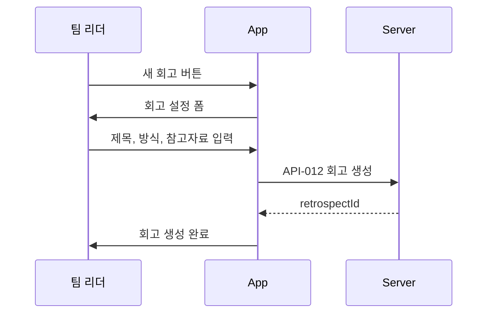

### 흐름 (참여자)

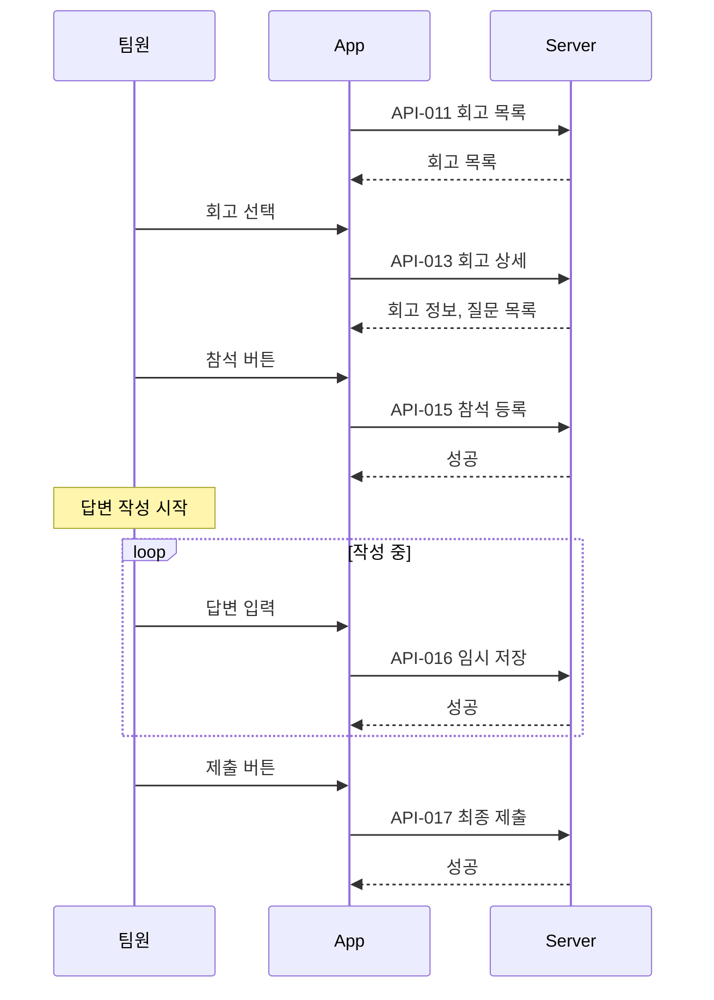

### API 호출 순서 (리더)

| 순서 | API | 설명 |
|:----:|-----|------|
| 1 | API-012 | 회고 생성 |

### API 호출 순서 (참여자)

| 순서 | API | 설명 |
|:----:|-----|------|
| 1 | API-011 | 회고 목록 조회 |
| 2 | API-013 | 회고 상세 조회 |
| 3 | API-015 | 참석 등록 |
| 4 | API-016 | 임시 저장 (반복) |
| 5 | API-017 | 최종 제출 |

---

## 🤖 시나리오 5: AI 분석 및 결과 확인

### 흐름

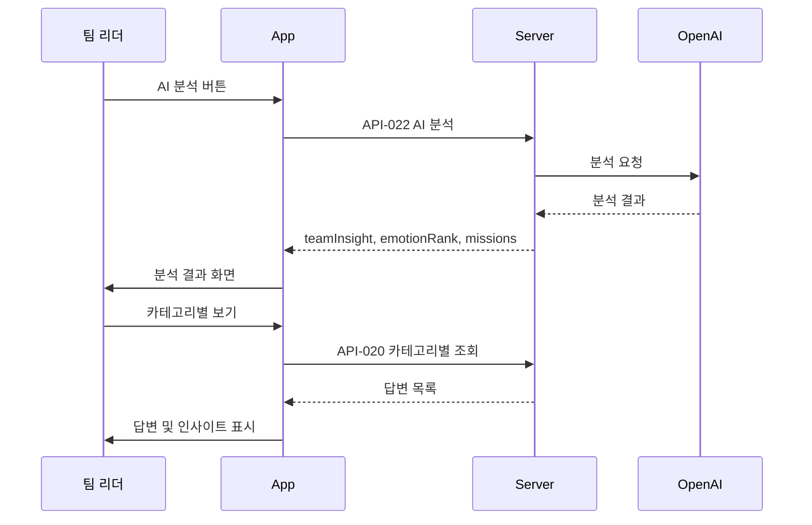

### API 호출 순서

| 순서 | API | 설명 |
|:----:|-----|------|
| 1 | API-022 | AI 분석 요청 |
| 2 | API-020 | 카테고리별 답변 조회 |

---

## 💬 시나리오 6: 소셜 상호작용

### 흐름

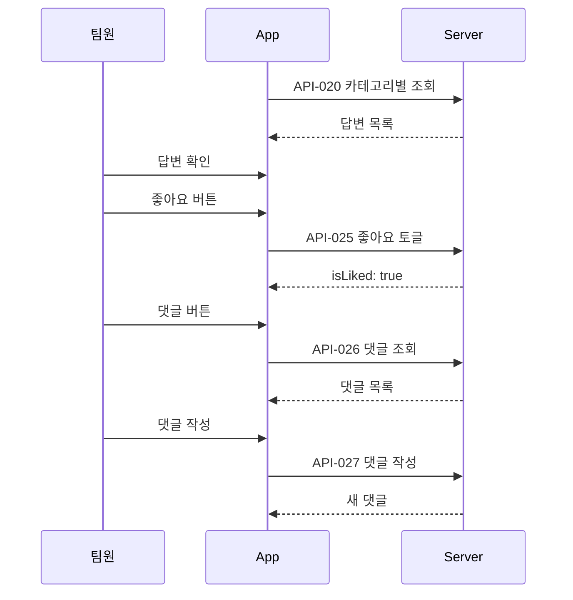

### API 호출 순서

| 순서 | API | 설명 |
|:----:|-----|------|
| 1 | API-020 | 답변 조회 |
| 2 | API-025 | 좋아요 토글 |
| 3 | API-026 | 댓글 조회 |
| 4 | API-027 | 댓글 작성 |

---

## 📤 시나리오 7: PDF 내보내기

### 흐름

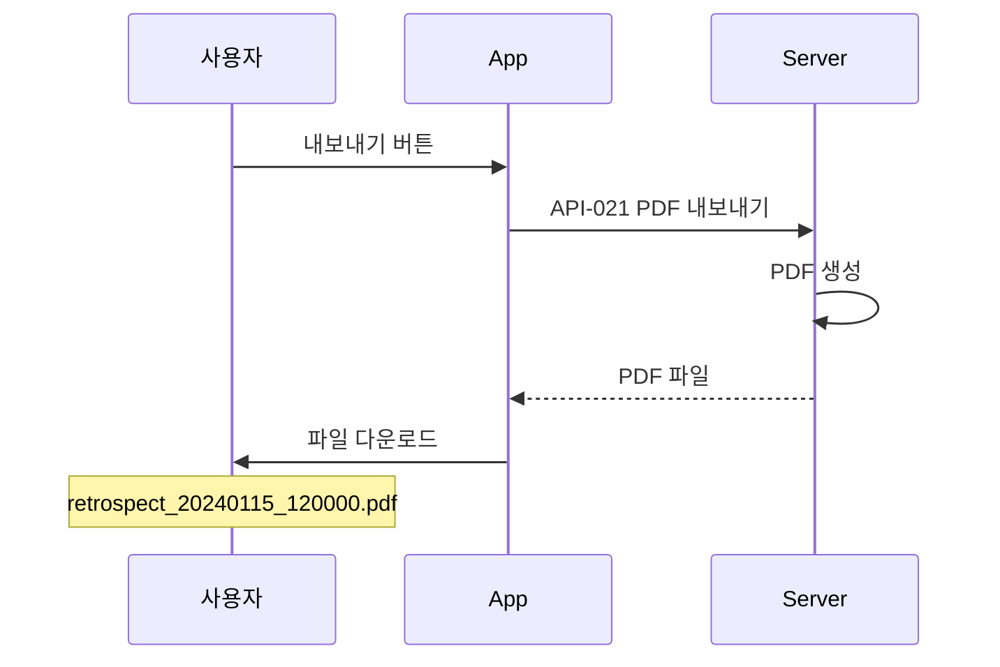

### API 호출 순서

| 순서 | API | 설명 |
|:----:|-----|------|
| 1 | API-021 | PDF 내보내기 |

---

## 🔍 시나리오 8: 회고 검색

### 흐름

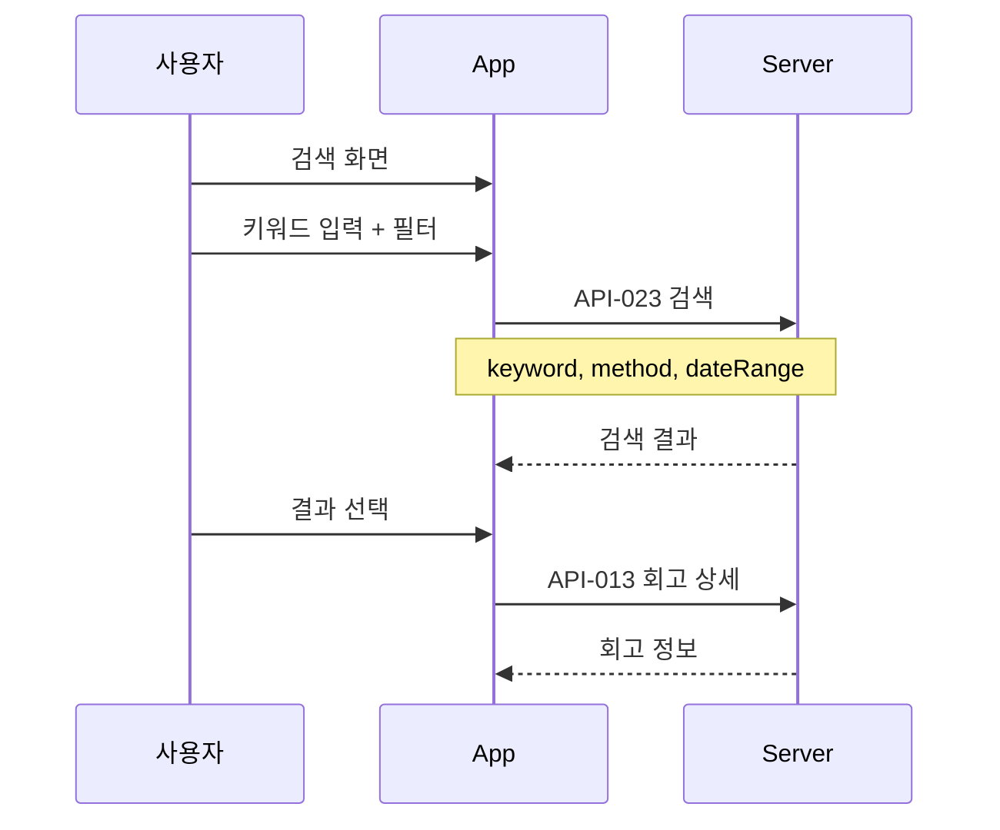

### API 호출 순서

| 순서 | API | 설명 |
|:----:|-----|------|
| 1 | API-023 | 회고 검색 |
| 2 | API-013 | 회고 상세 조회 |

---

## 🚪 시나리오 9: 로그아웃 및 탈퇴

### 로그아웃

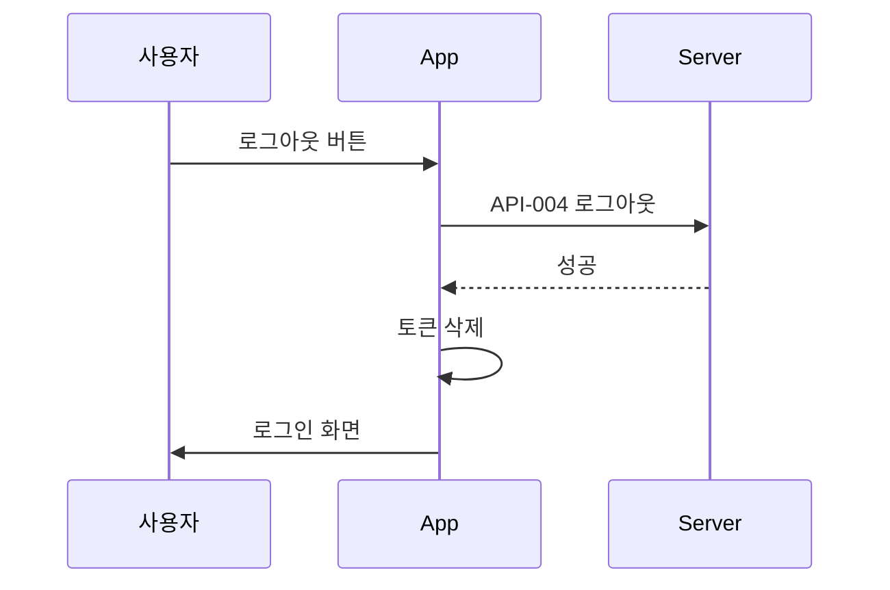

### 서비스 탈퇴

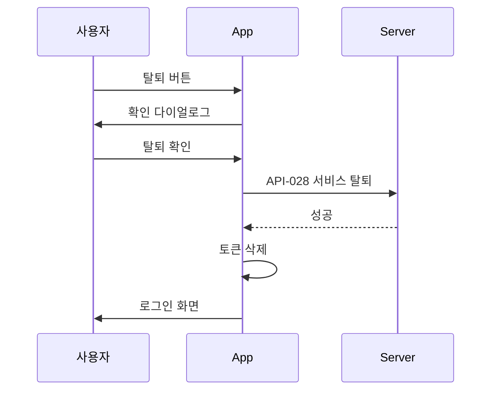

---

## 📊 시나리오별 API 요약

| 시나리오 | API 수 | 주요 API |
|---------|:------:|---------|
| 신규 가입 | 2 | 001, 002 |
| 팀 생성 | 1 | 005 |
| 팀 합류 | 2 | 006, 007 |
| 회고 진행 | 5 | 011-017 |
| AI 분석 | 2 | 022, 020 |
| 소셜 | 3 | 025-027 |
| PDF | 1 | 021 |
| 검색 | 2 | 023, 013 |
| 로그아웃 | 1 | 004 |
| 탈퇴 | 1 | 028 |

---

## 🔗 Related

- [[00-HOME|🏠 HOME]]
- [[05-API-Overview|🔌 API Overview]]
- [[03-Retrospect-Flow|📝 Retrospect Flow]]

---

#scenario #user #flow #journey
