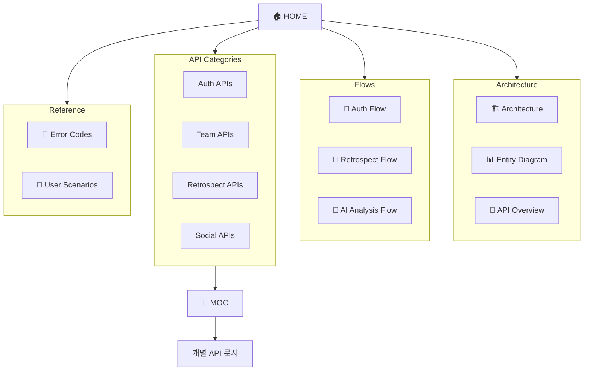

# 📚 API Visual Documentation

> Obsidian에서 보는 회고록 AI 서비스 시각화 문서

---

## 🚀 시작하기

### Obsidian에서 열기

1. Obsidian 실행
2. `Open folder as vault` 선택
3. `docs/api-visual` 폴더 선택
4. [[00-HOME]] 문서에서 시작

### 추천 플러그인

- **Dataview** - 동적 쿼리
- **Excalidraw** - 다이어그램 편집
- **Graph Analysis** - 연결 분석

---

## 📁 문서 구조

```
docs/api-visual/
│
├── 📌 Core Documents
│   ├── 00-HOME.md              # 메인 허브
│   ├── 01-Architecture.md      # 시스템 아키텍처
│   ├── 04-Entity-Diagram.md    # DB 스키마
│   └── 05-API-Overview.md      # API 전체 맵
│
├── 🔄 Flow Documents
│   ├── 02-Auth-Flow.md         # 인증 플로우
│   ├── 03-Retrospect-Flow.md   # 회고 플로우
│   └── 06-AI-Analysis-Flow.md  # AI 분석 플로우
│
├── 📋 API Category Documents
│   ├── 07-Auth-APIs.md         # 인증 API
│   ├── 08-Team-APIs.md         # 팀 API
│   ├── 09-Retrospect-APIs.md   # 회고 API
│   └── 10-Social-APIs.md       # 소셜 API
│
├── 📚 Reference Documents
│   ├── 11-Error-Codes.md       # 에러 코드
│   └── 12-User-Scenarios.md    # 사용자 시나리오
│
└── apis/                       # 개별 API 문서
    ├── MOC.md                  # API 인덱스
    └── API-XXX *.md            # 각 API 상세
```

---

## 🗺️ 문서 맵



---

## ✨ 주요 기능

### Mermaid 다이어그램

모든 문서에서 Mermaid 다이어그램을 사용합니다:
- Flowchart
- Sequence Diagram
- Entity Relationship Diagram
- State Diagram
- Pie Chart
- Journey Map

### 내부 링크

`[[문서명]]` 형식으로 문서 간 연결됩니다.
Obsidian Graph View에서 전체 연결 관계를 확인할 수 있습니다.

### Callout

> [!note] 참고
> 중요한 정보는 Callout으로 표시합니다.

> [!warning] 주의
> 주의가 필요한 내용입니다.

> [!tip] 팁
> 유용한 팁입니다.

---

## 🎯 추천 탐색 경로

### 프로젝트 이해하기

1. [[00-HOME]] - 전체 개요
2. [[01-Architecture]] - 시스템 구조
3. [[04-Entity-Diagram]] - 데이터 모델

### API 파악하기

1. [[05-API-Overview]] - API 전체 맵
2. [[02-Auth-Flow]] - 인증 흐름
3. [[03-Retrospect-Flow]] - 회고 흐름

### 상세 스펙 확인

1. [[apis/MOC]] - API 인덱스
2. 개별 API 문서 참조

### 사용자 관점 이해

1. [[12-User-Scenarios]] - 시나리오별 흐름

---

## 🏷️ 태그 시스템

| 태그 | 용도 |
|------|------|
| `#home` | 메인 허브 |
| `#architecture` | 아키텍처 |
| `#flow` | 플로우 문서 |
| `#api` | API 관련 |
| `#auth` | 인증 |
| `#retrospect` | 회고 |
| `#ai` | AI 기능 |
| `#error` | 에러 코드 |
| `#scenario` | 시나리오 |

---

## 📖 관련 문서

- [API 상세 스펙](../api-specs/README.md)
- [AI 컨벤션](../ai-conventions/)
- [구현 리뷰](../reviews/)

---

## 🔄 업데이트 기록

| 날짜 | 변경 사항 |
|------|----------|
| 2024-01 | 초기 문서 구조 생성 |
| 2024-01 | Mermaid 다이어그램 추가 |
| 2024-01 | 사용자 시나리오 문서 추가 |
