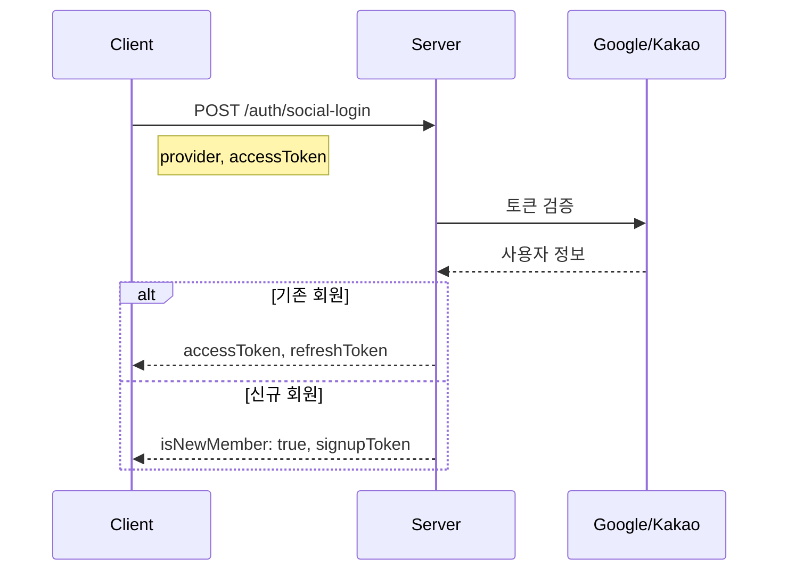

# API-001 소셜 로그인

> `POST /api/v1/auth/social-login`

---

## Flow



---

## Quick Reference

| 항목 | 값 |
|------|-----|
| **Method** | POST |
| **Auth** | 불필요 |
| **Provider** | `GOOGLE`, `KAKAO` |

---

## Token TTL

| 토큰 | 유효기간 |
|------|---------|
| accessToken | 30분 |
| refreshToken | 14일 |
| signupToken | 10분 |

---

## Response

### 기존 회원
```json
{
  "isNewMember": false,
  "accessToken": "xxx",
  "refreshToken": "xxx"
}
```

### 신규 회원
```json
{
  "isNewMember": true,
  "email": "user@example.com",
  "signupToken": "xxx"
}
```

---

## Error Codes

| Code | Status | 설명 |
|------|--------|------|
| AUTH2001 | 200 | 신규 회원 (정상) |
| AUTH4002 | 401 | 유효하지 않은 소셜 토큰 |

---

## Related

- [[API-002 회원가입]]
- [[API-003 토큰 리프레시]]

---

#auth #login #api
