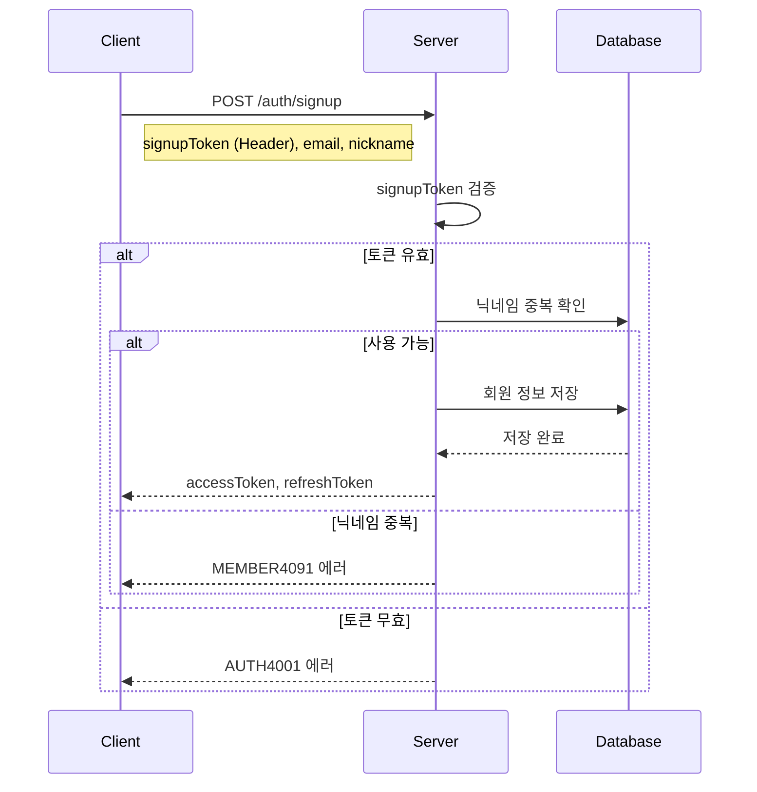

# API-002 회원가입

> `POST /api/v1/auth/signup`

---

## Flow



---

## Quick Reference

| 항목 | 값 |
|------|-----|
| **Method** | POST |
| **Auth** | signupToken (Bearer) |
| **Content-Type** | application/json |

---

## Token TTL

| 토큰 | 유효기간 |
|------|---------|
| signupToken | 10분 |
| accessToken | 30분 |
| refreshToken | 14일 |

---

## Request Body

```json
{
  "email": "user@example.com",
  "nickname": "제이슨"
}
```

| Field | Type | Required | Validation |
|-------|------|----------|------------|
| email | string | Yes | 이메일 형식 |
| nickname | string | Yes | 1~20자, 특수문자 제외 |

---

## Response

```json
{
  "isSuccess": true,
  "code": "COMMON200",
  "message": "회원가입이 성공적으로 완료되었습니다.",
  "result": {
    "memberId": 505,
    "nickname": "제이슨",
    "accessToken": "xxx",
    "refreshToken": "xxx"
  }
}
```

---

## Error Codes

| Code | Status | 설명 |
|------|--------|------|
| COMMON400 | 400 | 닉네임 유효성 검증 실패 |
| AUTH4001 | 401 | signupToken 유효하지 않음 |
| MEMBER4041 | 404 | 유효하지 않은 회원가입 정보 |
| MEMBER4091 | 409 | 닉네임 중복 |

---

## Related

- [[API-001 소셜 로그인]]
- [[API-003 토큰 리프레시]]

---

#auth #signup #api
