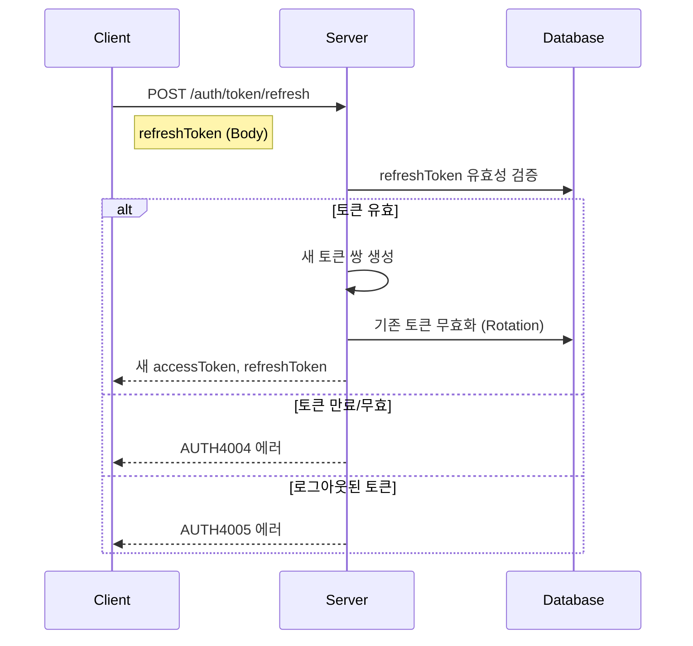

# API-003 토큰 리프레시

> `POST /api/v1/auth/token/refresh`

---

## Flow



---

## Quick Reference

| 항목 | 값 |
|------|-----|
| **Method** | POST |
| **Auth** | 불필요 |
| **Content-Type** | application/json |

---

## Token TTL

| 토큰 | 유효기간 |
|------|---------|
| accessToken | 30분 |
| refreshToken | 14일 |

---

## Request Body

```json
{
  "refreshToken": "service_refresh_token_xxx"
}
```

---

## Response

```json
{
  "isSuccess": true,
  "code": "COMMON200",
  "message": "토큰이 성공적으로 갱신되었습니다.",
  "result": {
    "accessToken": "new_access_token",
    "refreshToken": "new_refresh_token"
  }
}
```

> [!note] Refresh Token Rotation
> 기존 refreshToken은 무효화되고 새 토큰이 발급됩니다.
> 반드시 새 토큰을 저장하세요.

---

## Error Codes

| Code | Status | 설명 |
|------|--------|------|
| COMMON400 | 400 | refreshToken 누락 |
| AUTH4004 | 401 | 만료/유효하지 않은 토큰 |
| AUTH4005 | 401 | 로그아웃된 토큰 |

---

## Related

- [[API-001 소셜 로그인]]
- [[API-004 로그아웃]]

---

#auth #token #refresh #api
