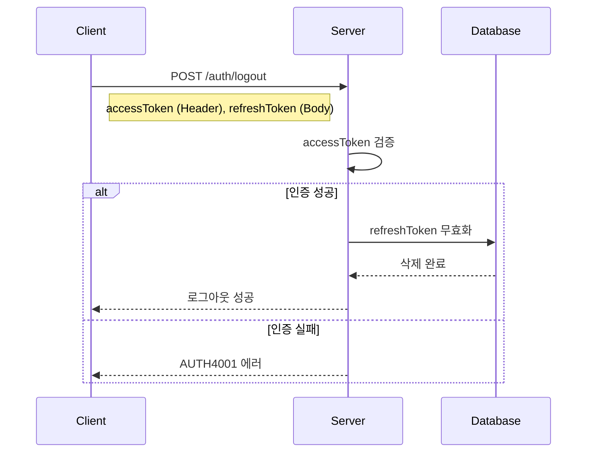

# API-004 로그아웃

> `POST /api/v1/auth/logout`

---

## Flow



---

## Quick Reference

| 항목 | 값 |
|------|-----|
| **Method** | POST |
| **Auth** | accessToken (Bearer) |
| **Content-Type** | application/json |

---

## Request Body

```json
{
  "refreshToken": "service_refresh_token_xxx"
}
```

> [!tip] 다중 기기 지원
> refreshToken을 명시적으로 전달하여 특정 기기만 로그아웃할 수 있습니다.

---

## Response

```json
{
  "isSuccess": true,
  "code": "COMMON200",
  "message": "로그아웃이 성공적으로 처리되었습니다.",
  "result": null
}
```

---

## Error Codes

| Code | Status | 설명 |
|------|--------|------|
| AUTH4001 | 401 | 인증 정보 유효하지 않음 |
| AUTH4003 | 400 | 이미 로그아웃/유효하지 않은 토큰 |

---

## Related

- [[API-003 토큰 리프레시]]
- [[API-001 소셜 로그인]]

---

#auth #logout #api
