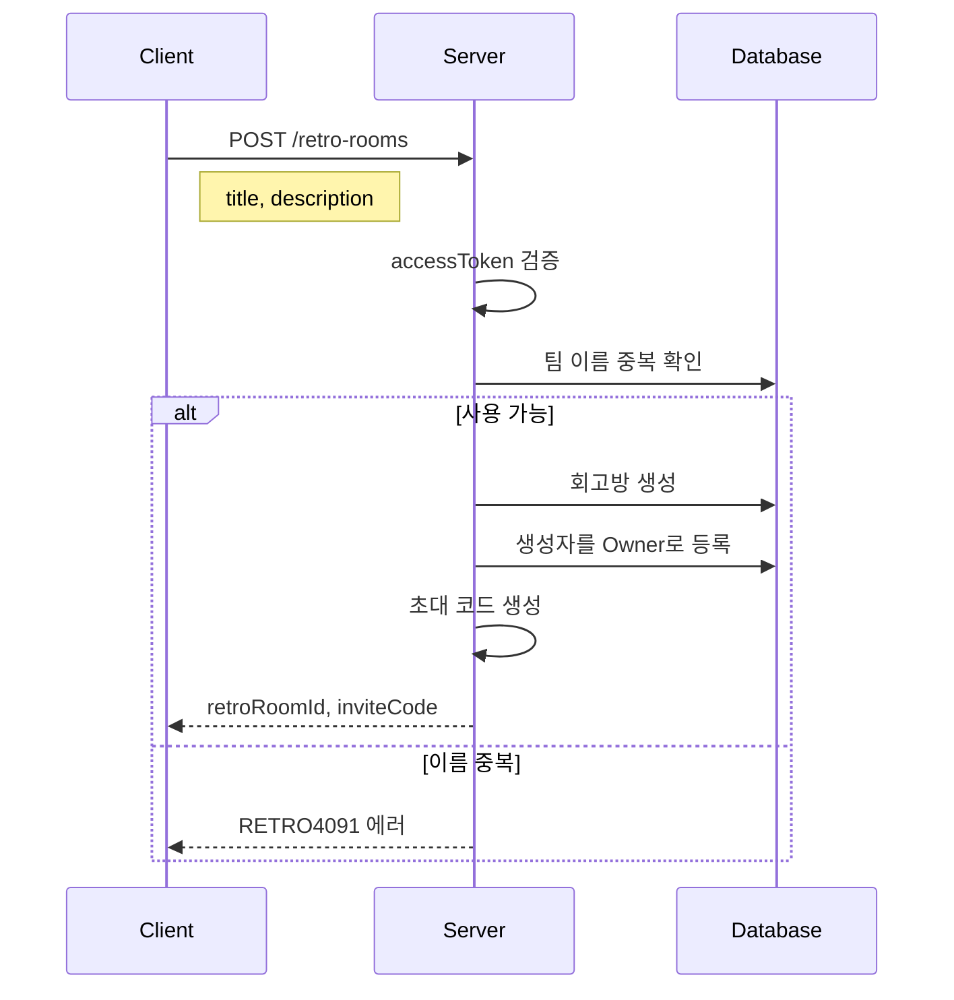

# API-005 팀 생성

> `POST /api/v1/retro-rooms`

---

## Flow



---

## Quick Reference

| 항목 | 값 |
|------|-----|
| **Method** | POST |
| **Auth** | accessToken (Bearer) |
| **Content-Type** | application/json |

---

## Request Body

```json
{
  "title": "코드 마스터즈",
  "description": "우리 팀의 성장을 위한 회고 모임입니다."
}
```

| Field | Type | Required | Validation |
|-------|------|----------|------------|
| title | string | Yes | 최대 20자 |
| description | string | No | 최대 50자 |

---

## Response

```json
{
  "isSuccess": true,
  "code": "COMMON200",
  "message": "회고방이 성공적으로 생성되었습니다.",
  "result": {
    "retroRoomId": 789,
    "title": "코드 마스터즈",
    "inviteCode": "INV-A1B2-C3D4"
  }
}
```

---

## Invite Code

| 항목 | 값 |
|------|-----|
| **형식** | `INV-XXXX-XXXX` |
| **유효기간** | 7일 |
| **재발급** | 만료 후 가능 |

---

## Error Codes

| Code | Status | 설명 |
|------|--------|------|
| RETRO4001 | 400 | 이름 길이 초과 (20자) |
| AUTH4001 | 401 | 인증 실패 |
| RETRO4091 | 409 | 팀 이름 중복 |

---

## Related

- [[API-006 팀 합류]]
- [[API-007 팀 목록]]

---

#team #create #api
