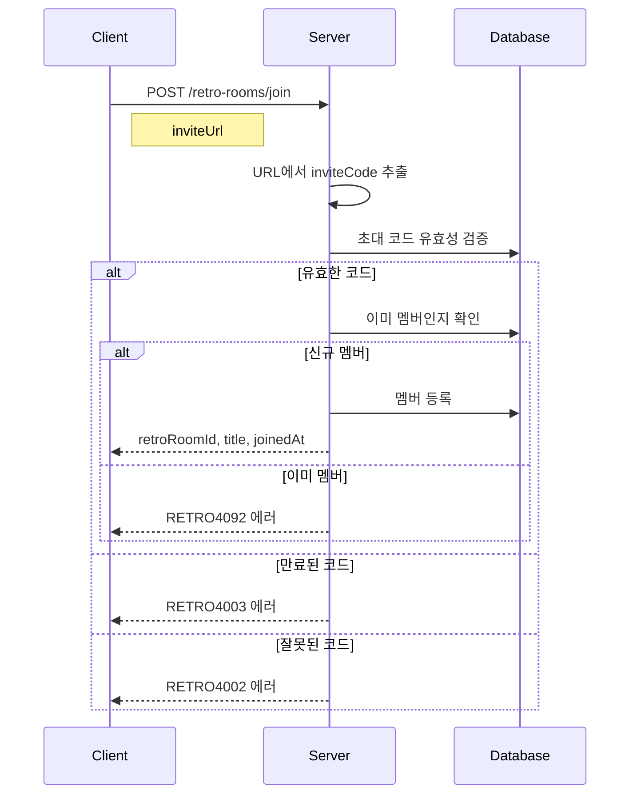

# API-006 팀 합류

> `POST /api/v1/retro-rooms/join`

---

## Flow



---

## Quick Reference

| 항목 | 값 |
|------|-----|
| **Method** | POST |
| **Auth** | accessToken (Bearer) |
| **Content-Type** | application/json |

---

## Request Body

```json
{
  "inviteUrl": "https://service.com/invite/INV-A1B2-C3D4"
}
```

> [!note] inviteCode 추출
> 서버가 URL의 마지막 경로에서 초대 코드를 자동 추출합니다.

---

## Response

```json
{
  "isSuccess": true,
  "code": "COMMON200",
  "message": "회고방에 성공적으로 합류하였습니다.",
  "result": {
    "retroRoomId": 789,
    "title": "코드 마스터즈",
    "joinedAt": "2026-01-24T15:45:00"
  }
}
```

---

## Invite Code Policy

| 항목 | 값 |
|------|-----|
| **유효기간** | 7일 |
| **만료 시** | 관리자가 재발급 |
| **형식** | `INV-XXXX-XXXX` |

---

## Error Codes

| Code | Status | 설명 |
|------|--------|------|
| RETRO4002 | 400 | 잘못된 초대 링크 |
| RETRO4003 | 400 | 만료된 초대 코드 |
| AUTH4001 | 401 | 인증 실패 |
| RETRO4041 | 404 | 존재하지 않는 회고방 |
| RETRO4092 | 409 | 이미 멤버 |

---

## Related

- [[API-005 팀 생성]]
- [[API-007 팀 목록]]

---

#team #join #invite #api
