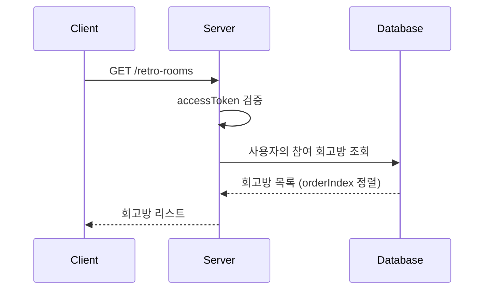

# API-007 팀 목록

> `GET /api/v1/retro-rooms`

---

## Flow



---

## Quick Reference

| 항목 | 값 |
|------|-----|
| **Method** | GET |
| **Auth** | accessToken (Bearer) |
| **Body** | 없음 |

---

## Response

```json
{
  "isSuccess": true,
  "code": "COMMON200",
  "message": "참여 중인 회고방 목록 조회를 성공했습니다.",
  "result": [
    {
      "retroRoomId": 789,
      "retroRoomName": "첫 번째 회고방",
      "orderIndex": 1
    },
    {
      "retroRoomId": 456,
      "retroRoomName": "두 번째 회고방",
      "orderIndex": 2
    }
  ]
}
```

---

## Response Fields

| Field | Type | Description |
|-------|------|-------------|
| retroRoomId | long | 회고방 고유 ID |
| retroRoomName | string | 회고방 이름 |
| orderIndex | integer | 정렬 순서 (1부터 시작) |

> [!tip] 정렬 순서
> `orderIndex` 기준 **오름차순** 정렬되어 반환됩니다.

---

## Error Codes

| Code | Status | 설명 |
|------|--------|------|
| AUTH4001 | 401 | 인증 실패 |
| COMMON500 | 500 | 서버 에러 |

---

## Related

- [[API-005 팀 생성]]
- [[API-008 팀 순서 변경]]

---

#team #list #api
