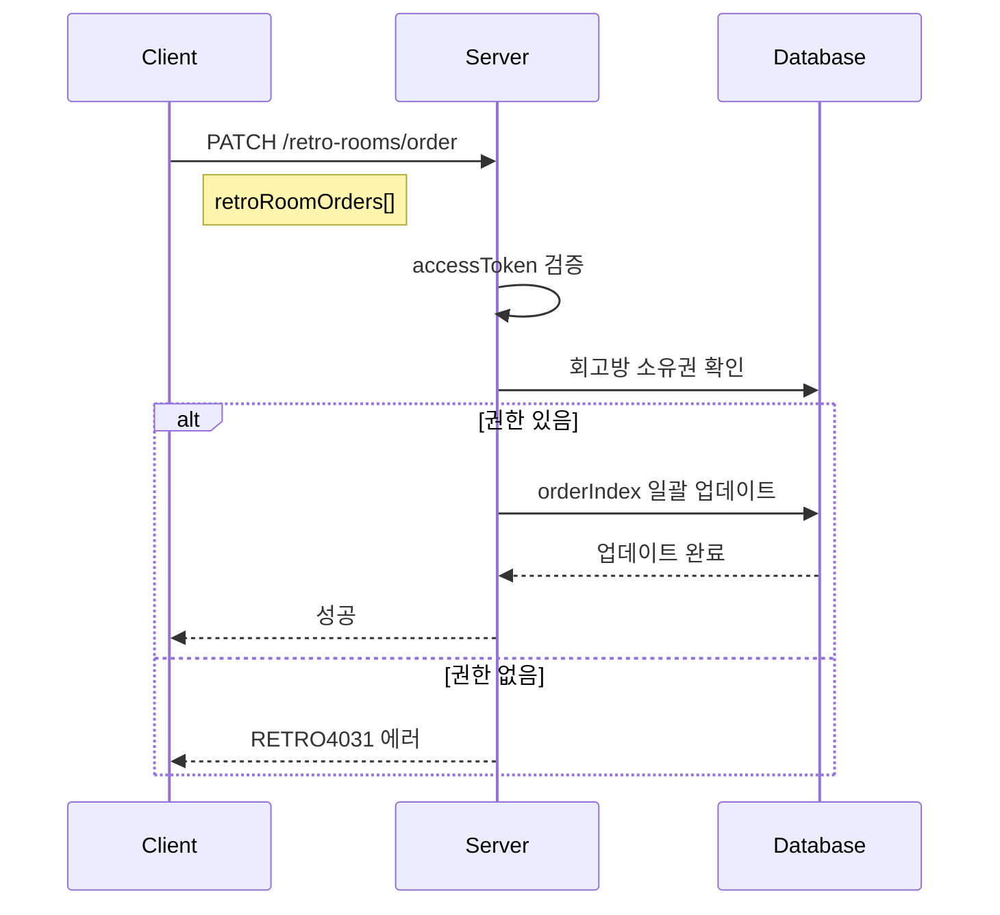

# API-008 팀 순서 변경

> `PATCH /api/v1/retro-rooms/order`

---

## Flow



---

## Quick Reference

| 항목 | 값 |
|------|-----|
| **Method** | PATCH |
| **Auth** | accessToken (Bearer) |
| **Content-Type** | application/json |

---

## Request Body

```json
{
  "retroRoomOrders": [
    { "retroRoomId": 456, "orderIndex": 1 },
    { "retroRoomId": 789, "orderIndex": 2 }
  ]
}
```

| Field | Type | Required | Validation |
|-------|------|----------|------------|
| retroRoomOrders | array | Yes | 최소 1개 |
| retroRoomId | long | Yes | - |
| orderIndex | integer | Yes | 1 이상, 중복 불가 |

---

## Response

```json
{
  "isSuccess": true,
  "code": "COMMON200",
  "message": "회고방 순서가 성공적으로 변경되었습니다.",
  "result": null
}
```

---

## Error Codes

| Code | Status | 설명 |
|------|--------|------|
| RETRO4004 | 400 | 중복 orderIndex 또는 잘못된 형식 |
| AUTH4001 | 401 | 인증 실패 |
| RETRO4031 | 403 | 참여하지 않은 회고방 포함 |
| RETRO4041 | 404 | 존재하지 않는 회고방 |

---

## Related

- [[API-007 팀 목록]]
- [[API-009 팀 이름 변경]]

---

#team #order #api
