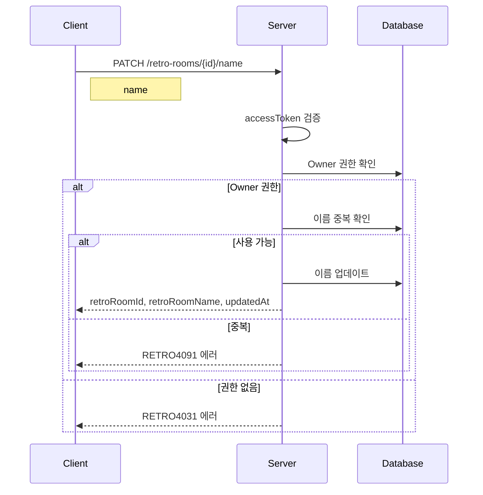

# API-009 팀 이름 변경

> `PATCH /api/v1/retro-rooms/{retroRoomId}/name`

---

## Flow



---

## Quick Reference

| 항목 | 값 |
|------|-----|
| **Method** | PATCH |
| **Auth** | accessToken (Bearer) |
| **권한** | Owner만 가능 |

---

## Request Body

```json
{
  "name": "새로운 회고방 이름"
}
```

| Field | Type | Required | Validation |
|-------|------|----------|------------|
| name | string | Yes | 1~20자 |

---

## Response

```json
{
  "isSuccess": true,
  "code": "COMMON200",
  "message": "회고방 이름 변경에 성공하였습니다.",
  "result": {
    "retroRoomId": 123,
    "retroRoomName": "새로운 회고방 이름",
    "updatedAt": "2026-01-24T15:30:00"
  }
}
```

---

## Error Codes

| Code | Status | 설명 |
|------|--------|------|
| RETRO4001 | 400 | 이름 길이 초과 (20자) |
| AUTH4001 | 401 | 인증 실패 |
| RETRO4031 | 403 | Owner가 아님 |
| RETRO4041 | 404 | 존재하지 않는 회고방 |
| RETRO4091 | 409 | 이름 중복 |

---

## Related

- [[API-007 팀 목록]]
- [[API-010 팀 삭제]]

---

#team #name #update #api
