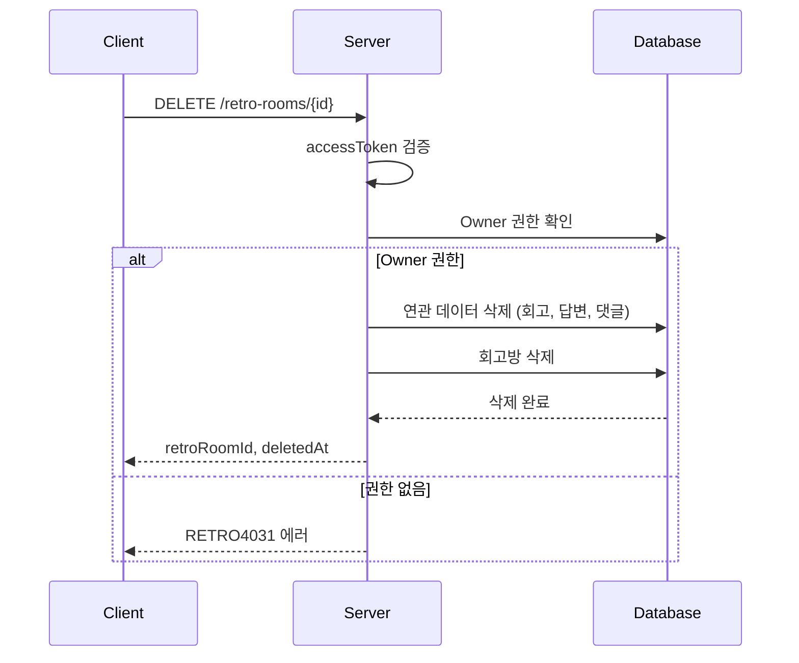

# API-010 팀 삭제

> `DELETE /api/v1/retro-rooms/{retroRoomId}`

---

## Flow



---

## Quick Reference

| 항목 | 값 |
|------|-----|
| **Method** | DELETE |
| **Auth** | accessToken (Bearer) |
| **권한** | Owner만 가능 |
| **Body** | 없음 |

---

## Response

```json
{
  "isSuccess": true,
  "code": "COMMON200",
  "message": "회고방 삭제에 성공하였습니다.",
  "result": {
    "retroRoomId": 123,
    "deletedAt": "2026-01-24T22:45:05"
  }
}
```

---

> [!warning] 데이터 파기
> 삭제 시 **모든 회고, 답변, 댓글, 초대 코드**가 영구 삭제됩니다.
> 복구가 불가능합니다.

---

## Error Codes

| Code | Status | 설명 |
|------|--------|------|
| AUTH4001 | 401 | 인증 실패 |
| RETRO4031 | 403 | Owner가 아님 |
| RETRO4041 | 404 | 존재하지 않는 회고방 |

---

## Related

- [[API-005 팀 생성]]
- [[API-009 팀 이름 변경]]

---

#team #delete #api
