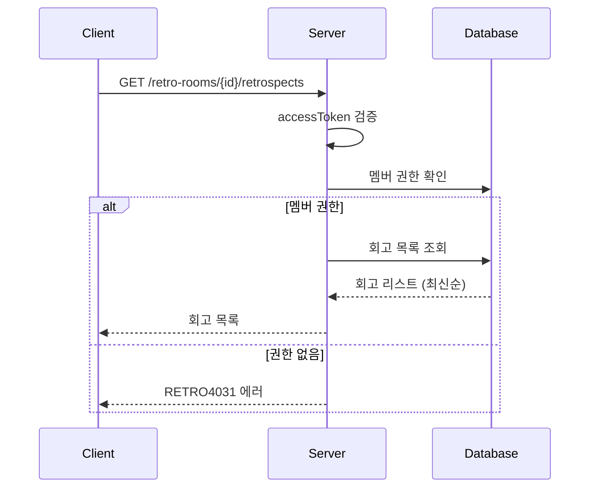

# API-011 팀 회고 목록

> `GET /api/v1/retro-rooms/{retroRoomId}/retrospects`

---

## Flow



---

## Quick Reference

| 항목 | 값 |
|------|-----|
| **Method** | GET |
| **Auth** | accessToken (Bearer) |
| **Body** | 없음 |

---

## Response

```json
{
  "isSuccess": true,
  "code": "COMMON200",
  "message": "회고방 내 전체 회고 목록 조회를 성공했습니다.",
  "result": [
    {
      "retrospectId": 100,
      "projectName": "지난 주 프로젝트 회고",
      "retrospectMethod": "PMI",
      "retrospectDate": "2026-01-20",
      "retrospectTime": "10:00"
    },
    {
      "retrospectId": 101,
      "projectName": "오늘 정기 회고",
      "retrospectMethod": "KPT",
      "retrospectDate": "2026-01-24",
      "retrospectTime": "16:00"
    }
  ]
}
```

---

## retrospectMethod Enum

| 값 | 설명 |
|----|------|
| KPT | Keep-Problem-Try |
| FOUR_L | 4L (Liked, Learned, Lacked, Longed For) |
| FIVE_F | 5F (Facts, Feelings, Findings, Future, Feedback) |
| PMI | Plus-Minus-Interesting |
| FREE | 자유 형식 |

---

## Error Codes

| Code | Status | 설명 |
|------|--------|------|
| AUTH4001 | 401 | 인증 실패 |
| RETRO4031 | 403 | 멤버가 아님 |
| RETRO4041 | 404 | 존재하지 않는 회고방 |

---

## Related

- [[API-012 회고 생성]]
- [[API-007 팀 목록]]

---

#retrospect #list #api
