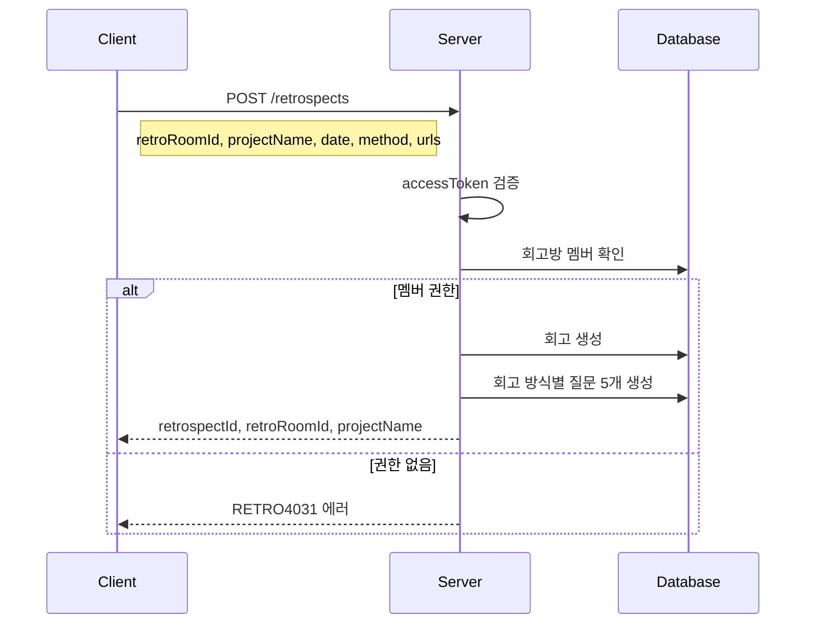
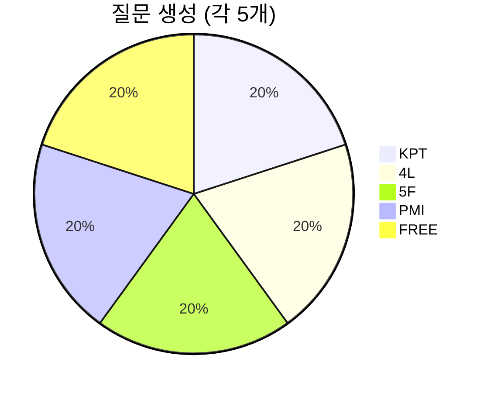

# API-012 회고 생성

> `POST /api/v1/retrospects`

---

## Flow



---

## Quick Reference

| 항목 | 값 |
|------|-----|
| **Method** | POST |
| **Auth** | accessToken (Bearer) |
| **Content-Type** | application/json |

---

## Request Body

```json
{
  "retroRoomId": 789,
  "projectName": "나만의 회고 플랫폼",
  "retrospectDate": "2026-01-24",
  "retrospectTime": "14:00",
  "retrospectMethod": "KPT",
  "referenceUrls": [
    "https://github.com/jayson/project",
    "https://notion.so/retrospective-guide"
  ]
}
```

| Field | Type | Required | Validation |
|-------|------|----------|------------|
| retroRoomId | long | Yes | 1 이상 양수 |
| projectName | string | Yes | 1~20자 |
| retrospectDate | string | Yes | YYYY-MM-DD |
| retrospectTime | string | Yes | HH:mm |
| retrospectMethod | enum | Yes | KPT, FOUR_L, FIVE_F, PMI, FREE |
| referenceUrls | array | No | 최대 10개, http/https URL |

---

## Response

```json
{
  "isSuccess": true,
  "code": "COMMON200",
  "message": "회고가 성공적으로 생성되었습니다.",
  "result": {
    "retrospectId": 12345,
    "retroRoomId": 789,
    "projectName": "나만의 회고 플랫폼"
  }
}
```

---

## 회고 방식별 기본 질문



> [!note] 자동 질문 생성
> 회고 생성 시 선택한 방식에 따라 5개의 기본 질문이 자동 생성됩니다.

---

## Error Codes

| Code | Status | 설명 |
|------|--------|------|
| RETRO4001 | 400 | 프로젝트명 길이 초과 (20자) |
| RETRO4005 | 400 | 잘못된 회고 방식 |
| RETRO4006 | 400 | 잘못된 URL 형식 |
| AUTH4001 | 401 | 인증 실패 |
| RETRO4031 | 403 | 멤버가 아님 |
| RETRO4041 | 404 | 존재하지 않는 회고방 |

---

## Related

- [[API-011 팀 회고 목록]]
- [[API-013 회고 상세]]

---

#retrospect #create #api
