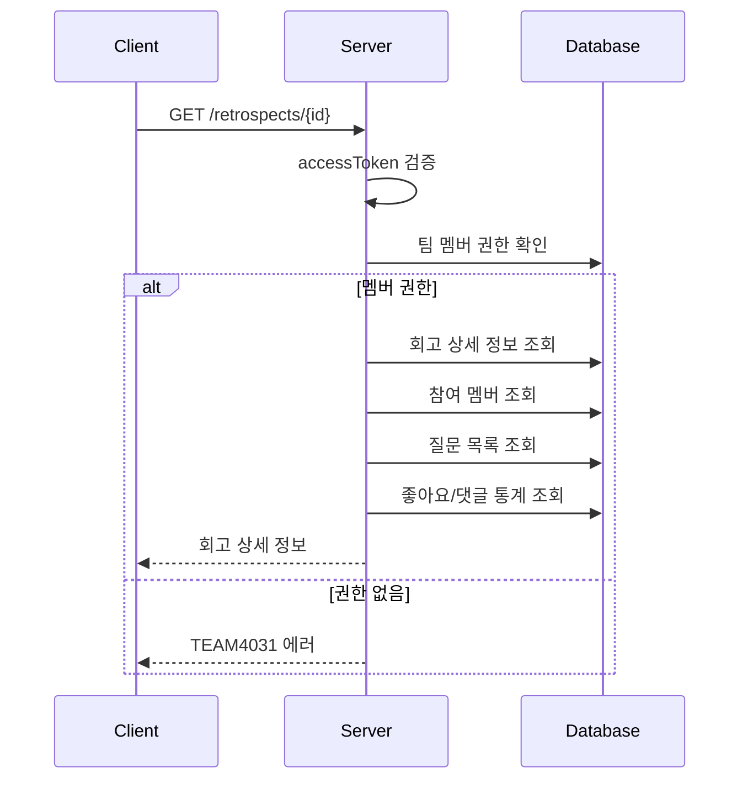

# API-013 회고 상세

> `GET /api/v1/retrospects/{retrospectId}`

---

## Flow



---

## Quick Reference

| 항목 | 값 |
|------|-----|
| **Method** | GET |
| **Auth** | accessToken (Bearer) |
| **Body** | 없음 |

---

## Response

```json
{
  "isSuccess": true,
  "code": "COMMON200",
  "message": "회고 상세 정보 조회를 성공했습니다.",
  "result": {
    "teamId": 789,
    "title": "3차 스프린트 회고",
    "startTime": "2026-01-24",
    "retroCategory": "KPT",
    "members": [
      { "memberId": 1, "userName": "김민철" },
      { "memberId": 2, "userName": "카이" }
    ],
    "totalLikeCount": 156,
    "totalCommentCount": 42,
    "questions": [
      { "index": 1, "content": "계속 유지하고 싶은 좋은 점은 무엇인가요?" },
      { "index": 2, "content": "개선이 필요한 문제점은 무엇인가요?" },
      { "index": 3, "content": "다음에 시도해보고 싶은 것은 무엇인가요?" }
    ]
  }
}
```

---

## Response Fields

| Field | Type | Description |
|-------|------|-------------|
| teamId | long | 팀 고유 ID |
| title | string | 회고 제목 |
| startTime | string | 회고 날짜 (YYYY-MM-DD) |
| retroCategory | enum | 회고 유형 |
| members | array | 참여 멤버 (등록일 오름차순) |
| questions | array | 질문 리스트 (최대 5개) |
| totalLikeCount | integer | 전체 좋아요 수 |
| totalCommentCount | integer | 전체 댓글 수 |

---

## Error Codes

| Code | Status | 설명 |
|------|--------|------|
| COMMON400 | 400 | 잘못된 retrospectId |
| AUTH4001 | 401 | 인증 실패 |
| TEAM4031 | 403 | 접근 권한 없음 |
| RETRO4041 | 404 | 존재하지 않는 회고 |

---

## Related

- [[API-012 회고 생성]]
- [[API-014 회고 삭제]]

---

#retrospect #detail #api
