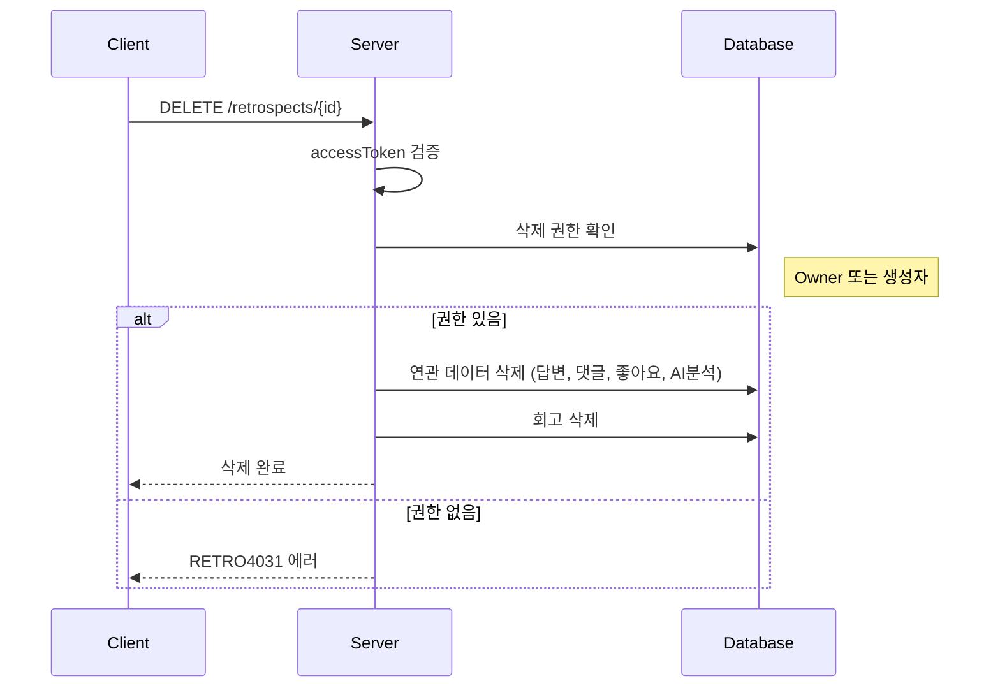

# API-014 회고 삭제

> `DELETE /api/v1/retrospects/{retrospectId}`

---

## Flow



---

## Quick Reference

| 항목 | 값 |
|------|-----|
| **Method** | DELETE |
| **Auth** | accessToken (Bearer) |
| **권한** | Owner 또는 회고 생성자 |
| **Body** | 없음 |

---

## Response

```json
{
  "isSuccess": true,
  "code": "COMMON200",
  "message": "회고가 성공적으로 삭제되었습니다.",
  "result": null
}
```

---

## 삭제 권한

| 역할 | 조건 |
|------|------|
| 팀 관리자 (Owner) | 해당 회고가 속한 팀의 Owner |
| 회고 생성자 | 해당 회고를 직접 생성한 사용자 |

---

> [!warning] 데이터 파기
> 삭제 시 **모든 답변, 댓글, 좋아요, AI 분석 결과**가 영구 삭제됩니다.
> 복구가 불가능합니다.

---

## Error Codes

| Code | Status | 설명 |
|------|--------|------|
| COMMON400 | 400 | 잘못된 retrospectId |
| AUTH4001 | 401 | 인증 실패 |
| RETRO4031 | 403 | 삭제 권한 없음 |
| RETRO4041 | 404 | 존재하지 않는 회고 |

---

## Related

- [[API-012 회고 생성]]
- [[API-013 회고 상세]]

---

#retrospect #delete #api
