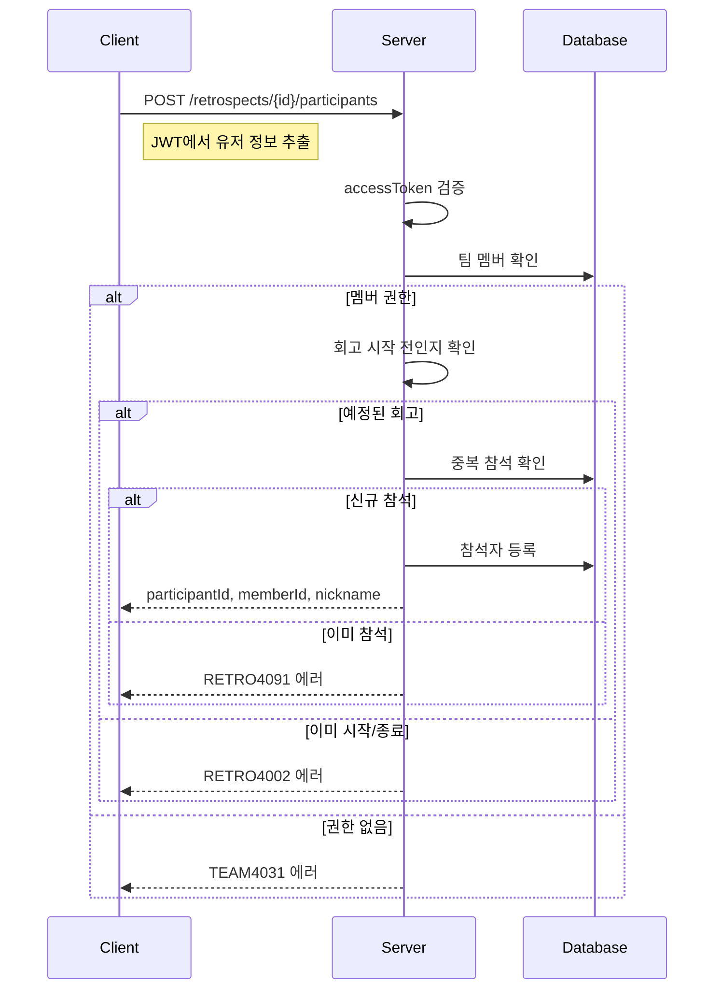

# API-015 참석 등록

> `POST /api/v1/retrospects/{retrospectId}/participants`

---

## Flow



---

## Quick Reference

| 항목 | 값 |
|------|-----|
| **Method** | POST |
| **Auth** | accessToken (Bearer) |
| **Body** | 없음 (JWT에서 추출) |

---

## Response

```json
{
  "isSuccess": true,
  "code": "COMMON200",
  "message": "회고 참석자로 성공적으로 등록되었습니다.",
  "result": {
    "participantId": 5001,
    "memberId": 123,
    "nickname": "제이슨"
  }
}
```

---

## Error Codes

| Code | Status | 설명 |
|------|--------|------|
| COMMON400 | 400 | 잘못된 retrospectId |
| RETRO4002 | 400 | 과거/진행중 회고 |
| AUTH4001 | 401 | 인증 실패 |
| TEAM4031 | 403 | 팀 멤버가 아님 |
| RETRO4041 | 404 | 존재하지 않는 회고 |
| RETRO4091 | 409 | 이미 참석 등록됨 |

---

## Related

- [[API-016 참여자 조회]]
- [[API-017 임시 저장]]

---

#retrospect #participant #api
