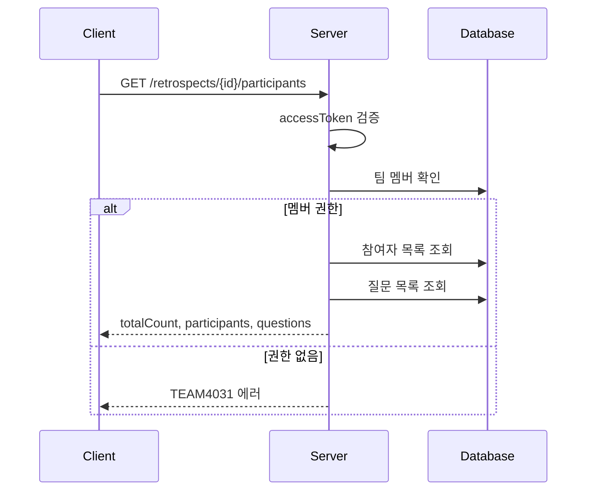

# API-016 참여자 조회

> `GET /api/v1/retrospects/{retrospectId}/participants`

---

## Flow



---

## Quick Reference

| 항목 | 값 |
|------|-----|
| **Method** | GET |
| **Auth** | accessToken (Bearer) |
| **Body** | 없음 |

---

## Response

```json
{
  "isSuccess": true,
  "code": "COMMON200",
  "message": "회고 참여자 및 질문 정보를 성공적으로 조회했습니다.",
  "result": {
    "totalCount": 3,
    "participants": [
      { "nickname": "제이슨" },
      { "nickname": "알렉스" },
      { "nickname": "사라" }
    ],
    "questions": [
      { "questionId": 1, "content": "계속 유지하고 싶은 좋은 점은 무엇인가요?" },
      { "questionId": 2, "content": "개선이 필요한 문제점은 무엇인가요?" },
      { "questionId": 3, "content": "다음에 시도해보고 싶은 것은 무엇인가요?" },
      { "questionId": 4, "content": "전체 프로젝트를 돌아보며 느낀 점은?" },
      { "questionId": 5, "content": "추가로 공유하고 싶은 의견이 있나요?" }
    ]
  }
}
```

---

## 정렬 순서

| 필드 | 기준 | 순서 |
|------|------|------|
| participants | 참석 등록일 | 오름차순 |
| questions | questionId | 오름차순 |

---

## Error Codes

| Code | Status | 설명 |
|------|--------|------|
| COMMON400 | 400 | 잘못된 retrospectId |
| AUTH4001 | 401 | 인증 실패 |
| TEAM4031 | 403 | 팀 멤버가 아님 |
| RETRO4041 | 404 | 존재하지 않는 회고 |

---

## Related

- [[API-015 참석 등록]]
- [[API-017 임시 저장]]

---

#retrospect #participant #questions #api
