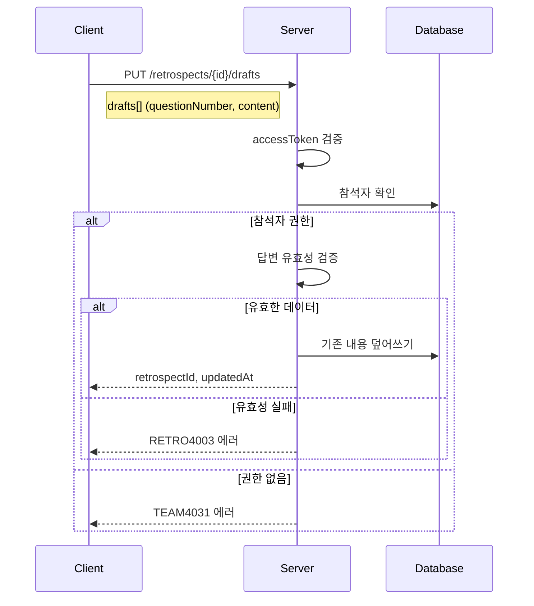

# API-017 임시 저장

> `PUT /api/v1/retrospects/{retrospectId}/drafts`

---

## Flow



---

## Quick Reference

| 항목 | 값 |
|------|-----|
| **Method** | PUT |
| **Auth** | accessToken (Bearer) |
| **Content-Type** | application/json |

---

## Request Body

```json
{
  "drafts": [
    { "questionNumber": 1, "content": "첫 번째 질문 임시 저장..." },
    { "questionNumber": 3, "content": "세 번째 질문도 함께 저장..." }
  ]
}
```

| Field | Type | Required | Validation |
|-------|------|----------|------------|
| drafts | array | Yes | 1~5개 |
| questionNumber | integer | Yes | 1~5 범위, 중복 불가 |
| content | string | No | 최대 1,000자, null 허용 |

---

## Response

```json
{
  "isSuccess": true,
  "code": "COMMON200",
  "message": "임시 저장이 완료되었습니다.",
  "result": {
    "retrospectId": 101,
    "updatedAt": "2026-01-24"
  }
}
```

---

> [!tip] 자동 저장
> 클라이언트에서 Auto-save 기능 구현 시 활용하기 적합합니다.

---

## Error Codes

| Code | Status | 설명 |
|------|--------|------|
| COMMON400 | 400 | 잘못된 질문 번호, 빈 배열, 중복 |
| RETRO4003 | 400 | 답변 길이 초과 (1,000자) |
| AUTH4001 | 401 | 인증 실패 |
| TEAM4031 | 403 | 작성 권한 없음 |
| RETRO4041 | 404 | 존재하지 않는 회고 |

---

## Related

- [[API-016 참여자 조회]]
- [[API-018 최종 제출]]

---

#retrospect #draft #save #api
