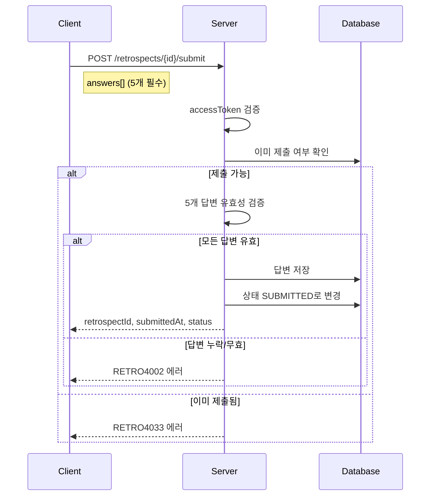
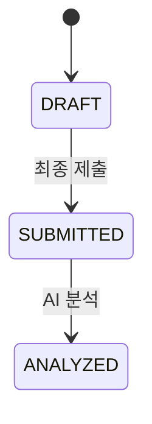

# API-018 최종 제출

> `POST /api/v1/retrospects/{retrospectId}/submit`

---

## Flow



---

## Quick Reference

| 항목 | 값 |
|------|-----|
| **Method** | POST |
| **Auth** | accessToken (Bearer) |
| **Content-Type** | application/json |

---

## Request Body

```json
{
  "answers": [
    { "questionNumber": 1, "content": "유지할 점에 대한 답변..." },
    { "questionNumber": 2, "content": "문제점에 대한 답변..." },
    { "questionNumber": 3, "content": "시도할 점에 대한 답변..." },
    { "questionNumber": 4, "content": "느낀 점에 대한 답변..." },
    { "questionNumber": 5, "content": "기타 의견에 대한 답변..." }
  ]
}
```

| Field | Type | Required | Validation |
|-------|------|----------|------------|
| answers | array | Yes | **정확히 5개** 필수 |
| questionNumber | integer | Yes | 1~5 (모든 번호 필수) |
| content | string | Yes | 1~1,000자, 공백만 불가 |

---

## Response

```json
{
  "isSuccess": true,
  "code": "COMMON200",
  "message": "회고 제출이 성공적으로 완료되었습니다.",
  "result": {
    "retrospectId": 101,
    "submittedAt": "2026-01-24",
    "status": "SUBMITTED"
  }
}
```

---

## Status Flow



| 상태 | 설명 |
|------|------|
| DRAFT | 임시 저장 상태 |
| SUBMITTED | 제출 완료 |
| ANALYZED | AI 분석 완료 |

---

## Error Codes

| Code | Status | 설명 |
|------|--------|------|
| RETRO4002 | 400 | 답변 누락 (5개 미만) |
| RETRO4003 | 400 | 답변 길이 초과 (1,000자) |
| RETRO4007 | 400 | 공백만 입력 |
| AUTH4001 | 401 | 인증 실패 |
| RETRO4033 | 403 | 이미 제출됨 |
| RETRO4041 | 404 | 존재하지 않는 회고 |

---

## Related

- [[API-017 임시 저장]]
- [[API-023 AI 분석]]

---

#retrospect #submit #api
