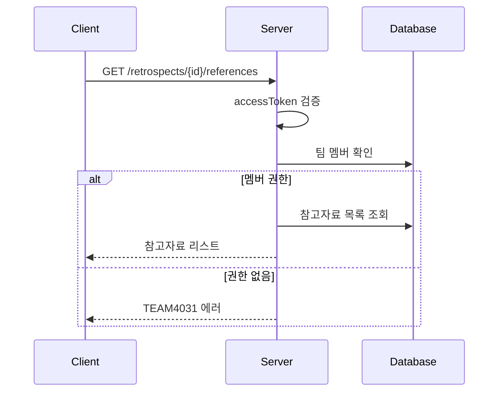

# API-019 참고자료

> `GET /api/v1/retrospects/{retrospectId}/references`

---

## Flow



---

## Quick Reference

| 항목 | 값 |
|------|-----|
| **Method** | GET |
| **Auth** | accessToken (Bearer) |
| **Body** | 없음 |

---

## Response

```json
{
  "isSuccess": true,
  "code": "COMMON200",
  "message": "참고자료 목록을 성공적으로 조회했습니다.",
  "result": [
    {
      "referenceId": 1,
      "urlName": "프로젝트 저장소",
      "url": "https://github.com/jayson/my-project"
    },
    {
      "referenceId": 2,
      "urlName": "기획 문서",
      "url": "https://notion.so/doc/123"
    }
  ]
}
```

---

## Response Fields

| Field | Type | Validation |
|-------|------|------------|
| referenceId | long | - |
| urlName | string | 최대 50자 |
| url | string | http/https, 최대 2,048자 |

> [!note] 정렬 순서
> `referenceId` 기준 오름차순 (등록 순서대로)

---

## Error Codes

| Code | Status | 설명 |
|------|--------|------|
| COMMON400 | 400 | 잘못된 retrospectId |
| AUTH4001 | 401 | 인증 실패 |
| TEAM4031 | 403 | 접근 권한 없음 |
| RETRO4041 | 404 | 존재하지 않는 회고 |

---

## Related

- [[API-012 회고 생성]]
- [[API-013 회고 상세]]

---

#retrospect #references #api
