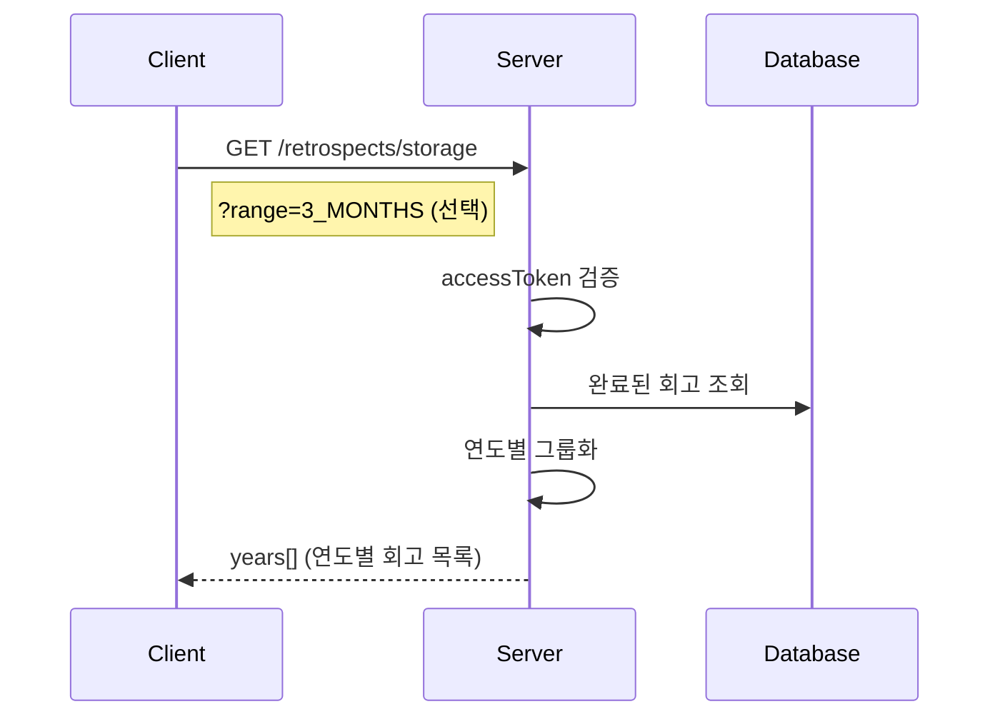

# API-020 보관함

> `GET /api/v1/retrospects/storage`

---

## Flow



---

## Quick Reference

| 항목 | 값 |
|------|-----|
| **Method** | GET |
| **Auth** | accessToken (Bearer) |
| **Body** | 없음 |

---

## Query Parameters

| Parameter | Type | Required | Default |
|-----------|------|----------|---------|
| range | enum | No | ALL |

### range Enum

| 값 | 설명 | 조회 범위 |
|----|------|----------|
| ALL | 전체 | 무제한 |
| 3_MONTHS | 최근 3개월 | 90일 |
| 6_MONTHS | 최근 6개월 | 180일 |
| 1_YEAR | 최근 1년 | 365일 |

---

## Response

```json
{
  "isSuccess": true,
  "code": "COMMON200",
  "message": "보관함 조회를 성공했습니다.",
  "result": {
    "years": [
      {
        "yearLabel": "2026년",
        "retrospects": [
          {
            "retrospectId": 124,
            "displayDate": "2026-01-24",
            "title": "API 명세 표준화 프로젝트",
            "retroCategory": "KPT",
            "memberCount": 5
          }
        ]
      }
    ]
  }
}
```

---

## 정렬 순서

| 필드 | 기준 | 순서 |
|------|------|------|
| years | 연도 | 내림차순 (최신 연도) |
| retrospects | 회고 일시 | 내림차순 (최신 회고) |

---

## Error Codes

| Code | Status | 설명 |
|------|--------|------|
| COMMON400 | 400 | 잘못된 range 값 |
| AUTH4001 | 401 | 인증 실패 |

---

## Related

- [[API-024 검색]]
- [[API-022 PDF 내보내기]]

---

#retrospect #storage #archive #api
