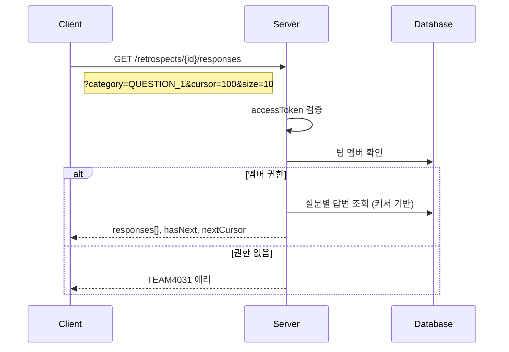

# API-021 카테고리별 조회

> `GET /api/v1/retrospects/{retrospectId}/responses`

---

## Flow



---

## Quick Reference

| 항목 | 값 |
|------|-----|
| **Method** | GET |
| **Auth** | accessToken (Bearer) |
| **Pagination** | 커서 기반 |

---

## Query Parameters

| Parameter | Type | Required | Default |
|-----------|------|----------|---------|
| category | enum | Yes | - |
| cursor | long | No | 첫 페이지 |
| size | integer | No | 10 (1~100) |

### category Enum

| 값 | 설명 |
|----|------|
| ALL | 전체 답변 |
| QUESTION_1 | 1번 질문 답변 |
| QUESTION_2 | 2번 질문 답변 |
| QUESTION_3 | 3번 질문 답변 |
| QUESTION_4 | 4번 질문 답변 |
| QUESTION_5 | 5번 질문 답변 |

---

## Response

```json
{
  "isSuccess": true,
  "code": "COMMON200",
  "message": "답변 리스트 조회를 성공했습니다.",
  "result": {
    "responses": [
      {
        "responseId": 501,
        "userName": "제이슨",
        "content": "이번 스프린트에서 테스트 코드를 꼼꼼히 짠 것이 좋았습니다.",
        "likeCount": 12,
        "commentCount": 3
      }
    ],
    "hasNext": true,
    "nextCursor": 455
  }
}
```

---

## 정렬 순서

| 기준 | 순서 |
|------|------|
| responseId | 내림차순 (최신 답변) |

---

## Error Codes

| Code | Status | 설명 |
|------|--------|------|
| COMMON400 | 400 | 잘못된 파라미터 |
| RETRO4004 | 400 | 잘못된 category |
| AUTH4001 | 401 | 인증 실패 |
| TEAM4031 | 403 | 접근 권한 없음 |
| RETRO4041 | 404 | 존재하지 않는 회고 |

---

## Related

- [[API-013 회고 상세]]
- [[API-026 좋아요 토글]]

---

#retrospect #responses #pagination #api
