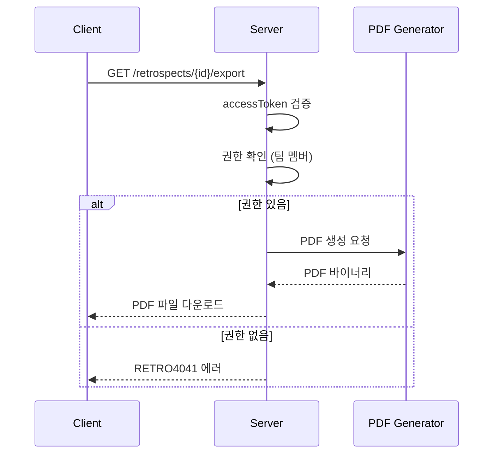

# API-022 PDF 내보내기

> `GET /api/v1/retrospects/{retrospectId}/export`

---

## Flow



---

## Quick Reference

| 항목 | 값 |
|------|-----|
| **Method** | GET |
| **Auth** | accessToken (Bearer) |
| **Response** | Binary (PDF) |

---

## Response Headers

| Header | Value |
|--------|-------|
| Content-Type | application/pdf; charset=utf-8 |
| Content-Disposition | attachment; filename="{dynamicFileName}.pdf" |
| Cache-Control | no-cache, no-store, must-revalidate |

---

## 파일명 규칙

```
retrospect_report_{retrospectId}_{timestamp}.pdf
```

**예시:**
- `retrospect_report_100_20250125_143022.pdf`

| 구성요소 | 설명 |
|----------|------|
| retrospectId | 회고 ID |
| timestamp | 생성 시간 (YYYYMMdd_HHmmss, UTC) |

---

## Response

성공 시 PDF 바이너리가 직접 반환됩니다.

> [!note] 브라우저 다운로드
> 성공 시 브라우저에서 파일 다운로드가 즉시 시작됩니다.

---

## Error Codes

| Code | Status | 설명 |
|------|--------|------|
| COMMON400 | 400 | 잘못된 retrospectId |
| AUTH4001 | 401 | 인증 실패 |
| RETRO4041 | 404 | 회고 없음 또는 권한 없음 |
| COMMON500 | 500 | PDF 생성 실패 |

> [!warning] 보안 정책
> 회고 존재 여부와 접근 권한 없음을 동일한 404로 처리합니다.

---

## Related

- [[API-020 보관함]]
- [[API-023 AI 분석]]

---

#retrospect #export #pdf #api
