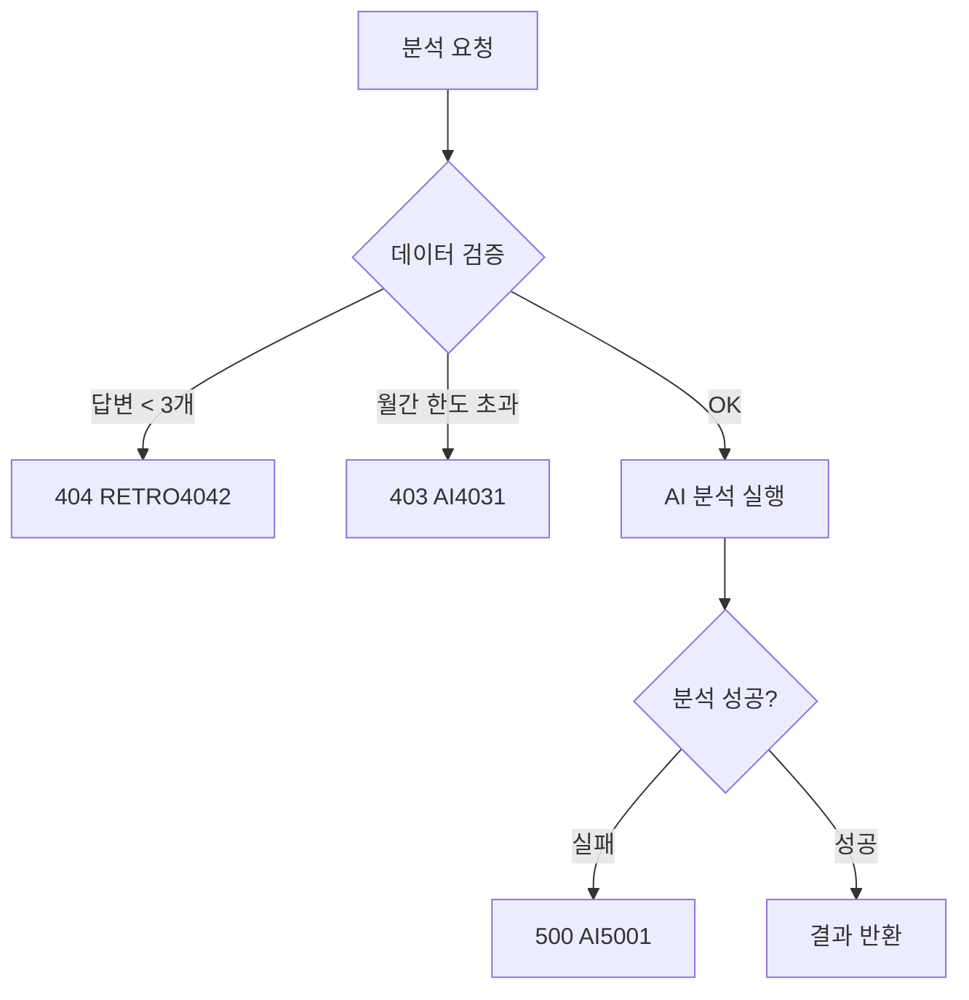

# API-023 AI 분석

> `POST /api/v1/retrospects/{retrospectId}/analysis`

---

## Flow



---

## Quick Reference

| 항목 | 값 |
|------|-----|
| **Method** | POST |
| **Auth** | Bearer Token 필수 |
| **월간 한도** | 팀당 10회 |

---

## 최소 데이터 기준

| 기준 | 최소값 |
|------|-------|
| 답변 수 | 3개 이상 |
| 참여자 수 | 1명 이상 |

---

## Response Structure

```json
{
  "teamInsight": "팀 전체 AI 분석 메시지",
  "emotionRank": [
    { "rank": 1, "label": "피로", "count": 6 },
    { "rank": 2, "label": "뿌듯", "count": 4 },
    { "rank": 3, "label": "불안", "count": 2 }
  ],
  "personalMissions": [
    {
      "userId": 1,
      "userName": "소은",
      "missions": [
        { "missionTitle": "...", "missionDesc": "..." }
      ]
    }
  ]
}
```

---

## 응답 데이터 규칙

| 필드 | 규칙 |
|------|------|
| emotionRank | 정확히 3개, count 내림차순 |
| personalMissions | userId 오름차순 |
| missions | 사용자당 정확히 3개 |

---

## Error Codes

| Code | Status | 설명 |
|------|--------|------|
| AI4031 | 403 | 월간 한도 초과 |
| RETRO4041 | 404 | 존재하지 않는 회고 |
| RETRO4042 | 404 | 분석 데이터 부족 |
| AI5001 | 500 | AI 분석 실패 |

---

## Related

- [[API-011 회고 생성]]
- [[API-018 최종 제출]]
- [[../../ai-monitoring/03-agents|AI Agent 설계]]

---

#ai #analysis #retrospect #api
