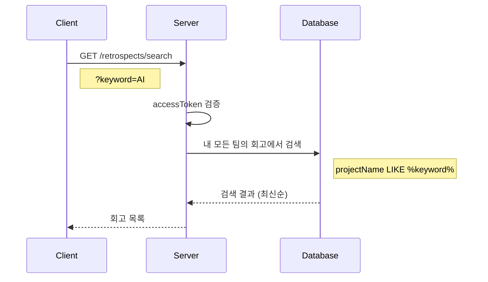
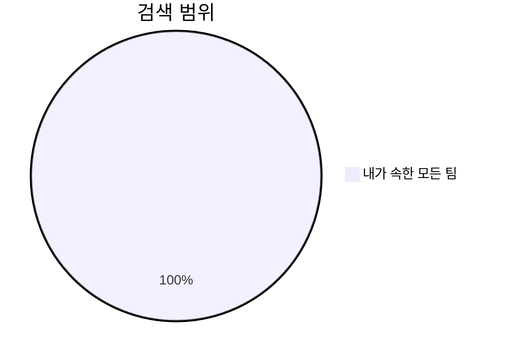

# API-024 검색

> `GET /api/v1/retrospects/search`

---

## Flow



---

## Quick Reference

| 항목 | 값 |
|------|-----|
| **Method** | GET |
| **Auth** | accessToken (Bearer) |
| **검색 대상** | projectName (회고 제목) |

---

## Query Parameters

| Parameter | Type | Required | Validation |
|-----------|------|----------|------------|
| keyword | string | Yes | 1~100자 |

---

## Response

```json
{
  "isSuccess": true,
  "code": "COMMON200",
  "message": "회고 검색 결과 조회 성공.",
  "result": [
    {
      "retrospectId": 201,
      "projectName": "AI 서비스 1차 릴리즈 회고",
      "teamName": "AI 사이드팀",
      "retrospectMethod": "KPT",
      "retrospectDate": "2026-01-10",
      "retrospectTime": "14:00"
    }
  ]
}
```

---

## 검색 범위



> [!note] 검색 범위
> 특정 팀이 아닌, **내가 속한 모든 팀**의 회고에서 검색합니다.

---

## 정렬 순서

| 우선순위 | 기준 | 순서 |
|---------|------|------|
| 1 | retrospectDate | 내림차순 (최신순) |
| 2 | retrospectTime | 내림차순 |

---

## Error Codes

| Code | Status | 설명 |
|------|--------|------|
| SEARCH4001 | 400 | 검색어 누락 또는 길이 초과 |
| AUTH4001 | 401 | 인증 실패 |

---

## Related

- [[API-020 보관함]]
- [[API-011 팀 회고 목록]]

---

#retrospect #search #api
