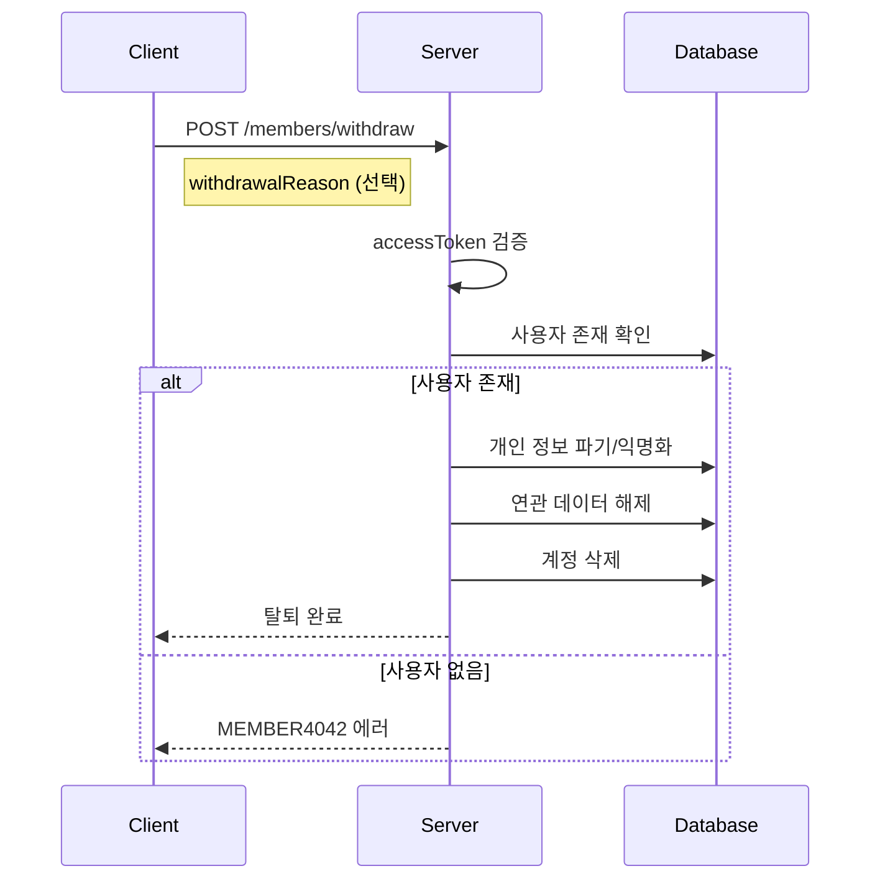

# API-025 서비스 탈퇴

> `POST /api/v1/members/withdraw`

---

## Flow



---

## Quick Reference

| 항목 | 값 |
|------|-----|
| **Method** | POST |
| **Auth** | accessToken (Bearer) |
| **Content-Type** | application/json |

---

## Request Body

```json
{
  "withdrawalReason": "더 이상 회고를 작성할 필요가 없습니다."
}
```

| Field | Type | Required | Validation |
|-------|------|----------|------------|
| withdrawalReason | string | No | 최대 200자, 이모지 허용 |

---

## Response

```json
{
  "isSuccess": true,
  "code": "COMMON200",
  "message": "회원 탈퇴가 성공적으로 완료되었습니다.",
  "result": null
}
```

---

> [!warning] 데이터 파기
> 탈퇴 시 **모든 개인 정보 및 데이터**가 즉시 파기되거나 익명화됩니다.
> **복구가 불가능합니다.**

---

## Error Codes

| Code | Status | 설명 |
|------|--------|------|
| AUTH4001 | 401 | 인증 실패 |
| MEMBER4042 | 404 | 존재하지 않는 사용자 또는 이미 탈퇴 |
| COMMON500 | 500 | 데이터 삭제 중 오류 |

---

## Related

- [[API-001 소셜 로그인]]
- [[API-004 로그아웃]]

---

#member #withdraw #api
