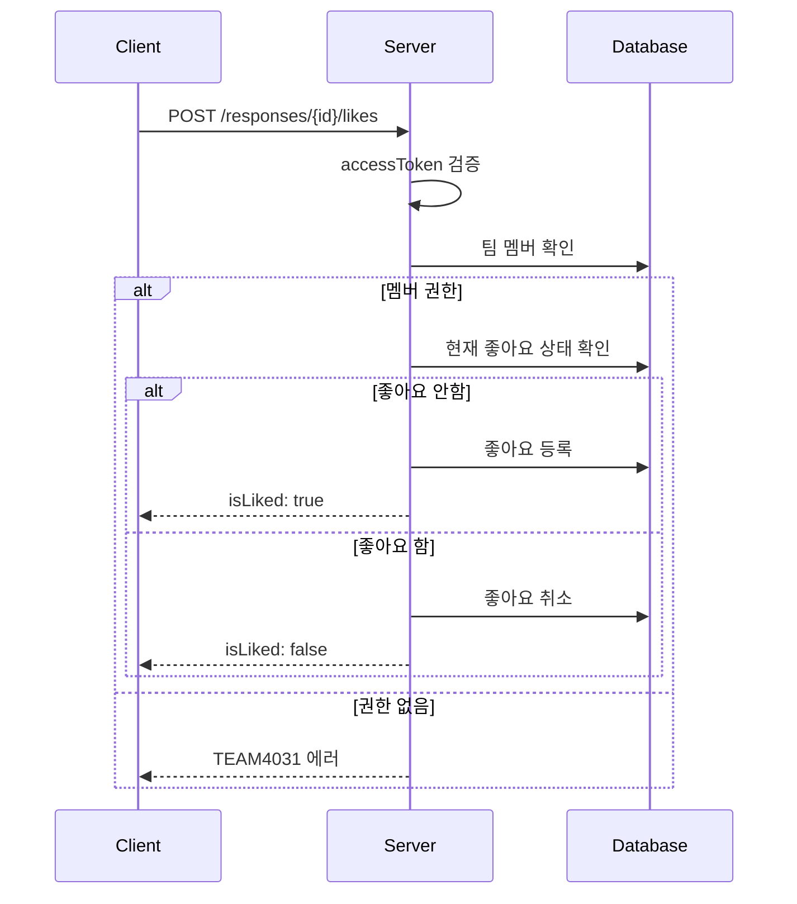
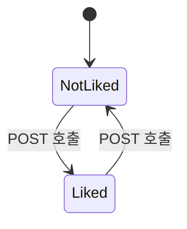

# API-026 좋아요 토글

> `POST /api/v1/responses/{responseId}/likes`

---

## Flow



---

## Quick Reference

| 항목 | 값 |
|------|-----|
| **Method** | POST |
| **Auth** | accessToken (Bearer) |
| **Body** | 없음 |
| **동작** | 토글 (등록/취소) |

---

## Response

```json
{
  "isSuccess": true,
  "code": "COMMON200",
  "message": "좋아요 상태가 성공적으로 업데이트되었습니다.",
  "result": {
    "responseId": 456,
    "isLiked": true,
    "totalLikes": 13
  }
}
```

---

## 토글 동작



| 현재 상태 | 호출 후 상태 |
|----------|-------------|
| 좋아요 안함 | 좋아요 등록 |
| 좋아요 함 | 좋아요 취소 |

---

## Error Codes

| Code | Status | 설명 |
|------|--------|------|
| AUTH4001 | 401 | 인증 실패 |
| TEAM4031 | 403 | 팀 멤버가 아님 |
| RES4041 | 404 | 존재하지 않는 답변 |

---

## Related

- [[API-021 카테고리별 조회]]
- [[API-027 댓글 조회]]

---

#social #like #toggle #api
