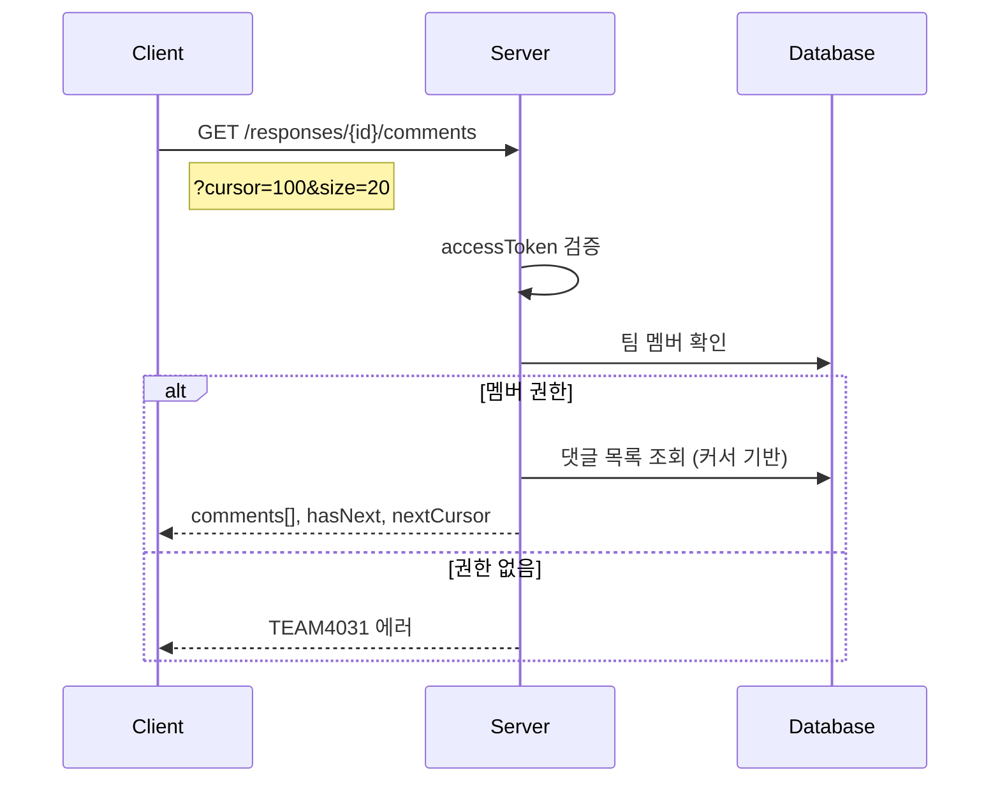

# API-027 댓글 조회

> `GET /api/v1/responses/{responseId}/comments`

---

## Flow



---

## Quick Reference

| 항목 | 값 |
|------|-----|
| **Method** | GET |
| **Auth** | accessToken (Bearer) |
| **Pagination** | 커서 기반 |

---

## Query Parameters

| Parameter | Type | Required | Default |
|-----------|------|----------|---------|
| cursor | long | No | 첫 페이지 |
| size | integer | No | 20 (1~100) |

---

## Response

```json
{
  "isSuccess": true,
  "code": "COMMON200",
  "message": "댓글 조회를 성공했습니다.",
  "result": {
    "comments": [
      {
        "commentId": 789,
        "memberId": 12,
        "userName": "김민수",
        "content": "이 의견에 전적으로 동의합니다!",
        "createdAt": "2026-01-24T16:30:15"
      }
    ],
    "hasNext": true,
    "nextCursor": 787
  }
}
```

---

## Response Fields

| Field | Type | Validation |
|-------|------|------------|
| commentId | long | - |
| memberId | long | - |
| userName | string | 1~50자 |
| content | string | 1~500자 |
| createdAt | string | ISO 8601 |

---

## 정렬 순서

| 기준 | 순서 |
|------|------|
| commentId | 내림차순 (최신 댓글) |

---

## Error Codes

| Code | Status | 설명 |
|------|--------|------|
| COMMON400 | 400 | 잘못된 파라미터 |
| AUTH4001 | 401 | 인증 실패 |
| TEAM4031 | 403 | 팀 멤버가 아님 |
| RES4041 | 404 | 존재하지 않는 답변 |

---

## Related

- [[API-028 댓글 작성]]
- [[API-026 좋아요 토글]]

---

#social #comment #list #api
