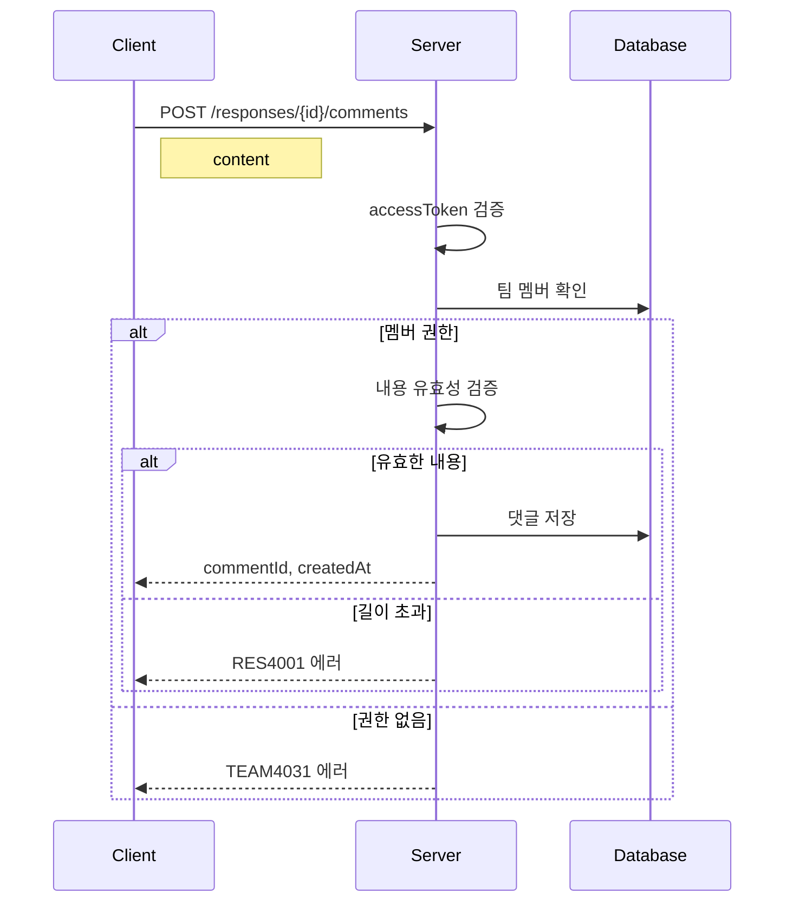

# API-028 댓글 작성

> `POST /api/v1/responses/{responseId}/comments`

---

## Flow



---

## Quick Reference

| 항목 | 값 |
|------|-----|
| **Method** | POST |
| **Auth** | accessToken (Bearer) |
| **Content-Type** | application/json |

---

## Request Body

```json
{
  "content": "이 부분 정말 공감되네요! 고생 많으셨습니다."
}
```

| Field | Type | Required | Validation |
|-------|------|----------|------------|
| content | string | Yes | 1~200자, 공백만 불가 |

---

## Response

```json
{
  "isSuccess": true,
  "code": "COMMON200",
  "message": "댓글이 성공적으로 등록되었습니다.",
  "result": {
    "commentId": 789,
    "responseId": 456,
    "content": "이 부분 정말 공감되네요! 고생 많으셨습니다.",
    "createdAt": "2026-01-24T15:48:21"
  }
}
```

---

## Error Codes

| Code | Status | 설명 |
|------|--------|------|
| COMMON400 | 400 | content 누락 또는 빈 값 |
| RES4001 | 400 | 댓글 길이 초과 (200자) |
| AUTH4001 | 401 | 인증 실패 |
| TEAM4031 | 403 | 팀 멤버가 아님 |
| RES4041 | 404 | 존재하지 않는 답변 |

---

## Related

- [[API-027 댓글 조회]]
- [[API-026 좋아요 토글]]

---

#social #comment #create #api
