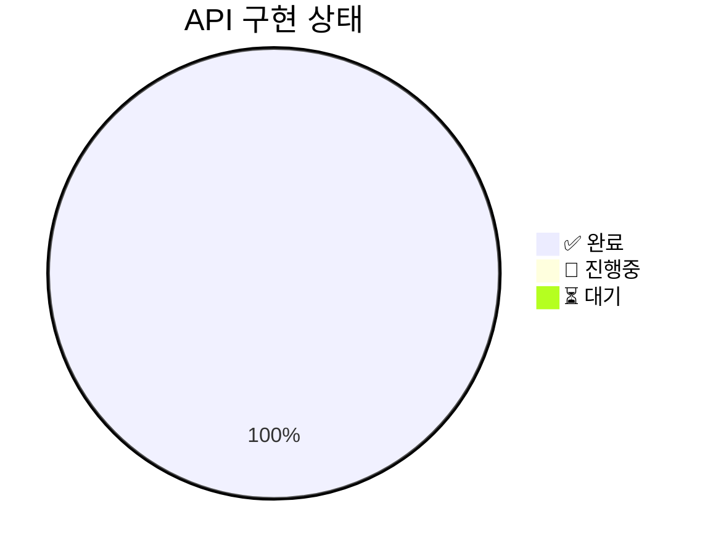

# 📑 API Visual - Map of Content

> API 명세 시각화 허브

---

## 🔗 Quick Links

| 문서 | 설명 |
|------|------|
| [[../00-HOME\|🏠 HOME]] | 프로젝트 전체 허브 |
| [[../01-Architecture\|🏗️ Architecture]] | 시스템 아키텍처 |
| [[../05-API-Overview\|🔌 API Overview]] | API 전체 맵 |

---

## 📋 API 분류

### 🔐 Auth (인증)

| API | 설명 | Method |
|-----|------|--------|
| [[API-001 소셜 로그인]] | Google/Kakao 소셜 로그인 | 🟡 POST |
| [[API-002 회원가입]] | 신규 회원 가입 | 🟡 POST |
| [[API-003 토큰 리프레시]] | 토큰 갱신 | 🟡 POST |
| [[API-004 로그아웃]] | 로그아웃 | 🟡 POST |

→ [[../07-Auth-APIs|Auth APIs 상세]]

---

### 👥 Team (팀/회고방)

| API | 설명 | Method |
|-----|------|--------|
| [[API-005 팀 생성]] | 회고방 생성 | 🟡 POST |
| [[API-006 팀 합류]] | 회고방 참여 | 🟡 POST |
| [[API-007 팀 목록]] | 내 회고방 목록 | 🟢 GET |
| [[API-008 팀 순서 변경]] | 회고방 순서 변경 | 🟣 PATCH |
| [[API-009 팀 이름 변경]] | 회고방 이름 수정 | 🟣 PATCH |
| [[API-010 팀 삭제]] | 회고방 삭제 | 🔴 DELETE |
| [[API-011 팀 회고 목록]] | 회고방 내 회고 목록 | 🟢 GET |

→ [[../08-Team-APIs|Team APIs 상세]]

---

### 📝 Retrospect (회고)

| API | 설명 | Method |
|-----|------|--------|
| [[API-012 회고 생성]] | 회고 세션 생성 | 🟡 POST |
| [[API-013 회고 상세]] | 회고 상세 조회 | 🟢 GET |
| [[API-014 회고 삭제]] | 회고 삭제 | 🔴 DELETE |
| [[API-015 참석 등록]] | 회고 참여자 등록 | 🟡 POST |
| [[API-016 참여자 조회]] | 회고 참여자 조회 | 🟢 GET |
| [[API-017 임시 저장]] | 답변 임시저장 | 🔵 PUT |
| [[API-018 최종 제출]] | 답변 최종 제출 | 🟡 POST |

→ [[../09-Retrospect-APIs|Retrospect APIs 상세]]

---

### 📄 Contents (컨텐츠)

| API | 설명 | Method |
|-----|------|--------|
| [[API-019 참고자료]] | 참고자료 조회 | 🟢 GET |
| [[API-020 보관함]] | 보관함 목록 | 🟢 GET |
| [[API-021 카테고리별 조회]] | 카테고리 필터 | 🟢 GET |
| [[API-022 PDF 내보내기]] | PDF 다운로드 | 🟢 GET |
| [[API-023 AI 분석]] | AI 인사이트 생성 | 🟡 POST |
| [[API-024 검색]] | 회고 검색 | 🟢 GET |

→ [[../06-AI-Analysis-Flow|AI 분석 플로우]]

---

### 💬 Social (소셜)

| API | 설명 | Method |
|-----|------|--------|
| [[API-026 좋아요 토글]] | 좋아요/취소 | 🟡 POST |
| [[API-027 댓글 조회]] | 댓글 목록 | 🟢 GET |
| [[API-028 댓글 작성]] | 댓글 등록 | 🟡 POST |

→ [[../10-Social-APIs|Social APIs 상세]]

---

### 👤 Member (회원)

| API | 설명 | Method |
|-----|------|--------|
| [[API-025 서비스 탈퇴]] | 회원 탈퇴 | 🔴 DELETE |

---

## 📊 API 구현 상태

| 카테고리 | 완료 | 전체 |
|---------|------|------|
| Auth | 4/4 | ██████████ |
| Team | 7/7 | ██████████ |
| Retrospect | 7/7 | ██████████ |
| Contents | 6/6 | ██████████ |
| Social | 3/3 | ██████████ |
| Member | 1/1 | ██████████ |

---

## 🎯 Flow Diagrams

| 플로우 | 설명 |
|--------|------|
| [[../02-Auth-Flow\|🔐 Auth Flow]] | 인증 전체 흐름 |
| [[../03-Retrospect-Flow\|📝 Retrospect Flow]] | 회고 전체 흐름 |
| [[../06-AI-Analysis-Flow\|🤖 AI Analysis Flow]] | AI 분석 상세 |

---

## 📚 Reference

| 문서 | 설명 |
|------|------|
| [[../04-Entity-Diagram\|📊 Entity Diagram]] | DB 스키마 |
| [[../11-Error-Codes\|🚨 Error Codes]] | 에러 코드 참조 |
| [[../../api-specs/README\|📖 API 상세 스펙]] | 원본 API 문서 |

---

#api #moc #visual #index
