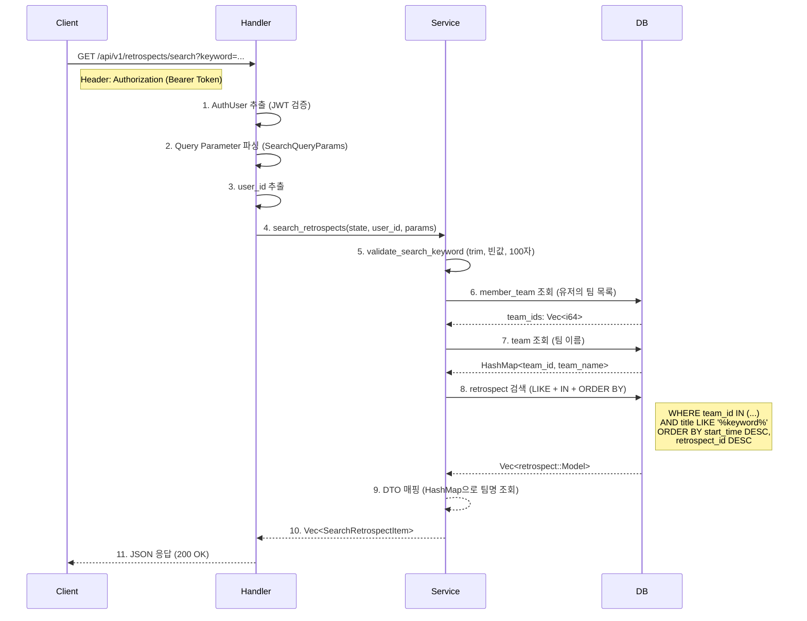

# 데이터 흐름도 (Data Flow)

요청부터 응답까지의 데이터 처리 흐름입니다.



## 상세 단계 설명

### 1단계: 인증 (Handler)

**파일**: `handler.rs:457-467`

```rust
pub async fn search_retrospects(
    user: AuthUser,                              // JWT에서 추출된 인증 정보
    State(state): State<AppState>,               // DB 커넥션 등 애플리케이션 상태
    Query(params): Query<SearchQueryParams>,     // ?keyword=... 쿼리 파라미터
) -> Result<Json<BaseResponse<Vec<SearchRetrospectItem>>>, AppError> {
    let user_id: i64 = user.0.sub.parse()
        .map_err(|_| AppError::Unauthorized("유효하지 않은 사용자 ID입니다.".to_string()))?;
```

- `AuthUser`: 미들웨어에서 JWT를 검증하고 클레임을 추출하는 Axum 커스텀 Extractor
- `Query<SearchQueryParams>`: URL 쿼리 파라미터를 구조체로 자동 매핑
- `user.0.sub`: JWT 토큰의 `sub` 클레임 (사용자 ID 문자열)

### 2단계: 키워드 검증 (Service)

**파일**: `service.rs:952-969`

```rust
let keyword = Self::validate_search_keyword(params.keyword.as_deref())?;
```

검증 함수 내부:
1. `keyword.unwrap_or("")`: `None`이면 빈 문자열로 대체
2. `.trim()`: 앞뒤 공백 제거
3. 빈 문자열 체크 -> `SEARCH4001` 에러
4. `chars().count() > 100` 체크 -> `SEARCH4001` 에러

### 3단계: 유저의 팀 목록 조회 (DB 쿼리 1)

**파일**: `service.rs:986-997`

```rust
let user_teams = member_team::Entity::find()
    .filter(member_team::Column::MemberId.eq(user_id))
    .all(&state.db).await?;

if user_teams.is_empty() {
    return Ok(vec![]);  // 소속 팀이 없으면 빈 결과 즉시 반환
}

let team_ids: Vec<i64> = user_teams.iter().map(|mt| mt.team_id).collect();
```

- `member_team`: 유저와 팀의 N:M 관계 중간 테이블
- SQL: `SELECT * FROM member_team WHERE member_id = ?`

### 4단계: 팀 이름 HashMap 구축 (DB 쿼리 2)

**파일**: `service.rs:999-1007`

```rust
let teams = team::Entity::find()
    .filter(team::Column::TeamId.is_in(team_ids.clone()))
    .all(&state.db).await?;

let team_map: HashMap<i64, String> =
    teams.iter().map(|t| (t.team_id, t.name.clone())).collect();
```

- SQL: `SELECT * FROM team WHERE team_id IN (?,...)`
- HashMap으로 변환하여 이후 DTO 매핑 시 O(1) 조회

### 5단계: 회고 검색 (DB 쿼리 3)

**파일**: `service.rs:1009-1017`

```rust
let retrospects = retrospect::Entity::find()
    .filter(retrospect::Column::TeamId.is_in(team_ids))
    .filter(retrospect::Column::Title.contains(&keyword))
    .order_by_desc(retrospect::Column::StartTime)
    .order_by_desc(retrospect::Column::RetrospectId)
    .all(&state.db).await?;
```

- SQL: `SELECT * FROM retrospect WHERE team_id IN (?,...)  AND title LIKE '%keyword%' ORDER BY start_time DESC, retrospect_id DESC`
- 검색 대상 컬럼은 `title` (API 스펙의 `projectName`에 해당)

### 6단계: DTO 매핑 및 응답

**파일**: `service.rs:1019-1030`

```rust
let items: Vec<SearchRetrospectItem> = retrospects
    .iter()
    .map(|r| SearchRetrospectItem {
        retrospect_id: r.retrospect_id,
        project_name: r.title.clone(),
        team_name: team_map.get(&r.team_id).cloned().unwrap_or_default(),
        retrospect_method: r.retrospect_method.clone(),
        retrospect_date: r.start_time.format("%Y-%m-%d").to_string(),
        retrospect_time: r.start_time.format("%H:%M").to_string(),
    })
    .collect();
```

- `r.title` -> `project_name`: DB 컬럼명과 API 응답 필드명이 다름
- `start_time` -> `retrospect_date` + `retrospect_time`: 단일 datetime을 두 문자열로 분리

---

## 에러 흐름 요약

| 단계 | 에러 조건 | AppError | 에러 코드 | HTTP |
|------|-----------|----------|-----------|------|
| 1 | JWT 유효하지 않음 | `Unauthorized` | AUTH4001 | 401 |
| 2 | 키워드 누락/공백/100자 초과 | `SearchKeywordInvalid` | SEARCH4001 | 400 |
| 3-5 | DB 연결 실패/쿼리 오류 | `InternalError` | COMMON500 | 500 |

## DB 쿼리 요약

| 순서 | 테이블 | 목적 | 결과 |
|------|--------|------|------|
| 1 | `member_team` | 유저 소속 팀 ID 목록 | `Vec<i64>` (team_ids) |
| 2 | `team` | 팀 이름 조회 | `HashMap<i64, String>` |
| 3 | `retrospect` | 키워드 검색 + 팀 필터 + 정렬 | `Vec<retrospect::Model>` |
